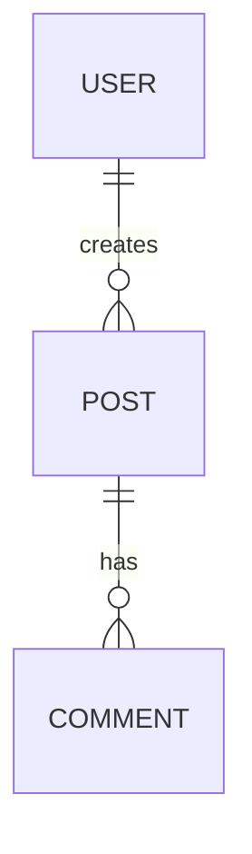

# Schema Diagram Generation

SpecQL can automatically generate visual ER diagrams from your entity definitions, helping you document and understand your data relationships.

## Quick Examples

### Basic ER Diagram

```bash
# Generate SVG ER diagram
specql diagram entities/*.yaml
```

### Interactive HTML Viewer

```bash
# Create interactive HTML diagram with pan/zoom
specql diagram entities/*.yaml --format html --output schema.html
```

### Documentation-Ready Mermaid

```bash
# Generate Mermaid syntax for Markdown docs
specql diagram entities/*.yaml --format mermaid --output docs/schema.md
```

### Custom PNG with Title

```bash
# PNG format with custom title
specql diagram entities/*.yaml --format png --title "My App Schema"
```

## Output Formats

| Format | Description | Use Case |
|--------|-------------|----------|
| `svg` | Scalable vector graphics | Web documentation, high-quality printing |
| `png` | Portable network graphics | Presentations, README files |
| `pdf` | Portable document format | Professional documentation |
| `dot` | Graphviz source code | Custom styling, version control |
| `mermaid` | Mermaid ERD syntax | Markdown documentation, GitHub READMEs |
| `html` | Interactive HTML viewer | Exploration, stakeholder demos |

## Advanced Options

### Schema Clustering

```bash
# Group entities by schema (default)
specql diagram entities/*.yaml --cluster

# Flat layout without clustering
specql diagram entities/*.yaml --no-cluster
```

### Field Display Control

```bash
# Show all fields including Trinity pattern (default)
specql diagram entities/*.yaml --show-fields --show-trinity

# Hide Trinity fields (pk_*, id, identifier)
specql diagram entities/*.yaml --hide-trinity

# Hide all fields (relationships only)
specql diagram entities/*.yaml --hide-fields
```

### Statistics and Analysis

```bash
# Show relationship statistics
specql diagram entities/*.yaml --stats
```

Output includes:
- Entity count by schema
- Relationship types and counts
- Top referenced entities
- Circular dependency detection

## Example: CRM Schema

Given these entities:

```yaml
# contact.yaml
entity: Contact
schema: crm
fields:
  email: text!
  organization: ref(Organization)

# organization.yaml
entity: Organization
schema: crm
fields:
  name: text!

# opportunity.yaml
entity: Opportunity
schema: crm
fields:
  title: text!
  contact: ref(Contact)
  organization: ref(Organization)
```

The diagram command generates:

```
CRM Schema
├── Contact (crm)
│   ├── email: TEXT
│   └── organization_id: FK → Organization
├── Organization (crm)
│   └── name: TEXT
└── Opportunity (crm)
    ├── title: TEXT
    ├── contact_id: FK → Contact
    └── organization_id: FK → Organization
```

## Integration Examples

### CI/CD Pipeline

```yaml
# .github/workflows/docs.yml
- name: Generate schema diagrams
  run: |
    specql diagram entities/*.yaml --format mermaid --output docs/schema.md
    specql diagram entities/*.yaml --format svg --output docs/schema.svg
```

### MkDocs Integration

```yaml
# mkdocs.yml
nav:
  - Schema Documentation:
    - ER Diagram: schema.md
    - Interactive Viewer: schema.html
```

### README Badges

```markdown
# My Project

[](docs/schema.svg)

## Database Schema


