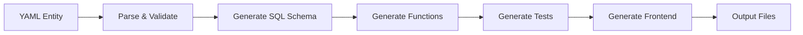

# Generate Commands - Schema and Test Generation

The `specql generate` command creates database schemas, functions, tests, and frontend code from your YAML entity specifications. This guide covers all generation options and use cases.

## 🎯 What You'll Learn

- Schema generation from YAML entities
- Test generation (pgTAP, pytest, performance)
- Frontend code generation
- Advanced generation options
- Multi-environment generation
- Output customization

## 📋 Prerequisites

- [SpecQL installed](../getting-started/installation.md)
- [Entity specifications created](../getting-started/first-entity.md)
- PostgreSQL database (for schema application)
- Understanding of YAML entity format

## 💡 Generation Overview

### What Gets Generated

**From this YAML:**
```yaml
name: user
fields:
  id: uuid
  email: string
  status: string

patterns:
  - name: state_machine
    states: [inactive, active, suspended]
    transitions:
      - from: inactive
        to: active
        trigger: activate
```

**SpecQL generates:**
- **Database Schema** - Tables, functions, constraints
- **Tests** - pgTAP, pytest, performance tests
- **Documentation** - Markdown docs and API references
- **Frontend Code** - TypeScript types, React hooks

### Generation Pipeline



## 🚀 Basic Schema Generation

### Generate Tables and Functions

```bash
# Generate schema for one entity
specql generate schema entities/user.yaml

# Generate schema for multiple entities
specql generate schema entities/user.yaml entities/company.yaml

# Generate schema for all entities
specql generate schema entities/*.yaml
```

**Generated Output:**
```
db/schema/
├── 00_foundation/
│   └── 000_app_foundation.sql     # Types, extensions
├── 10_tables/
│   ├── user.sql                   # User table DDL
│   └── company.sql                # Company table DDL
├── 20_helpers/
│   └── user_helpers.sql           # Helper functions
├── 30_functions/
│   ├── user_state_machine.sql     # Business logic
│   └── user_validation.sql        # Validation rules
└── 40_metadata/
    └── user_metadata.sql          # FraiseQL annotations
```

### Apply Schema to Database

```bash
# Apply foundation first
psql $DATABASE_URL -f db/schema/00_foundation/000_app_foundation.sql

# Apply tables
psql $DATABASE_URL -f db/schema/10_tables/user.sql
psql $DATABASE_URL -f db/schema/10_tables/company.sql

# Apply functions
psql $DATABASE_URL -f db/schema/30_functions/user_state_machine.sql
psql $DATABASE_URL -f db/schema/40_metadata/user_metadata.sql
```

## 🧪 Test Generation

### Generate All Test Types

```bash
# Generate pgTAP, pytest, and performance tests
specql generate tests entities/user.yaml

# Generate only pgTAP tests
specql generate tests --type pgtap entities/user.yaml

# Generate only pytest tests
specql generate tests --type pytest entities/user.yaml

# Generate only performance tests
specql generate tests --type performance entities/user.yaml
```

**Generated Test Structure:**
```
tests/
├── pgtap/
│   ├── user_state_machine_test.sql
│   └── user_validation_test.sql
└── pytest/
    ├── test_user_state_machine.py
    └── test_user_validation.py
```

### Test Generation Options

```bash
# Generate with custom test data
specql generate tests entities/user.yaml --test-data-size large

# Generate tests for specific patterns
specql generate tests entities/user.yaml --patterns state_machine,validation

# Force regeneration (overwrite existing)
specql generate tests entities/user.yaml --force

# Generate with performance benchmarks
specql generate tests entities/user.yaml --include-performance
```

## 🎨 Frontend Code Generation

### Generate TypeScript and React Code

```bash
# Generate frontend code
specql generate entities/user.yaml --output-frontend src/generated

# Generate with GraphQL impacts
specql generate entities/user.yaml --with-impacts --output-frontend src/generated
```

**Generated Frontend Code:**
```
src/generated/
├── types.ts              # TypeScript interfaces
├── mutations.ts          # Apollo GraphQL mutations
├── queries.ts            # Apollo GraphQL queries
├── hooks.ts              # React hooks
└── docs/
    └── user.md           # Generated documentation
```

### Full-Stack Generation

```bash
# Generate everything at once
specql generate entities/*.yaml \
  --with-impacts \
  --output-frontend src/generated \
  --include-docs
```

## ⚙️ Advanced Options

### Environment-Specific Generation

```bash
# Generate for staging environment
specql generate schema entities/*.yaml --env staging

# Generate for production
specql generate schema entities/*.yaml --env production

# Use environment variables
export SPECQL_ENV=production
specql generate schema entities/*.yaml
```

### Output Format Control

```bash
# Flat directory structure
specql generate schema entities/*.yaml --output-format flat

# Hierarchical by organization/domain
specql generate schema entities/*.yaml --output-format hierarchical
```

**Flat Output:**
```
db/schema/10_tables/
├── contact.sql
├── company.sql
└── order.sql
```

**Hierarchical Output:**
```
db/schema/10_tables/
├── CRM/
│   ├── Customer/
│   │   └── 012311_contact.sql
│   └── Account/
│       └── 012312_company.sql
└── Commerce/
    └── Orders/
        └── 042001_order.sql
```

### Selective Generation

```bash
# Generate only foundation
specql generate entities/user.yaml --foundation-only

# Include table views (CQRS)
specql generate entities/user.yaml --include-tv

# Skip metadata generation
specql generate entities/user.yaml --skip-metadata

# Custom output directory
specql generate entities/user.yaml --output-dir custom/schema
```

## 🔧 Generation Configuration

### Config File (`confiture.yaml`)

```yaml
# Generation configuration
generation:
  output_format: hierarchical
  include_impacts: true
  frontend_output: src/generated
  test_types: [pgtap, pytest, performance]

schema_dirs:
  - path: db/schema/00_foundation
    order: 0
  - path: db/schema/10_tables
    order: 10
  - path: db/schema/20_helpers
    order: 20
  - path: db/schema/30_functions
    order: 30
  - path: db/schema/40_metadata
    order: 40

environments:
  local:
    database_url: postgresql://localhost:5432/myapp_dev
    output_format: flat

  staging:
    database_url: ${DATABASE_URL}
    output_format: hierarchical

  production:
    database_url: ${DATABASE_URL}
    output_format: hierarchical
    include_impacts: false  # Skip impacts in prod
```

### Entity-Level Configuration

```yaml
# In your entity YAML
name: user
# ... fields and patterns ...

generation:
  # Skip certain patterns
  skip_patterns: [debug_audit]

  # Custom test configuration
  test_config:
    enabled: true
    types: [pgtap, pytest]
    data_sets:
      - name: premium_users
        count: 100
        template:
          status: premium

  # Frontend generation options
  frontend:
    generate_hooks: true
    generate_types: true
    custom_types:
      - name: UserStatus
        values: [active, inactive, suspended]
```

## 📊 Generation Examples

### E-commerce Schema Generation

```bash
# Generate complete e-commerce schema
specql generate schema \
  entities/user.yaml \
  entities/product.yaml \
  entities/order.yaml \
  entities/cart.yaml \
  --with-impacts \
  --output-frontend src/generated
```

### Multi-Tenant Application

```bash
# Generate tenant-aware schema
specql generate schema \
  entities/tenant.yaml \
  entities/user.yaml \
  entities/organization.yaml \
  --env multi-tenant \
  --include-row-security
```

### API-Only Generation

```bash
# Generate only API-related code
specql generate entities/*.yaml \
  --with-impacts \
  --output-frontend src/api \
  --skip-database-schema
```

## 🔍 Understanding Generated Code

### Table Schema Example

**Generated SQL:**
```sql
-- db/schema/10_tables/user.sql
CREATE TABLE IF NOT EXISTS user (
    id UUID PRIMARY KEY DEFAULT gen_random_uuid(),
    email TEXT NOT NULL UNIQUE,
    first_name TEXT,
    last_name TEXT,
    status TEXT NOT NULL DEFAULT 'inactive'
        CHECK (status IN ('inactive', 'active', 'suspended')),
    created_at TIMESTAMP WITH TIME ZONE DEFAULT NOW(),
    updated_at TIMESTAMP WITH TIME ZONE DEFAULT NOW()
);

-- Indexes
CREATE INDEX idx_user_email ON user(email);
CREATE INDEX idx_user_status ON user(status);
CREATE INDEX idx_user_created_at ON user(created_at);
```

### State Machine Functions

**Generated SQL:**
```sql
-- db/schema/30_functions/user_state_machine.sql
CREATE OR REPLACE FUNCTION user_activate(user_id UUID)
RETURNS user_result AS $$
DECLARE
    result user_result;
    current_status TEXT;
BEGIN
    -- Get current status
    SELECT status INTO current_status
    FROM user WHERE id = user_id;

    -- Validate transition
    IF current_status != 'inactive' THEN
        result.success := false;
        result.message := 'Can only activate from inactive status';
        RETURN result;
    END IF;

    -- Perform transition
    UPDATE user
    SET status = 'active', updated_at = NOW()
    WHERE id = user_id;

    result.success := true;
    result.message := 'User activated successfully';
    RETURN result;
END;
$$ LANGUAGE plpgsql;
```

### Generated Tests

**pgTAP Test:**
```sql
-- tests/pgtap/user_state_machine_test.sql
BEGIN;

-- Setup test data
INSERT INTO user (id, email, status)
VALUES ('test-user-id', 'test@example.com', 'inactive');

-- Test activation
SELECT ok(
    user_activate('test-user-id').success = true,
    'Can activate user from inactive state'
);

SELECT is(
    (SELECT status FROM user WHERE id = 'test-user-id'),
    'active',
    'Status changes to active after activation'
);

ROLLBACK;
```

**pytest Test:**
```python
# tests/pytest/test_user_state_machine.py
def test_user_activation(db_cursor, test_user):
    """Test user activation from inactive state"""

    # Activate user
    result = user_activate(test_user)

    # Verify success
    assert result.success == True

    # Verify state change
    db_cursor.execute(
        "SELECT status FROM user WHERE id = %s",
        (test_user,)
    )
    status = db_cursor.fetchone()[0]
    assert status == 'active'
```

### Frontend TypeScript

**Generated Types:**
```typescript
// src/generated/types.ts
export interface User {
  id: string;
  email: string;
  firstName?: string;
  lastName?: string;
  status: UserStatus;
  createdAt: Date;
  updatedAt: Date;
}

export type UserStatus = 'inactive' | 'active' | 'suspended';

export interface UserResult {
  success: boolean;
  message: string;
  user?: User;
}
```

**Generated React Hooks:**
```typescript
// src/generated/hooks.ts
import { useMutation, useQuery } from '@apollo/client';
import { ACTIVATE_USER, GET_USER } from './mutations';

export function useActivateUser() {
  return useMutation(ACTIVATE_USER, {
    update(cache, { data }) {
      // Update cache after activation
      cache.modify({
        id: cache.identify(data.activateUser.user),
        fields: {
          status() {
            return 'active';
          }
        }
      });
    }
  });
}

export function useUser(id: string) {
  return useQuery(GET_USER, {
    variables: { id },
    fetchPolicy: 'cache-first'
  });
}
```

## 🚀 Generation Workflows

### Development Workflow

```bash
# 1. Edit entity
vim entities/user.yaml

# 2. Validate
specql validate entities/user.yaml

# 3. Generate schema
specql generate schema entities/user.yaml

# 4. Apply to dev database
psql $DATABASE_URL -f db/schema/10_tables/user.sql

# 5. Generate tests
specql generate tests entities/user.yaml

# 6. Run tests
specql test run entities/user.yaml

# 7. Generate frontend (if needed)
specql generate entities/user.yaml --output-frontend src/generated
```

### CI/CD Generation

```yaml
# .github/workflows/generate.yml
name: Generate Schema

on: [push, pull_request]

jobs:
  generate:
    runs-on: ubuntu-latest

    steps:
      - uses: actions/checkout@v4

      - name: Setup Python
        uses: actions/setup-python@v4
        with:
          python-version: '3.11'

      - name: Install SpecQL
        run: pip install specql

      - name: Validate entities
        run: specql validate entities/*.yaml

      - name: Generate schema
        run: specql generate schema entities/*.yaml --env production

      - name: Generate tests
        run: specql generate tests entities/*.yaml

      - name: Upload generated files
        uses: actions/upload-artifact@v3
        with:
          name: generated-schema
          path: |
            db/schema/
            tests/
```

### Multi-Environment Deployment

```bash
# Local development
specql generate schema entities/*.yaml --env local --output-format flat

# Staging deployment
specql generate schema entities/*.yaml --env staging --output-format hierarchical

# Production deployment
specql generate schema entities/*.yaml --env production --output-format hierarchical --skip-debug-code
```

## 🎯 Best Practices

### Generation Strategy
- **Validate first** - Always validate YAML before generating
- **Incremental generation** - Generate only changed entities during development
- **Environment awareness** - Use different settings per environment
- **Version control** - Commit generated files for reproducibility

### Performance Optimization
- **Parallel generation** - Generate multiple entities concurrently
- **Selective generation** - Use `--foundation-only` for database setup
- **Caching** - Cache generated code when possible
- **Incremental updates** - Only regenerate changed components

### Code Organization
- **Consistent naming** - Follow project naming conventions
- **Logical grouping** - Group related entities together
- **Documentation** - Generate docs alongside code
- **Testing** - Generate tests for all generated code

### Maintenance
- **Regenerate regularly** - Keep generated code in sync
- **Review changes** - Check generated code for correctness
- **Backup databases** - Before applying schema changes
- **Test thoroughly** - Validate generated code works correctly

## 🆘 Troubleshooting

### "Generation failed: invalid YAML"
```bash
# Check YAML syntax
specql validate entities/user.yaml --verbose

# Common issues:
# - Indentation errors
# - Unknown field types
# - Invalid pattern configuration
# - Missing required fields
```

### "Database permission denied"
```bash
# Grant necessary permissions
psql $DATABASE_URL -c "GRANT ALL ON SCHEMA public TO specql_user;"

# Check user permissions
psql $DATABASE_URL -c "SELECT current_user;"

# Use superuser for schema changes
sudo -u postgres psql -c "GRANT specql_user TO postgres;"
```

### "Generated code has errors"
```bash
# Check entity specification
specql validate entities/user.yaml --check-impacts

# Regenerate with force
specql generate schema entities/user.yaml --force

# Check for conflicting patterns
# Some patterns may not be compatible
```

### "Frontend generation failed"
```bash
# Check impact declarations
specql validate entities/user.yaml --check-impacts

# Ensure output directory exists
mkdir -p src/generated

# Check write permissions
ls -la src/generated/
```

### "Tests not generating"
```bash
# Force test regeneration
specql generate tests entities/user.yaml --force

# Check test configuration
# Ensure test_config is enabled in YAML

# Verify pattern support
# Some patterns may not support all test types
```

## 📊 Generation Metrics

### Success Metrics
- **Generation time**: <30 seconds for typical projects
- **Success rate**: 100% valid generated code
- **Test coverage**: >95% of generated functions
- **Schema compatibility**: Works with target PostgreSQL version

### Quality Metrics
- **Code consistency**: Uniform formatting and naming
- **Documentation coverage**: All public APIs documented
- **Type safety**: Full TypeScript coverage for frontend
- **Performance**: Generated code meets performance requirements

## 🎉 Summary

The `specql generate` command provides:
- ✅ **Complete code generation** - Schema, tests, and frontend code
- ✅ **Multi-environment support** - Different configs per environment
- ✅ **Flexible output** - Flat or hierarchical organization
- ✅ **Comprehensive testing** - pgTAP, pytest, and performance tests
- ✅ **Full-stack development** - Backend and frontend codegen
- ✅ **CI/CD integration** - Automated generation pipelines

## 🚀 What's Next?

- **[Validate Commands](validate.md)** - YAML validation and checking
- **[Test Commands](test.md)** - Running and managing tests
- **[Performance Commands](performance.md)** - Benchmarking and optimization
- **[Workflows](workflows.md)** - Common development patterns

**Ready to generate production-ready code? Let's explore more commands! 🚀**