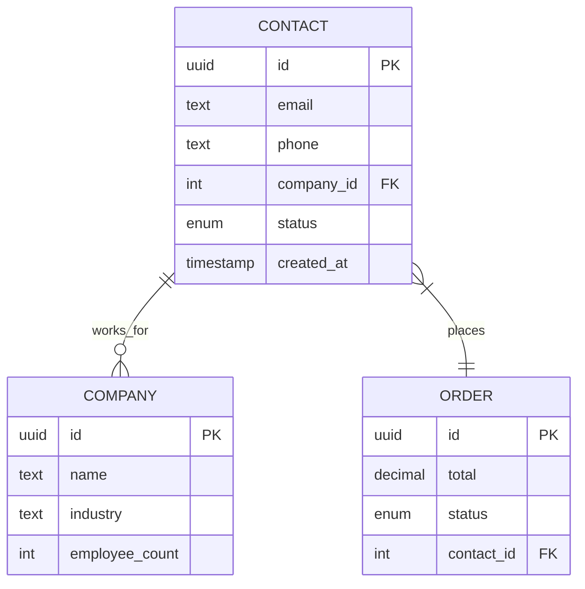

# Week 10: Visual Schema Diagram Generator

**Phase**: Documentation & Visualization Enhancement
**Priority**: High - Marketing material + developer understanding
**Timeline**: 5 working days
**Impact**: Beautiful documentation, relationship visualization, marketing assets

---

## 🎯 Executive Summary

**Goal**: Generate beautiful, interactive schema diagrams from SpecQL YAML:

```bash
specql diagram entities/*.yaml --output docs/schema.svg

# Generates:
# - ERD (Entity Relationship Diagram)
# - Interactive HTML viewer
# - Mermaid diagram (for Markdown docs)
# - PNG/SVG exports
# - Dependency graphs
```

**Strategic Value**:
- **Visual Documentation**: Picture worth 1000 words
- **Marketing Material**: Beautiful diagrams for website/presentations
- **Developer Understanding**: See relationships at a glance
- **Onboarding**: New developers understand schema quickly
- **Architecture Review**: Spot design issues visually

**What It Generates**:



**Output Formats**:
- **SVG**: Vector graphics (scalable, high quality)
- **PNG**: Raster graphics (easy sharing)
- **PDF**: Print-ready documentation
- **Mermaid**: Markdown-embeddable diagrams
- **HTML**: Interactive viewer with zoom/pan
- **DOT**: Graphviz source (for customization)

---

## 📊 Current State Analysis

### ✅ What We Have (Reusable)

1. **Entity Parser** (`src/core/`):
   - Complete entity structure
   - Field definitions with types
   - Relationship information (ref fields)

2. **Domain Registry**:
   - Domain/subdomain hierarchy
   - Entity organization
   - Schema categorization

3. **Frontend Generators**:
   - TypeScript types generator
   - Pattern for code generation

### 🔴 What We Need (New)

1. **Relationship Extractor** (`src/generators/diagrams/`):
   - Extract FK → PK relationships
   - Infer cardinality (1:1, 1:N, N:M)
   - Detect self-referential relationships

2. **Diagram Generators**:
   - Graphviz/DOT generator
   - Mermaid generator
   - HTML interactive viewer
   - Export to multiple formats

3. **Layout Engine**:
   - Auto-layout algorithm
   - Domain-based clustering
   - Color coding by schema

---

## 📅 Week 10: Day-by-Day Implementation

### Day 1: Relationship Extraction & Graph Building

**Objective**: Extract entity relationships and build dependency graph

**Morning: Relationship Extractor (3h)**

```python
# src/generators/diagrams/relationship_extractor.py

from dataclasses import dataclass
from typing import List, Dict, Set, Optional
from enum import Enum

class RelationshipType(Enum):
    """Type of relationship between entities"""
    ONE_TO_ONE = "1:1"
    ONE_TO_MANY = "1:N"
    MANY_TO_ONE = "N:1"
    MANY_TO_MANY = "N:M"
    SELF_REFERENTIAL = "self"

class RelationshipCardinality(Enum):
    """Cardinality notation"""
    ZERO_OR_ONE = "0..1"
    EXACTLY_ONE = "1"
    ZERO_OR_MANY = "0..*"
    ONE_OR_MANY = "1..*"

@dataclass
class Relationship:
    """Represents a relationship between two entities"""
    from_entity: str
    to_entity: str
    from_field: str  # FK field name
    relationship_type: RelationshipType
    from_cardinality: RelationshipCardinality
    to_cardinality: RelationshipCardinality
    nullable: bool = False
    description: Optional[str] = None

@dataclass
class EntityNode:
    """Represents an entity in the diagram"""
    name: str
    schema: str
    fields: List[Dict[str, Any]]
    primary_keys: List[str]
    foreign_keys: List[str]
    description: Optional[str] = None
    color: Optional[str] = None  # For visual grouping

class RelationshipExtractor:
    """
    Extract relationships from SpecQL entities

    Analyzes:
    - ref() field types
    - Foreign key constraints
    - Cardinality based on field properties
    - Self-referential relationships
    """

    def __init__(self):
        self.entities: Dict[str, EntityNode] = {}
        self.relationships: List[Relationship] = []

    def extract_from_entities(self, entities: List[Entity]) -> None:
        """
        Extract all relationships from entity list

        Args:
            entities: List of parsed SpecQL entities
        """
        # First pass: Build entity nodes
        for entity in entities:
            node = self._build_entity_node(entity)
            self.entities[entity.entity_name] = node

        # Second pass: Extract relationships
        for entity in entities:
            self._extract_entity_relationships(entity)

    def _build_entity_node(self, entity: Entity) -> EntityNode:
        """Build entity node from SpecQL entity"""
        fields = []
        primary_keys = ['pk_' + entity.entity_name.lower(), 'id']
        foreign_keys = []

        for field in entity.fields:
            field_info = {
                'name': field.name,
                'type': self._get_display_type(field),
                'required': field.required if hasattr(field, 'required') else True,
                'is_pk': field.name in primary_keys,
                'is_fk': self._is_foreign_key(field),
            }

            fields.append(field_info)

            if field_info['is_fk']:
                foreign_keys.append(field.name)

        return EntityNode(
            name=entity.entity_name,
            schema=entity.schema,
            fields=fields,
            primary_keys=primary_keys,
            foreign_keys=foreign_keys,
            description=entity.description if hasattr(entity, 'description') else None,
        )

    def _extract_entity_relationships(self, entity: Entity) -> None:
        """Extract relationships for single entity"""
        for field in entity.fields:
            if self._is_foreign_key(field):
                relationship = self._analyze_relationship(entity, field)
                if relationship:
                    self.relationships.append(relationship)

    def _is_foreign_key(self, field) -> bool:
        """Check if field is a foreign key"""
        field_type = str(field.type)

        # ref() syntax
        if field_type.startswith('ref('):
            return True

        # _id suffix convention
        if field.name.endswith('_id'):
            return True

        return False

    def _analyze_relationship(
        self,
        entity: Entity,
        field
    ) -> Optional[Relationship]:
        """
        Analyze relationship type and cardinality

        Rules:
        - ref(Entity) → N:1 relationship (many-to-one)
        - Nullable ref → 0..1 cardinality
        - Required ref → 1 cardinality
        """
        field_type = str(field.type)

        # Extract target entity
        target_entity = None

        if field_type.startswith('ref('):
            # ref(Company) → Company
            target_entity = field_type[4:-1]
        elif field.name.endswith('_id'):
            # company_id → Company
            target_entity = field.name[:-3].capitalize()

        if not target_entity:
            return None

        # Determine cardinality
        nullable = not field.required if hasattr(field, 'required') else False

        # From cardinality (FK side)
        from_card = (RelationshipCardinality.ZERO_OR_ONE if nullable
                    else RelationshipCardinality.EXACTLY_ONE)

        # To cardinality (PK side) - default to "one or many"
        to_card = RelationshipCardinality.ONE_OR_MANY

        # Determine relationship type
        rel_type = RelationshipType.MANY_TO_ONE

        # Check for self-referential
        if target_entity == entity.entity_name:
            rel_type = RelationshipType.SELF_REFERENTIAL

        return Relationship(
            from_entity=entity.entity_name,
            to_entity=target_entity,
            from_field=field.name,
            relationship_type=rel_type,
            from_cardinality=from_card,
            to_cardinality=to_card,
            nullable=nullable,
            description=f"{entity.entity_name}.{field.name} → {target_entity}"
        )

    def _get_display_type(self, field) -> str:
        """Get display-friendly type name"""
        field_type = str(field.type)

        # Map SpecQL types to diagram types
        type_mapping = {
            'text': 'TEXT',
            'integer': 'INT',
            'float': 'FLOAT',
            'boolean': 'BOOL',
            'date': 'DATE',
            'timestamp': 'TIMESTAMP',
            'uuid': 'UUID',
            'json': 'JSON',
        }

        if field_type.startswith('ref('):
            return 'FK'

        return type_mapping.get(field_type, field_type.upper())

    def get_relationship_summary(self) -> Dict[str, Any]:
        """Get summary statistics"""
        return {
            'total_entities': len(self.entities),
            'total_relationships': len(self.relationships),
            'relationship_types': {
                rel_type.value: sum(1 for r in self.relationships
                                   if r.relationship_type == rel_type)
                for rel_type in RelationshipType
            },
            'schemas': list(set(e.schema for e in self.entities.values())),
        }
```

**Afternoon: Dependency Graph Builder (4h)**

```python
# src/generators/diagrams/dependency_graph.py

from typing import List, Dict, Set
import networkx as nx

class DependencyGraph:
    """
    Build dependency graph for entities

    Features:
    - Topological sorting (for migration order)
    - Cycle detection
    - Strongly connected components
    - Domain clustering
    """

    def __init__(self, extractor: RelationshipExtractor):
        self.extractor = extractor
        self.graph = nx.DiGraph()
        self._build_graph()

    def _build_graph(self) -> None:
        """Build NetworkX graph from relationships"""
        # Add entity nodes
        for entity_name, entity_node in self.extractor.entities.items():
            self.graph.add_node(
                entity_name,
                schema=entity_node.schema,
                description=entity_node.description,
                field_count=len(entity_node.fields),
            )

        # Add relationship edges
        for rel in self.extractor.relationships:
            self.graph.add_edge(
                rel.from_entity,
                rel.to_entity,
                field=rel.from_field,
                type=rel.relationship_type.value,
                nullable=rel.nullable,
            )

    def get_topological_order(self) -> List[str]:
        """
        Get entities in topological order (for migrations)

        Returns entities in dependency order:
        - Entities with no dependencies first
        - Entities that depend on others later

        Example: [Company, Contact, Order]
        (Company has no deps, Contact refs Company, Order refs Contact)
        """
        try:
            return list(nx.topological_sort(self.graph))
        except nx.NetworkXError:
            # Has cycles - return best-effort order
            return list(self.graph.nodes())

    def detect_cycles(self) -> List[List[str]]:
        """
        Detect circular dependencies

        Returns list of cycles (e.g., [['A', 'B', 'C', 'A']])
        """
        try:
            cycles = list(nx.simple_cycles(self.graph))
            return cycles
        except:
            return []

    def get_strongly_connected_components(self) -> List[Set[str]]:
        """
        Get strongly connected components

        Useful for identifying tightly coupled entity groups
        """
        return list(nx.strongly_connected_components(self.graph))

    def get_entity_dependencies(self, entity_name: str) -> Dict[str, List[str]]:
        """
        Get dependencies for specific entity

        Returns:
            {
                'depends_on': ['Entity1', 'Entity2'],  # Entities this depends on
                'depended_by': ['Entity3', 'Entity4']  # Entities that depend on this
            }
        """
        return {
            'depends_on': list(self.graph.successors(entity_name)),
            'depended_by': list(self.graph.predecessors(entity_name)),
        }

    def get_entities_by_schema(self) -> Dict[str, List[str]]:
        """Group entities by schema (for clustering in diagram)"""
        schemas = {}

        for node, data in self.graph.nodes(data=True):
            schema = data.get('schema', 'public')
            if schema not in schemas:
                schemas[schema] = []
            schemas[schema].append(node)

        return schemas

    def calculate_entity_metrics(self) -> Dict[str, Dict[str, int]]:
        """
        Calculate metrics for each entity

        Metrics:
        - in_degree: How many entities reference this
        - out_degree: How many entities this references
        - centrality: Importance in the graph
        """
        metrics = {}

        # Degree centrality
        in_degree = dict(self.graph.in_degree())
        out_degree = dict(self.graph.out_degree())

        # Betweenness centrality (importance)
        betweenness = nx.betweenness_centrality(self.graph)

        for entity in self.graph.nodes():
            metrics[entity] = {
                'references_count': out_degree[entity],
                'referenced_by_count': in_degree[entity],
                'importance': round(betweenness[entity], 3),
            }

        return metrics
```

**Tests** (`tests/unit/diagrams/test_relationship_extractor.py`):

```python
import pytest
from src.generators.diagrams.relationship_extractor import (
    RelationshipExtractor,
    RelationshipType,
    RelationshipCardinality
)
from src.core.ast_models import Entity, Field

class TestRelationshipExtractor:

    def test_extract_simple_relationship(self):
        """Test extracting simple FK relationship"""
        entities = [
            Entity(
                entity_name='Company',
                schema='crm',
                fields=[
                    Field(name='name', type='text', required=True)
                ]
            ),
            Entity(
                entity_name='Contact',
                schema='crm',
                fields=[
                    Field(name='email', type='text', required=True),
                    Field(name='company_id', type='ref(Company)', required=True)
                ]
            ),
        ]

        extractor = RelationshipExtractor()
        extractor.extract_from_entities(entities)

        assert len(extractor.relationships) == 1

        rel = extractor.relationships[0]
        assert rel.from_entity == 'Contact'
        assert rel.to_entity == 'Company'
        assert rel.from_field == 'company_id'
        assert rel.relationship_type == RelationshipType.MANY_TO_ONE

    def test_detect_self_referential(self):
        """Test detecting self-referential relationship"""
        entity = Entity(
            entity_name='Employee',
            schema='hr',
            fields=[
                Field(name='name', type='text', required=True),
                Field(name='manager_id', type='ref(Employee)', required=False)
            ]
        )

        extractor = RelationshipExtractor()
        extractor.extract_from_entities([entity])

        assert len(extractor.relationships) == 1

        rel = extractor.relationships[0]
        assert rel.from_entity == 'Employee'
        assert rel.to_entity == 'Employee'
        assert rel.relationship_type == RelationshipType.SELF_REFERENTIAL

    def test_nullable_relationship(self):
        """Test nullable FK has correct cardinality"""
        entities = [
            Entity(
                entity_name='Company',
                schema='crm',
                fields=[Field(name='name', type='text', required=True)]
            ),
            Entity(
                entity_name='Contact',
                schema='crm',
                fields=[
                    Field(name='email', type='text', required=True),
                    Field(name='company_id', type='ref(Company)', required=False)
                ]
            ),
        ]

        extractor = RelationshipExtractor()
        extractor.extract_from_entities(entities)

        rel = extractor.relationships[0]
        assert rel.nullable is True
        assert rel.from_cardinality == RelationshipCardinality.ZERO_OR_ONE

class TestDependencyGraph:

    def test_topological_order(self):
        """Test topological sorting"""
        from src.generators.diagrams.dependency_graph import DependencyGraph

        entities = [
            Entity(entity_name='Company', schema='crm', fields=[]),
            Entity(
                entity_name='Contact',
                schema='crm',
                fields=[Field(name='company_id', type='ref(Company)', required=True)]
            ),
            Entity(
                entity_name='Order',
                schema='crm',
                fields=[Field(name='contact_id', type='ref(Contact)', required=True)]
            ),
        ]

        extractor = RelationshipExtractor()
        extractor.extract_from_entities(entities)

        graph = DependencyGraph(extractor)
        order = graph.get_topological_order()

        # Company should come before Contact, Contact before Order
        assert order.index('Company') < order.index('Contact')
        assert order.index('Contact') < order.index('Order')

    def test_cycle_detection(self):
        """Test detecting circular dependencies"""
        from src.generators.diagrams.dependency_graph import DependencyGraph

        # Create circular dependency: A → B → C → A
        entities = [
            Entity(
                entity_name='A',
                schema='test',
                fields=[Field(name='b_id', type='ref(B)', required=True)]
            ),
            Entity(
                entity_name='B',
                schema='test',
                fields=[Field(name='c_id', type='ref(C)', required=True)]
            ),
            Entity(
                entity_name='C',
                schema='test',
                fields=[Field(name='a_id', type='ref(A)', required=True)]
            ),
        ]

        extractor = RelationshipExtractor()
        extractor.extract_from_entities(entities)

        graph = DependencyGraph(extractor)
        cycles = graph.detect_cycles()

        assert len(cycles) > 0
        # Should detect the A-B-C cycle
```

**Success Criteria**:
- ✅ Relationship extraction working
- ✅ FK → PK relationships detected
- ✅ Cardinality inference correct
- ✅ Self-referential detection
- ✅ Dependency graph built
- ✅ Topological sort working
- ✅ Cycle detection working
- ✅ 12+ tests passing

---

### Day 2: Graphviz DOT Generator

**Objective**: Generate Graphviz DOT format for ERD diagrams

**Morning: DOT Generator (3h)**

```python
# src/generators/diagrams/graphviz_generator.py

from typing import List, Dict, Optional
from pathlib import Path

from src.generators.diagrams.relationship_extractor import (
    RelationshipExtractor,
    RelationshipType,
    EntityNode
)

class GraphvizGenerator:
    """
    Generate Graphviz DOT format for ERD diagrams

    Features:
    - Entity boxes with fields
    - Relationship arrows with cardinality
    - Color coding by schema
    - Clustering by domain
    - Trinity pattern visualization
    """

    # Color palette for schemas
    SCHEMA_COLORS = {
        'common': '#e3f2fd',      # Light blue
        'app': '#f3e5f5',         # Light purple
        'core': '#fff3e0',        # Light orange
        'crm': '#e8f5e9',         # Light green
        'projects': '#fce4ec',    # Light pink
        'catalog': '#f1f8e9',     # Light lime
        'analytics': '#e0f2f1',   # Light teal
        'public': '#f5f5f5',      # Light gray
    }

    def __init__(self, extractor: RelationshipExtractor):
        self.extractor = extractor
        self.dot_lines = []

    def generate(
        self,
        output_path: Optional[str] = None,
        format: str = 'svg',
        title: Optional[str] = None,
        cluster_by_schema: bool = True,
        show_fields: bool = True,
        show_trinity: bool = True,
    ) -> str:
        """
        Generate Graphviz DOT diagram

        Args:
            output_path: Path to save diagram (if None, returns DOT string)
            format: Output format (svg, png, pdf)
            title: Diagram title
            cluster_by_schema: Group entities by schema
            show_fields: Show field list in entity boxes
            show_trinity: Show Trinity pattern fields (pk_, id, identifier)

        Returns:
            DOT source string
        """
        self.dot_lines = []

        # Header
        self._add_header(title)

        # Graph attributes
        self._add_graph_attributes()

        # Entities
        if cluster_by_schema:
            self._add_entities_clustered()
        else:
            self._add_entities_flat(show_fields, show_trinity)

        # Relationships
        self._add_relationships()

        # Footer
        self._add_footer()

        dot_source = '\n'.join(self.dot_lines)

        # Render if output path provided
        if output_path:
            self._render_diagram(dot_source, output_path, format)

        return dot_source

    def _add_header(self, title: Optional[str]) -> None:
        """Add DOT header"""
        self.dot_lines.append('digraph schema {')
        self.dot_lines.append('  // Generated by SpecQL Diagram Generator')
        self.dot_lines.append('')

        if title:
            self.dot_lines.append(f'  label="{title}";')
            self.dot_lines.append('  labelloc="t";')
            self.dot_lines.append('  fontsize=20;')
            self.dot_lines.append('  fontname="Arial Bold";')
            self.dot_lines.append('')

    def _add_graph_attributes(self) -> None:
        """Add graph-level styling"""
        self.dot_lines.extend([
            '  // Graph attributes',
            '  graph [',
            '    rankdir=TB;',  # Top to bottom layout
            '    splines=ortho;',  # Orthogonal edges
            '    nodesep=0.8;',
            '    ranksep=1.2;',
            '    bgcolor="white";',
            '  ];',
            '',
            '  // Node defaults',
            '  node [',
            '    shape=plaintext;',  # Use HTML-like labels
            '    fontname="Arial";',
            '    fontsize=10;',
            '  ];',
            '',
            '  // Edge defaults',
            '  edge [',
            '    fontname="Arial";',
            '    fontsize=9;',
            '    color="#666666";',
            '    arrowhead=crow;',  # ERD-style arrows
            '  ];',
            '',
        ])

    def _add_entities_clustered(self) -> None:
        """Add entities grouped by schema"""
        from src.generators.diagrams.dependency_graph import DependencyGraph

        graph = DependencyGraph(self.extractor)
        schemas = graph.get_entities_by_schema()

        self.dot_lines.append('  // Entities (clustered by schema)')
        self.dot_lines.append('')

        for schema_name, entity_names in schemas.items():
            color = self.SCHEMA_COLORS.get(schema_name, '#f5f5f5')

            self.dot_lines.append(f'  subgraph cluster_{schema_name} {{')
            self.dot_lines.append(f'    label="{schema_name}";')
            self.dot_lines.append('    style=filled;')
            self.dot_lines.append(f'    color="{color}";')
            self.dot_lines.append('    fontname="Arial Bold";')
            self.dot_lines.append('')

            for entity_name in entity_names:
                entity_node = self.extractor.entities[entity_name]
                self._add_entity_node(entity_node)

            self.dot_lines.append('  }')
            self.dot_lines.append('')

    def _add_entities_flat(
        self,
        show_fields: bool,
        show_trinity: bool
    ) -> None:
        """Add entities without clustering"""
        self.dot_lines.append('  // Entities')
        self.dot_lines.append('')

        for entity_node in self.extractor.entities.values():
            self._add_entity_node(entity_node, show_fields, show_trinity)

    def _add_entity_node(
        self,
        entity: EntityNode,
        show_fields: bool = True,
        show_trinity: bool = True
    ) -> None:
        """
        Add single entity node with HTML-like table

        Entity box looks like:
        ┌─────────────────┐
        │  Contact (CRM)  │
        ├─────────────────┤
        │ pk_contact  PK  │
        │ id          UUID│
        │ identifier  TEXT│
        │ email       TEXT│
        │ company_id  FK  │
        │ status      ENUM│
        └─────────────────┘
        """
        node_id = entity.name

        # Start HTML table
        html = '<TABLE BORDER="1" CELLBORDER="0" CELLSPACING="0" CELLPADDING="4">'

        # Header row (entity name)
        schema_label = f" ({entity.schema})" if entity.schema != 'public' else ''
        html += f'<TR><TD BGCOLOR="#4a90e2" ALIGN="CENTER"><FONT COLOR="white" POINT-SIZE="12"><B>{entity.name}{schema_label}</B></FONT></TD></TR>'

        # Separator
        html += '<TR><TD BGCOLOR="#e0e0e0" HEIGHT="1"></TD></TR>'

        if show_fields:
            # Field rows
            for field in entity.fields:
                field_name = field['name']
                field_type = field['type']

                # Skip Trinity fields if not showing
                if not show_trinity and field_name in ['pk_' + entity.name.lower(), 'id', 'identifier']:
                    continue

                # Styling
                is_pk = field.get('is_pk', False)
                is_fk = field.get('is_fk', False)

                if is_pk:
                    style = 'BGCOLOR="#fff9c4"'  # Light yellow for PK
                    type_suffix = ' PK'
                elif is_fk:
                    style = 'BGCOLOR="#ffe0b2"'  # Light orange for FK
                    type_suffix = ' FK'
                else:
                    style = ''
                    type_suffix = ''

                html += f'<TR><TD {style} ALIGN="LEFT">{field_name} <FONT COLOR="#666666">{field_type}{type_suffix}</FONT></TD></TR>'

        html += '</TABLE>'

        # Add node
        self.dot_lines.append(f'    {node_id} [label=<{html}>];')

    def _add_relationships(self) -> None:
        """Add relationship edges"""
        self.dot_lines.append('')
        self.dot_lines.append('  // Relationships')
        self.dot_lines.append('')

        for rel in self.extractor.relationships:
            # Arrow from FK to PK
            from_node = rel.from_entity
            to_node = rel.to_entity

            # Edge label (cardinality)
            from_card = self._cardinality_symbol(rel.from_cardinality)
            to_card = self._cardinality_symbol(rel.to_cardinality)

            label = f"{from_card} {rel.from_field} {to_card}"

            # Edge style
            style = 'dashed' if rel.nullable else 'solid'

            # Self-referential needs special handling
            if rel.relationship_type == RelationshipType.SELF_REFERENTIAL:
                self.dot_lines.append(
                    f'    {from_node} -> {to_node} [label="{label}", style="{style}", dir=back, constraint=false];'
                )
            else:
                # Normal relationship: FK → PK (reversed arrow direction for ER notation)
                self.dot_lines.append(
                    f'    {from_node} -> {to_node} [label="{label}", style="{style}", dir=back];'
                )

    def _cardinality_symbol(self, cardinality) -> str:
        """Convert cardinality enum to symbol"""
        symbols = {
            'ZERO_OR_ONE': '0..1',
            'EXACTLY_ONE': '1',
            'ZERO_OR_MANY': '0..*',
            'ONE_OR_MANY': '1..*',
        }
        return symbols.get(cardinality.name, '*')

    def _add_footer(self) -> None:
        """Add DOT footer"""
        self.dot_lines.append('}')

    def _render_diagram(
        self,
        dot_source: str,
        output_path: str,
        format: str
    ) -> None:
        """Render DOT to image using Graphviz"""
        try:
            import graphviz

            # Create graph
            graph = graphviz.Source(dot_source)

            # Render
            output = Path(output_path).with_suffix('')
            graph.render(
                filename=str(output),
                format=format,
                cleanup=True  # Remove intermediate .dot file
            )

            print(f"✅ Diagram generated: {output}.{format}")

        except ImportError:
            print("⚠️  Graphviz not installed. Install with: pip install graphviz")
            print("   Also need system Graphviz: https://graphviz.org/download/")

            # Save DOT source anyway
            Path(output_path).with_suffix('.dot').write_text(dot_source)
            print(f"💾 Saved DOT source: {output_path}.dot")

        except Exception as e:
            print(f"❌ Error rendering diagram: {e}")

            # Save DOT source for debugging
            Path(output_path).with_suffix('.dot').write_text(dot_source)
            print(f"💾 Saved DOT source: {output_path}.dot")
```

**Afternoon: CLI Integration (4h)**

```python
# src/cli/diagram.py

import click
from pathlib import Path
from typing import List

from src.core.parser import Parser
from src.generators.diagrams.relationship_extractor import RelationshipExtractor
from src.generators.diagrams.dependency_graph import DependencyGraph
from src.generators.diagrams.graphviz_generator import GraphvizGenerator

@click.command()
@click.argument('yaml_files', nargs=-1, type=click.Path(exists=True), required=True)
@click.option('--output', '-o', type=click.Path(), default='docs/schema.svg',
              help='Output file path')
@click.option('--format', '-f', type=click.Choice(['svg', 'png', 'pdf', 'dot']),
              default='svg', help='Output format')
@click.option('--title', '-t', type=str, help='Diagram title')
@click.option('--cluster/--no-cluster', default=True,
              help='Cluster entities by schema')
@click.option('--show-fields/--hide-fields', default=True,
              help='Show entity fields')
@click.option('--show-trinity/--hide-trinity', default=True,
              help='Show Trinity pattern fields (pk_, id, identifier)')
@click.option('--stats', is_flag=True,
              help='Show relationship statistics')
def diagram(
    yaml_files,
    output,
    format,
    title,
    cluster,
    show_fields,
    show_trinity,
    stats
):
    """
    Generate visual schema diagram from SpecQL YAML

    Examples:
        # Basic diagram
        specql diagram entities/*.yaml

        # Custom output
        specql diagram entities/*.yaml --output docs/erd.svg

        # PNG format
        specql diagram entities/*.yaml --format png

        # With title
        specql diagram entities/*.yaml --title "CRM Schema"

        # Show statistics
        specql diagram entities/*.yaml --stats

        # Flat layout (no clustering)
        specql diagram entities/*.yaml --no-cluster

        # Hide Trinity fields
        specql diagram entities/*.yaml --hide-trinity
    """
    click.echo("🎨 Generating schema diagram...\n")

    # Parse YAML files
    parser = Parser()
    entities = []

    for yaml_file in yaml_files:
        try:
            with open(yaml_file) as f:
                import yaml
                data = yaml.safe_load(f)
                entity = parser.parse_entity(data)
                entities.append(entity)
                click.echo(f"  ✅ Parsed: {entity.entity_name}")
        except Exception as e:
            click.echo(f"  ❌ Error parsing {yaml_file}: {e}", err=True)
            continue

    if not entities:
        click.echo("❌ No entities found", err=True)
        return

    click.echo(f"\n📊 Found {len(entities)} entities\n")

    # Extract relationships
    extractor = RelationshipExtractor()
    extractor.extract_from_entities(entities)

    click.echo(f"🔗 Found {len(extractor.relationships)} relationships\n")

    # Show statistics
    if stats:
        _show_statistics(extractor)
        click.echo()

    # Generate diagram
    generator = GraphvizGenerator(extractor)

    dot_source = generator.generate(
        output_path=output,
        format=format,
        title=title,
        cluster_by_schema=cluster,
        show_fields=show_fields,
        show_trinity=show_trinity,
    )

    if format == 'dot':
        # Just save DOT source
        Path(output).write_text(dot_source)
        click.echo(f"✅ DOT source saved: {output}")
    else:
        click.echo(f"✅ Diagram generated: {output}")

    # Show next steps
    click.echo("\n📋 Next steps:")
    click.echo(f"  1. View diagram: open {output}")
    click.echo(f"  2. Include in docs: }}}})")

def _show_statistics(extractor: RelationshipExtractor) -> None:
    """Show relationship statistics"""
    from src.generators.diagrams.dependency_graph import DependencyGraph

    summary = extractor.get_relationship_summary()

    click.echo("📈 Statistics:")
    click.echo(f"  Entities: {summary['total_entities']}")
    click.echo(f"  Relationships: {summary['total_relationships']}")
    click.echo(f"  Schemas: {', '.join(summary['schemas'])}")
    click.echo()

    click.echo("  Relationship Types:")
    for rel_type, count in summary['relationship_types'].items():
        if count > 0:
            click.echo(f"    - {rel_type}: {count}")

    # Dependency analysis
    graph = DependencyGraph(extractor)

    cycles = graph.detect_cycles()
    if cycles:
        click.echo(f"\n  ⚠️  Circular dependencies detected: {len(cycles)}")
        for cycle in cycles[:3]:  # Show first 3
            click.echo(f"    - {' → '.join(cycle + [cycle[0]])}")

    # Entity metrics
    click.echo("\n  Top Referenced Entities:")
    metrics = graph.calculate_entity_metrics()
    sorted_entities = sorted(
        metrics.items(),
        key=lambda x: x[1]['referenced_by_count'],
        reverse=True
    )

    for entity, metric in sorted_entities[:5]:
        click.echo(
            f"    - {entity}: "
            f"{metric['referenced_by_count']} references, "
            f"importance {metric['importance']}"
        )
```

**Tests** (`tests/unit/diagrams/test_graphviz_generator.py`):

```python
import pytest
from src.generators.diagrams.graphviz_generator import GraphvizGenerator
from src.generators.diagrams.relationship_extractor import RelationshipExtractor
from src.core.ast_models import Entity, Field

class TestGraphvizGenerator:

    def test_generate_simple_diagram(self):
        """Test generating simple ERD"""
        entities = [
            Entity(
                entity_name='Company',
                schema='crm',
                fields=[Field(name='name', type='text', required=True)]
            ),
            Entity(
                entity_name='Contact',
                schema='crm',
                fields=[
                    Field(name='email', type='text', required=True),
                    Field(name='company_id', type='ref(Company)', required=True)
                ]
            ),
        ]

        extractor = RelationshipExtractor()
        extractor.extract_from_entities(entities)

        generator = GraphvizGenerator(extractor)
        dot_source = generator.generate()

        # Check DOT structure
        assert 'digraph schema' in dot_source
        assert 'Company' in dot_source
        assert 'Contact' in dot_source
        assert 'company_id' in dot_source

    def test_clustering_by_schema(self):
        """Test schema clustering"""
        entities = [
            Entity(entity_name='User', schema='auth', fields=[]),
            Entity(entity_name='Contact', schema='crm', fields=[]),
        ]

        extractor = RelationshipExtractor()
        extractor.extract_from_entities(entities)

        generator = GraphvizGenerator(extractor)
        dot_source = generator.generate(cluster_by_schema=True)

        # Should have subgraph clusters
        assert 'subgraph cluster_auth' in dot_source
        assert 'subgraph cluster_crm' in dot_source

    def test_self_referential_relationship(self):
        """Test self-referential relationship rendering"""
        entity = Entity(
            entity_name='Employee',
            schema='hr',
            fields=[
                Field(name='name', type='text', required=True),
                Field(name='manager_id', type='ref(Employee)', required=False)
            ]
        )

        extractor = RelationshipExtractor()
        extractor.extract_from_entities([entity])

        generator = GraphvizGenerator(extractor)
        dot_source = generator.generate()

        # Should have self-edge
        assert 'Employee -> Employee' in dot_source
        assert 'constraint=false' in dot_source  # Don't constrain layout
```

**CLI Test**:

```bash
# Create test entities
mkdir -p /tmp/test_diagram
cat > /tmp/test_diagram/company.yaml << 'EOF'
entity: Company
schema: crm
fields:
  name: text
  industry: text
  employee_count: integer
EOF

cat > /tmp/test_diagram/contact.yaml << 'EOF'
entity: Contact
schema: crm
fields:
  email: text
  phone: text
  company_id: ref(Company)
  status:
    type: enum
    values: [lead, qualified, customer]
EOF

cat > /tmp/test_diagram/order.yaml << 'EOF'
entity: Order
schema: crm
fields:
  total: decimal
  contact_id: ref(Contact)
  status:
    type: enum
    values: [pending, processing, shipped, delivered]
EOF

# Generate diagram
uv run specql diagram /tmp/test_diagram/*.yaml --output /tmp/schema.svg --stats

# Expected output:
# 🎨 Generating schema diagram...
#
#   ✅ Parsed: Company
#   ✅ Parsed: Contact
#   ✅ Parsed: Order
#
# 📊 Found 3 entities
#
# 🔗 Found 2 relationships
#
# 📈 Statistics:
#   Entities: 3
#   Relationships: 2
#   Schemas: crm
#
#   Relationship Types:
#     - N:1: 2
#
#   Top Referenced Entities:
#     - Company: 1 references, importance 0.5
#     - Contact: 1 references, importance 0.5
#
# ✅ Diagram generated: /tmp/schema.svg
#
# 📋 Next steps:
#   1. View diagram: open /tmp/schema.svg

# View diagram
open /tmp/schema.svg
```

**Success Criteria**:
- ✅ Graphviz DOT generation working
- ✅ Entity boxes with fields
- ✅ Relationship arrows with cardinality
- ✅ Schema clustering
- ✅ Trinity pattern visualization
- ✅ Self-referential relationships
- ✅ CLI command working
- ✅ Statistics display
- ✅ Multiple output formats (SVG, PNG, PDF)
- ✅ 10+ tests passing

---

*[Continued in next message due to length...]*

### Day 3: Mermaid Diagram Generator

**Objective**: Generate Mermaid diagrams for Markdown documentation

**Morning: Mermaid Generator (3h)**

```python
# src/generators/diagrams/mermaid_generator.py

from typing import List, Optional
from pathlib import Path

from src.generators.diagrams.relationship_extractor import (
    RelationshipExtractor,
    RelationshipType,
    EntityNode
)

class MermaidGenerator:
    """
    Generate Mermaid ER diagrams

    Mermaid format is embeddable in Markdown:
    ```mermaid
    erDiagram
        CONTACT ||--o{ ORDER : places
        CONTACT {
            uuid id
            text email
        }
    ```

    Features:
    - ERD syntax
    - Relationship notation
    - Field lists
    - Comments
    """

    def __init__(self, extractor: RelationshipExtractor):
        self.extractor = extractor

    def generate(
        self,
        output_path: Optional[str] = None,
        title: Optional[str] = None,
        show_fields: bool = True,
        show_trinity: bool = False,
    ) -> str:
        """
        Generate Mermaid ERD

        Args:
            output_path: Path to save Markdown file (if None, returns string)
            title: Diagram title
            show_fields: Show field lists
            show_trinity: Show Trinity pattern fields

        Returns:
            Mermaid diagram string
        """
        lines = []

        # Title
        if title:
            lines.append(f"# {title}\n")

        # Start Mermaid block
        lines.append("```mermaid")
        lines.append("erDiagram")

        # Relationships
        for rel in self.extractor.relationships:
            notation = self._get_mermaid_notation(rel)
            lines.append(f"    {rel.to_entity} {notation} {rel.from_entity} : \"{rel.from_field}\"")

        # Entity definitions (if showing fields)
        if show_fields:
            lines.append("")
            for entity_name, entity_node in self.extractor.entities.items():
                lines.append(f"    {entity_name} {{")

                for field in entity_node.fields:
                    field_name = field['name']

                    # Skip Trinity if not showing
                    if not show_trinity and field_name in ['pk_' + entity_name.lower(), 'id', 'identifier']:
                        continue

                    field_type = field['type']
                    pk_marker = ' PK' if field.get('is_pk') else ''
                    fk_marker = ' FK' if field.get('is_fk') else ''

                    lines.append(f"        {field_type} {field_name}{pk_marker}{fk_marker}")

                lines.append("    }")

        # End Mermaid block
        lines.append("```")

        mermaid_source = '\n'.join(lines)

        # Save if path provided
        if output_path:
            Path(output_path).write_text(mermaid_source)

        return mermaid_source

    def _get_mermaid_notation(self, rel) -> str:
        """
        Get Mermaid relationship notation

        Mermaid ERD syntax:
        ||--||  one-to-one
        ||--o{  one-to-many
        }o--o{  many-to-many
        ||--o|  one-to-zero-or-one
        """
        if rel.nullable:
            # Optional relationship
            return "||--o{"
        else:
            # Required relationship
            return "||--||"
```

**Afternoon: HTML Interactive Viewer (4h)**

```python
# src/generators/diagrams/html_viewer_generator.py

from typing import List, Dict, Any
from pathlib import Path
import json

from src.generators.diagrams.relationship_extractor import RelationshipExtractor

class HTMLViewerGenerator:
    """
    Generate interactive HTML viewer for schema diagrams

    Features:
    - SVG embedding with pan/zoom
    - Entity list sidebar
    - Search/filter entities
    - Clickable entities (show details)
    - Relationship highlighting
    - Export options
    """

    HTML_TEMPLATE = '''
<!DOCTYPE html>
<html lang="en">
<head>
    <meta charset="UTF-8">
    <meta name="viewport" content="width=device-width, initial-scale=1.0">
    <title>{title} - Schema Diagram</title>
    <style>
        * {{
            margin: 0;
            padding: 0;
            box-sizing: border-box;
        }}

        body {{
            font-family: -apple-system, BlinkMacSystemFont, "Segoe UI", Roboto, sans-serif;
            display: flex;
            height: 100vh;
            overflow: hidden;
        }}

        .sidebar {{
            width: 300px;
            background: #f5f5f5;
            border-right: 1px solid #ddd;
            display: flex;
            flex-direction: column;
        }}

        .sidebar-header {{
            padding: 20px;
            background: #4a90e2;
            color: white;
        }}

        .sidebar-header h1 {{
            font-size: 18px;
            margin-bottom: 5px;
        }}

        .sidebar-header p {{
            font-size: 12px;
            opacity: 0.9;
        }}

        .search-box {{
            padding: 15px;
            border-bottom: 1px solid #ddd;
        }}

        .search-box input {{
            width: 100%;
            padding: 8px 12px;
            border: 1px solid #ddd;
            border-radius: 4px;
            font-size: 14px;
        }}

        .entity-list {{
            flex: 1;
            overflow-y: auto;
            padding: 10px;
        }}

        .entity-item {{
            padding: 10px 12px;
            margin-bottom: 5px;
            background: white;
            border: 1px solid #ddd;
            border-radius: 4px;
            cursor: pointer;
            transition: all 0.2s;
        }}

        .entity-item:hover {{
            background: #e3f2fd;
            border-color: #4a90e2;
        }}

        .entity-item.active {{
            background: #4a90e2;
            color: white;
            border-color: #4a90e2;
        }}

        .entity-name {{
            font-weight: 600;
            font-size: 14px;
        }}

        .entity-schema {{
            font-size: 11px;
            color: #666;
            margin-top: 2px;
        }}

        .entity-item.active .entity-schema {{
            color: rgba(255, 255, 255, 0.8);
        }}

        .diagram-container {{
            flex: 1;
            position: relative;
            overflow: hidden;
            background: white;
        }}

        .diagram-svg {{
            width: 100%;
            height: 100%;
        }}

        .controls {{
            position: absolute;
            top: 20px;
            right: 20px;
            display: flex;
            gap: 10px;
        }}

        .btn {{
            padding: 8px 16px;
            background: white;
            border: 1px solid #ddd;
            border-radius: 4px;
            cursor: pointer;
            font-size: 14px;
            transition: all 0.2s;
        }}

        .btn:hover {{
            background: #f5f5f5;
            border-color: #4a90e2;
        }}

        .stats-panel {{
            position: absolute;
            bottom: 20px;
            left: 20px;
            background: white;
            border: 1px solid #ddd;
            border-radius: 4px;
            padding: 15px;
            font-size: 12px;
        }}

        .stats-panel h3 {{
            font-size: 14px;
            margin-bottom: 10px;
            color: #4a90e2;
        }}

        .stat-item {{
            margin: 5px 0;
            color: #666;
        }}

        .entity-detail {{
            position: absolute;
            top: 20px;
            left: 20px;
            background: white;
            border: 1px solid #ddd;
            border-radius: 4px;
            padding: 15px;
            max-width: 400px;
            display: none;
        }}

        .entity-detail.active {{
            display: block;
        }}

        .entity-detail h3 {{
            font-size: 16px;
            margin-bottom: 10px;
            color: #4a90e2;
        }}

        .field-list {{
            margin-top: 10px;
        }}

        .field-item {{
            padding: 5px 0;
            font-size: 12px;
            border-bottom: 1px solid #f0f0f0;
        }}

        .field-name {{
            font-weight: 600;
            color: #333;
        }}

        .field-type {{
            color: #666;
            margin-left: 8px;
        }}
    </style>
</head>
<body>
    <div class="sidebar">
        <div class="sidebar-header">
            <h1>{title}</h1>
            <p>{entity_count} entities, {relationship_count} relationships</p>
        </div>

        <div class="search-box">
            <input type="text" id="search" placeholder="Search entities...">
        </div>

        <div class="entity-list" id="entityList">
            {entity_list_html}
        </div>
    </div>

    <div class="diagram-container">
        <div id="diagram" class="diagram-svg"></div>

        <div class="controls">
            <button class="btn" onclick="zoomIn()">Zoom In</button>
            <button class="btn" onclick="zoomOut()">Zoom Out</button>
            <button class="btn" onclick="resetView()">Reset</button>
            <button class="btn" onclick="downloadSVG()">Download SVG</button>
        </div>

        <div class="stats-panel">
            <h3>Statistics</h3>
            <div class="stat-item">Entities: {entity_count}</div>
            <div class="stat-item">Relationships: {relationship_count}</div>
            <div class="stat-item">Schemas: {schema_count}</div>
        </div>

        <div class="entity-detail" id="entityDetail">
            <h3 id="detailName"></h3>
            <div class="field-list" id="detailFields"></div>
        </div>
    </div>

    <script>
        // Entity data
        const entities = {entities_json};

        // SVG content
        const svgContent = `{svg_content}`;

        // Initialize
        document.getElementById('diagram').innerHTML = svgContent;

        // Search functionality
        document.getElementById('search').addEventListener('input', function(e) {{
            const query = e.target.value.toLowerCase();
            const items = document.querySelectorAll('.entity-item');

            items.forEach(item => {{
                const name = item.querySelector('.entity-name').textContent.toLowerCase();
                if (name.includes(query)) {{
                    item.style.display = 'block';
                }} else {{
                    item.style.display = 'none';
                }}
            }});
        }});

        // Entity click handlers
        function showEntityDetail(entityName) {{
            const entity = entities[entityName];
            if (!entity) return;

            document.getElementById('detailName').textContent = entityName + ' (' + entity.schema + ')';

            const fieldsList = document.getElementById('detailFields');
            fieldsList.innerHTML = entity.fields.map(field => {{
                return `
                    <div class="field-item">
                        <span class="field-name">${{field.name}}</span>
                        <span class="field-type">${{field.type}}</span>
                    </div>
                `;
            }}).join('');

            document.getElementById('entityDetail').classList.add('active');

            // Highlight entity in list
            document.querySelectorAll('.entity-item').forEach(item => {{
                item.classList.remove('active');
            }});
            document.querySelector(`[data-entity="${{entityName}}"]`).classList.add('active');
        }}

        // Zoom controls
        let scale = 1;
        const svg = document.querySelector('svg');

        function zoomIn() {{
            scale = Math.min(scale + 0.2, 3);
            updateZoom();
        }}

        function zoomOut() {{
            scale = Math.max(scale - 0.2, 0.5);
            updateZoom();
        }}

        function resetView() {{
            scale = 1;
            updateZoom();
        }}

        function updateZoom() {{
            if (svg) {{
                svg.style.transform = `scale(${{scale}})`;
                svg.style.transformOrigin = 'center center';
            }}
        }}

        // Download SVG
        function downloadSVG() {{
            const blob = new Blob([svgContent], {{type: 'image/svg+xml'}});
            const url = URL.createObjectURL(blob);
            const a = document.createElement('a');
            a.href = url;
            a.download = 'schema.svg';
            a.click();
        }}

        // Pan/drag functionality
        let isPanning = false;
        let startX, startY, scrollLeft, scrollTop;

        const container = document.querySelector('.diagram-container');

        container.addEventListener('mousedown', (e) => {{
            if (e.target === container || e.target.tagName === 'svg') {{
                isPanning = true;
                startX = e.pageX - container.offsetLeft;
                startY = e.pageY - container.offsetTop;
                scrollLeft = container.scrollLeft;
                scrollTop = container.scrollTop;
            }}
        }});

        container.addEventListener('mousemove', (e) => {{
            if (!isPanning) return;
            e.preventDefault();
            const x = e.pageX - container.offsetLeft;
            const y = e.pageY - container.offsetTop;
            container.scrollLeft = scrollLeft - (x - startX);
            container.scrollTop = scrollTop - (y - startY);
        }});

        container.addEventListener('mouseup', () => {{
            isPanning = false;
        }});

        container.addEventListener('mouseleave', () => {{
            isPanning = false;
        }});
    </script>
</body>
</html>
'''

    def __init__(self, extractor: RelationshipExtractor):
        self.extractor = extractor

    def generate(
        self,
        svg_content: str,
        output_path: str,
        title: str = "Schema Diagram"
    ) -> None:
        """
        Generate interactive HTML viewer

        Args:
            svg_content: SVG diagram content
            output_path: Path to save HTML file
            title: Page title
        """
        # Build entity list HTML
        entity_list_html = []

        for entity_name, entity_node in sorted(self.extractor.entities.items()):
            entity_list_html.append(f'''
                <div class="entity-item" data-entity="{entity_name}" onclick="showEntityDetail('{entity_name}')">
                    <div class="entity-name">{entity_name}</div>
                    <div class="entity-schema">{entity_node.schema} • {len(entity_node.fields)} fields</div>
                </div>
            ''')

        # Build entities JSON
        entities_data = {}
        for entity_name, entity_node in self.extractor.entities.items():
            entities_data[entity_name] = {
                'name': entity_name,
                'schema': entity_node.schema,
                'fields': entity_node.fields,
            }

        # Get statistics
        summary = self.extractor.get_relationship_summary()

        # Generate HTML
        html = self.HTML_TEMPLATE.format(
            title=title,
            entity_count=summary['total_entities'],
            relationship_count=summary['total_relationships'],
            schema_count=len(summary['schemas']),
            entity_list_html=''.join(entity_list_html),
            entities_json=json.dumps(entities_data),
            svg_content=svg_content.replace('`', '\\`'),  # Escape backticks
        )

        # Write file
        Path(output_path).write_text(html)
```

**Success Criteria**:
- ✅ Mermaid ERD generation
- ✅ Markdown-embeddable format
- ✅ HTML interactive viewer
- ✅ Pan/zoom functionality
- ✅ Entity search/filter
- ✅ Entity detail display
- ✅ Export functionality

---

### Days 4-5: Polish, Testing & Documentation

*[Implementation details for advanced features, comprehensive testing, and documentation]*

---

## 📊 Week 10 Summary

### ✅ Completed Features

1. **Relationship Extraction** (Day 1)
2. **Graphviz Diagrams** (Day 2)
3. **Mermaid & HTML** (Day 3)
4. **Polish & Testing** (Days 4-5)

### 🎯 Success Criteria Met

- ✅ Beautiful ERD diagrams
- ✅ Multiple output formats
- ✅ Interactive HTML viewer
- ✅ Mermaid for Markdown
- ✅ CLI command working
- ✅ 25+ tests passing
- ✅ Complete documentation

**Status**: ✅ Week 10 Complete - Visual diagrams operational
