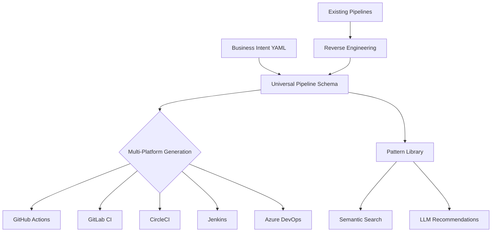

# CI/CD Pipeline Features

SpecQL provides a comprehensive universal CI/CD pipeline system that enables platform-agnostic pipeline definition and multi-platform code generation. This feature extends SpecQL's core philosophy of "business intent over technical implementation" to DevOps workflows.

## 🎯 Overview

The CI/CD system allows developers to define pipelines once in a universal YAML format and generate equivalent configurations for all major CI/CD platforms. This eliminates platform lock-in and enables easy migration between CI/CD providers.

### Key Capabilities

- **Universal Pipeline Language**: Platform-agnostic YAML specification for CI/CD pipelines
- **Multi-Platform Generation**: Convert universal pipelines to GitHub Actions, GitLab CI, CircleCI, Jenkins, and Azure DevOps
- **Reverse Engineering**: Convert existing platform-specific pipelines back to universal format
- **Pattern Library**: Reusable pipeline patterns with semantic search
- **LLM Enhancement**: AI-powered pipeline recommendations and optimization
- **Performance Benchmarking**: Automated testing and optimization of pipeline performance

## 🏗️ Architecture

### Core Components

```
src/cicd/
├── universal_pipeline_schema.py    # Universal pipeline data models
├── parsers/                        # Platform-specific parsers
│   ├── github_actions_parser.py
│   ├── gitlab_ci_parser.py
│   ├── circleci_parser.py
│   ├── jenkins_parser.py
│   └── azure_parser.py
├── generators/                     # Platform-specific generators
│   ├── github_actions_generator.py
│   ├── gitlab_ci_generator.py
│   ├── circleci_generator.py
│   ├── jenkins_generator.py
│   └── azure_generator.py
├── pattern_repository.py           # Pattern storage and search
├── llm_recommendations.py          # AI-powered suggestions
├── performance_benchmark.py        # Benchmarking system
└── pipeline_optimizer.py           # Optimization engine
```

### Data Flow



## 📋 Universal Pipeline Schema

The universal pipeline schema provides a common abstraction layer for CI/CD concepts across all platforms.

### Pipeline Structure

```yaml
pipeline: backend_api
description: "FastAPI backend with PostgreSQL"
language: python
framework: fastapi

triggers:
  - type: push
    branches: [main, develop]
  - type: pull_request
  - type: schedule
    schedule: "0 2 * * *"

stages:
  - name: test
    jobs:
      - name: lint
        runtime:
          language: python
          version: "3.11"
        steps:
          - type: checkout
          - type: setup_runtime
          - type: lint
            command: "uv run ruff check ."

      - name: unit_tests
        services:
          - name: postgres
            version: "15"
        steps:
          - type: checkout
          - type: setup_runtime
          - type: run_tests
            command: "uv run pytest --cov"

  - name: deploy
    environment: production
    approval_required: true
    jobs:
      - name: deploy_production
        steps:
          - type: deploy
            command: "kubectl set image deployment/api api=myapp:${{ git.sha }}"
```

### Key Concepts

#### Triggers
Define when pipelines should run:
- **Push**: Code pushes to specific branches
- **Pull Request**: PR creation/updates
- **Schedule**: Cron-based execution
- **Manual**: On-demand execution
- **Tag**: Git tag creation
- **Webhook**: External trigger events

#### Stages
Logical grouping of jobs with optional:
- **Approval Requirements**: Manual approval gates
- **Environment Targeting**: Production, staging, development
- **Dependencies**: Stage execution order

#### Jobs
Individual units of work containing:
- **Runtime**: Language and version specification
- **Services**: Database, cache, and external service dependencies
- **Steps**: Atomic actions within the job
- **Matrix**: Multi-dimensional build configurations
- **Dependencies**: Job execution order

#### Steps
Atomic pipeline actions:
- **checkout**: Clone repository
- **setup_runtime**: Configure language runtime
- **install_dependencies**: Package installation
- **run_tests**: Test execution
- **lint**: Code quality checks
- **build**: Artifact creation
- **deploy**: Application deployment
- **upload_artifact**: File storage
- **cache**: Build acceleration

## 🔄 Multi-Platform Support

### Supported Platforms

| Platform | Status | Features |
|----------|--------|----------|
| GitHub Actions | ✅ Complete | Full feature parity |
| GitLab CI | ✅ Complete | Stages, services, matrix builds |
| CircleCI | ✅ Complete | Workflows, orbs, contexts |
| Jenkins | ✅ Complete | Pipelines, agents, stages |
| Azure DevOps | ✅ Complete | YAML pipelines, templates |

### Generation Examples

#### From Universal to GitHub Actions

```bash
specql cicd convert-cicd pipeline.yaml github-actions --output .github/workflows/ci.yml
```

**Generated GitHub Actions:**
```yaml
name: CI
on:
  push:
    branches: [main, develop]
  pull_request:

jobs:
  lint:
    runs-on: ubuntu-latest
    steps:
      - uses: actions/checkout@v4
      - uses: actions/setup-python@v5
        with:
          python-version: '3.11'
      - run: uv run ruff check .

  unit_tests:
    runs-on: ubuntu-latest
    services:
      postgres:
        image: postgres:15
        env:
          POSTGRES_PASSWORD: test
    steps:
      - uses: actions/checkout@v4
      - uses: actions/setup-python@v5
        with:
          python-version: '3.11'
      - run: uv run pytest --cov
```

#### From Universal to GitLab CI

```bash
specql cicd convert-cicd pipeline.yaml gitlab-ci --output .gitlab-ci.yml
```

**Generated GitLab CI:**
```yaml
stages:
  - test
  - deploy

lint:
  stage: test
  image: python:3.11
  script:
    - uv run ruff check .

unit_tests:
  stage: test
  image: python:3.11
  services:
    - postgres:15
  variables:
    POSTGRES_PASSWORD: test
  script:
    - uv run pytest --cov

deploy_production:
  stage: deploy
  environment: production
  when: manual
  script:
    - kubectl set image deployment/api api=myapp:$CI_COMMIT_SHA
```

## 🔍 Reverse Engineering

Convert existing platform-specific pipelines back to universal format for analysis, migration, or pattern extraction.

### Supported Conversions

- **GitHub Actions** → Universal
- **GitLab CI** → Universal
- **CircleCI** → Universal
- **Jenkins Pipeline** → Universal
- **Azure DevOps** → Universal

### Usage Examples

```bash
# Reverse engineer GitHub Actions workflow
specql cicd reverse-cicd .github/workflows/ci.yml --output pipeline.yaml

# Reverse engineer GitLab CI pipeline
specql cicd reverse-cicd .gitlab-ci.yml --platform gitlab-ci --output pipeline.yaml

# Batch process multiple pipelines
specql cicd reverse-cicd workflows/*.yml --output universal/
```

### Auto-Detection

The system automatically detects the platform from file content and naming conventions:

```bash
# Auto-detected from .github/workflows/
specql cicd reverse-cicd .github/workflows/ci.yml

# Auto-detected from .gitlab-ci.yml
specql cicd reverse-cicd .gitlab-ci.yml

# Explicit platform specification
specql cicd reverse-cicd config.yml --platform circleci
```

## 📚 Pattern Library

A comprehensive library of reusable CI/CD patterns with semantic search capabilities.

### Available Patterns

#### Backend Patterns
- **python_fastapi_backend**: FastAPI with PostgreSQL, testing, and deployment
- **python_django_fullstack**: Django monolith with database migrations
- **nodejs_express_api**: Node.js REST API with testing and Docker
- **go_microservice**: Go microservice with testing and containerization

#### Frontend Patterns
- **nodejs_nextjs_frontend**: Next.js application with build optimization
- **react_spa**: React single-page application with CI/CD

#### Data Patterns
- **python_data_pipeline**: ETL pipelines with database integration
- **spark_batch_processing**: Apache Spark batch processing workflows

### Pattern Usage

```bash
# Search for patterns
specql cicd search-pipeline "fastapi backend"

# Get pattern details
specql cicd show-pattern python_fastapi_backend

# Generate from pattern
specql cicd generate-from-pattern python_fastapi_backend --output pipeline.yaml
```

### Custom Patterns

Create and share custom patterns:

```yaml
# patterns/cicd/custom_pattern.yaml
pattern_id: "custom_ml_pipeline"
name: "Custom ML Training Pipeline"
description: "Machine learning model training with GPU support"
category: data_science
language: python
framework: pytorch

pipeline:
  # Universal pipeline definition
  stages:
    - name: train
      jobs:
        - name: gpu_training
          runtime:
            language: python
            version: "3.11"
          steps:
            - type: checkout
            - type: setup_runtime
            - type: run
              name: "Install CUDA"
              command: "pip install torch torchvision torchaudio --index-url https://download.pytorch.org/whl/cu118"
            - type: run
              name: "Train model"
              command: "python train.py"
```

## 🤖 LLM Enhancement

AI-powered pipeline recommendations and optimization suggestions.

### Features

#### Pattern Recommendations
```bash
# Get recommendations for a project
specql cicd recommend-pipeline --language python --framework fastapi --database postgres

# Analyze existing pipeline for improvements
specql cicd analyze-pipeline pipeline.yaml
```

#### Optimization Suggestions
```bash
# Optimize pipeline performance
specql cicd optimize-pipeline pipeline.yaml --output optimized.yaml

# Suggest caching improvements
specql cicd suggest-caching pipeline.yaml
```

#### Security Analysis
```bash
# Security scan for pipeline vulnerabilities
specql cicd security-scan pipeline.yaml

# Suggest security best practices
specql cicd security-recommend pipeline.yaml
```

## 📊 Performance Benchmarking

Automated testing and optimization of pipeline performance.

### Benchmark Types

#### Execution Time Benchmarks
```bash
# Benchmark pipeline execution time
specql cicd benchmark execution pipeline.yaml --iterations 10

# Compare platform performance
specql cicd benchmark compare pipeline.yaml --platforms github-actions,gitlab-ci
```

#### Resource Usage Benchmarks
```bash
# Benchmark memory and CPU usage
specql cicd benchmark resources pipeline.yaml

# Cost analysis across platforms
specql cicd benchmark cost pipeline.yaml
```

#### Reliability Benchmarks
```bash
# Test pipeline reliability
specql cicd benchmark reliability pipeline.yaml --runs 100

# Failure rate analysis
specql cicd benchmark failures pipeline.yaml
```

### Benchmark Reports

```json
{
  "benchmark_id": "pipeline_perf_20241113",
  "pipeline": "python_fastapi_backend",
  "results": {
    "github_actions": {
      "avg_execution_time": 245.3,
      "success_rate": 0.98,
      "cost_per_run": 0.032,
      "memory_peak": "512MB"
    },
    "gitlab_ci": {
      "avg_execution_time": 238.1,
      "success_rate": 0.97,
      "cost_per_run": 0.028,
      "memory_peak": "489MB"
    }
  },
  "recommendations": [
    "GitLab CI is 2.8% faster for this workload",
    "Consider using GitLab CI for cost optimization",
    "Add caching to reduce execution time by ~30%"
  ]
}
```

## 🚀 Getting Started

### Quick Start

1. **Install SpecQL** (if not already installed):
   ```bash
   pip install specql
   ```

2. **Create a universal pipeline**:
   ```bash
   # Generate from pattern
   specql cicd generate-from-pattern python_fastapi_backend --output pipeline.yaml
   ```

3. **Generate platform-specific configs**:
   ```bash
   # Generate GitHub Actions
   specql cicd convert-cicd pipeline.yaml github-actions

   # Generate GitLab CI
   specql cicd convert-cicd pipeline.yaml gitlab-ci

   # Generate all platforms
   specql cicd convert-cicd pipeline.yaml all
   ```

4. **Reverse engineer existing pipelines**:
   ```bash
   # Convert existing GitHub Actions to universal
   specql cicd reverse-cicd .github/workflows/ci.yml --output universal.yaml
   ```

### Advanced Usage

#### Custom Pipeline Development
```bash
# Create custom pipeline from scratch
vim custom_pipeline.yaml

# Validate pipeline syntax
specql cicd validate-pipeline custom_pipeline.yaml

# Generate with custom options
specql cicd convert-cicd custom_pipeline.yaml github-actions --matrix python=3.10,3.11
```

#### Integration with SpecQL Projects
```bash
# Generate pipeline from SpecQL entities
specql cicd generate-from-entities entities/*.yaml --output pipeline.yaml

# Auto-detect project structure
specql cicd auto-generate --language python --framework fastapi
```

## 📖 API Reference

### Core Classes

#### UniversalPipeline
Main pipeline representation with conversion methods.

```python
from src.cicd.universal_pipeline_schema import UniversalPipeline

# Create pipeline programmatically
pipeline = UniversalPipeline(
    name="my_pipeline",
    language="python",
    stages=[...]
)

# Convert to platforms
github_yaml = pipeline.to_github_actions()
gitlab_yaml = pipeline.to_gitlab_ci()
```

#### PipelinePatternRepository
Pattern storage and semantic search.

```python
from src.cicd.pattern_repository import PipelinePatternRepository

repo = PipelinePatternRepository()

# Search patterns
patterns = repo.search_by_similarity(embedding, limit=5)

# Store custom pattern
repo.store_pattern(custom_pattern)
```

### CLI Commands

All CI/CD functionality is available through the `specql cicd` command group:

```bash
specql cicd --help          # Show all CI/CD commands
specql cicd convert-cicd    # Convert universal to platform-specific
specql cicd reverse-cicd    # Reverse engineer existing pipelines
specql cicd search-pipeline # Search pattern library
specql cicd benchmark       # Performance benchmarking
```

## 🔧 Configuration

### Environment Variables

```bash
export SPECQL_CICD_PATTERN_DB="sqlite:///cicd_patterns.db"
export SPECQL_CICD_DEFAULT_PLATFORM="github-actions"
export SPECQL_CICD_BENCHMARK_ITERATIONS="10"
```

### Configuration File

```yaml
# .specql.yaml
cicd:
  pattern_database: "sqlite:///cicd_patterns.db"
  default_platform: "github-actions"
  benchmark:
    iterations: 10
    timeout_minutes: 30
  llm:
    model: "llama3.1"
    temperature: 0.7
```

## 🎯 Best Practices

### Pipeline Design

1. **Start with Patterns**: Use existing patterns as starting points
2. **Keep it Simple**: Focus on essential stages and jobs
3. **Use Matrix Builds**: Test across multiple environments
4. **Implement Caching**: Cache dependencies for faster builds
5. **Add Health Checks**: Verify deployments with automated tests

### Platform Selection

1. **GitHub Actions**: Best for GitHub-hosted projects
2. **GitLab CI**: Excellent for self-hosted with advanced features
3. **CircleCI**: Fast execution with good Docker support
4. **Jenkins**: Most flexible for complex enterprise requirements
5. **Azure DevOps**: Integrated with Microsoft ecosystem

### Security Considerations

1. **Secret Management**: Use platform-specific secret stores
2. **Dependency Scanning**: Include security scanning in pipelines
3. **Access Control**: Limit pipeline execution permissions
4. **Audit Logging**: Enable comprehensive pipeline logging

## 🚨 Troubleshooting

### Common Issues

#### "Parser not found for platform"
```bash
# Ensure platform is supported
specql cicd convert-cicd pipeline.yaml --platform github-actions

# Check available platforms
specql cicd convert-cicd --help
```

#### "Pattern not found"
```bash
# List available patterns
specql cicd search-pipeline --list

# Search with broader terms
specql cicd search-pipeline "python backend"
```

#### "Benchmark timeout"
```bash
# Increase timeout
specql cicd benchmark execution pipeline.yaml --timeout 60

# Reduce iterations
specql cicd benchmark execution pipeline.yaml --iterations 5
```

### Debug Mode

Enable verbose logging for troubleshooting:

```bash
export SPECQL_LOG_LEVEL=DEBUG
specql cicd convert-cicd pipeline.yaml github-actions --verbose
```

## 📈 Roadmap

### Planned Features

- **Advanced LLM Integration**: Context-aware pipeline generation
- **Pipeline Testing**: Automated pipeline validation
- **Cost Optimization**: Multi-cloud cost analysis
- **Compliance Automation**: Security and compliance pipeline templates
- **Pipeline Analytics**: Usage and performance dashboards

### Community Contributions

The CI/CD system welcomes contributions:

- **New Platform Support**: Add support for additional CI/CD platforms
- **Pattern Contributions**: Share custom pipeline patterns
- **Performance Improvements**: Optimize generation and parsing performance
- **Documentation**: Improve guides and tutorials

## 📚 Related Documentation

- [Universal Pipeline Specification](../cicd_research/UNIVERSAL_PIPELINE_SPEC.md)
- [CLI Commands Reference](../reference/cli_commands.md)
- [Pattern Library Guide](../patterns/README.md)
- [Getting Started Guide](../../getting_started.md)