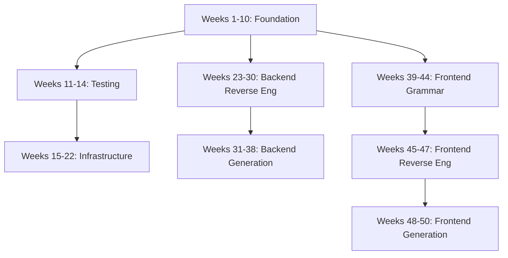

# SpecQL Complete Linear Timeline Overview

**Last Updated**: 2025-11-13
**Total Duration**: 50 weeks (~12 months)
**Status**: 🟢 Comprehensive plan covering all major features

---

## 📅 Timeline Summary

### Phase 1: Foundation & Core Features (Weeks 1-10)
**Status**: ✅ **COMPLETE**

| Week | Focus | Status |
|------|-------|--------|
| 1 | Domain Model & Hierarchical File Generation | ✅ Complete |
| 2 | Semantic Search Foundation | ✅ Complete |
| 3 | Pattern Recommendations | ✅ Complete |
| 4 | Self-Schema Dogfooding | ✅ Complete |
| 5-6 | Dual Interface (YAML + DB Comments) | ✅ Complete |
| 7-8 | Python Reverse Engineering | ✅ Complete |
| 9 | Interactive CLI with Live Preview | ✅ Complete |
| 10 | Visual Schema Diagrams | ✅ Complete (Graphviz DOT + Mermaid) |

**Key Achievement**: Core SpecQL parser, schema generation, action compiler, and CLI fully operational with production-ready tests.

---

### Phase 2: Testing & Infrastructure (Weeks 11-22)
**Status**: 🟡 Partially Complete

| Week | Focus | Status |
|------|-------|--------|
| 11 | Universal Test Specification | ✅ Complete |
| 12-14 | Trinity Pattern 100% Implementation | ✅ Complete |
| 15-17 | Universal CI/CD Expression | ⏸️ Planned |
| 18-20 | Universal Infrastructure Expression (IaC) | ⏸️ Planned |
| 21-22 | Unified Platform Integration | ⏸️ Planned |

**Goal**: Make SpecQL a complete application platform with testing, deployment, and infrastructure as code.

---

### Phase 3: Multi-Language Ecosystem (Weeks 23-38)
**Status**: 🔴 Planning

#### Reverse Engineering (Weeks 23-30)

| Week | Language/Framework | Status |
|------|-------------------|--------|
| 23-24 | Java (Spring/Hibernate) | 🔴 Planning |
| 25-26 | Rust (Diesel/SeaORM) | 🔴 Planning |
| 27-28 | JavaScript/TypeScript (Prisma/TypeORM) | 🔴 Planning |
| 29-30 | Go (GORM/sqlc) | 🔴 Planning |

**Goal**: Extract SpecQL from existing codebases in major languages.

#### Code Generation (Weeks 31-38)

| Week | Language/Framework | Status |
|------|-------------------|--------|
| 31-32 | Java Output (Spring Boot + JPA) | 🔴 Planning |
| 33-34 | Rust Output (Diesel/SeaORM + Actix/Axum) | 🔴 Planning |
| 35-36 | TypeScript Output (Prisma/TypeORM + tRPC) | 🔴 Planning |
| 37-38 | Go Output (GORM/sqlc + Gin/Echo) | 🔴 Planning |

**Goal**: Generate production-ready code in any major language from SpecQL.

---

### Phase 4: Frontend Universal Language (Weeks 39-50) ⭐ NEW
**Status**: 🔴 Planning

#### Part I: Grammar & Patterns (Weeks 39-44)

| Week | Focus | Description |
|------|-------|-------------|
| 39-40 | Core Component Grammar | Basic UI components (forms, tables, inputs, layouts) |
| 41-42 | Complex UI Patterns | Advanced patterns (wizards, dashboards, search, filters) |
| 43-44 | Pattern Library & AI | Semantic search, AI recommendations, pattern generation |

**Output**: Universal frontend component grammar with AI-searchable pattern library

#### Part II: Reverse Engineering (Weeks 45-47)

| Week | Framework | Description |
|------|-----------|-------------|
| 45 | React/Next.js | Extract SpecQL from React components and Next.js apps |
| 46 | Vue/Nuxt | Extract SpecQL from Vue components and Nuxt apps |
| 47 | Angular, Svelte, HTML | Support additional frameworks + vanilla HTML |

**Output**: Any frontend framework → SpecQL grammar

#### Part III: Code Generation (Weeks 48-50)

| Week | Framework | Description |
|------|-----------|-------------|
| 48 | React/Next.js | Generate React/Next.js from SpecQL with UI library support |
| 49 | Vue/Nuxt | Generate Vue/Nuxt from SpecQL |
| 50 | Cross-Framework Testing | E2E testing, performance, documentation |

**Output**: SpecQL grammar → Any frontend framework

---

## 🎯 Strategic Architecture

### The Complete SpecQL Ecosystem

```
┌─────────────────────────────────────────────────────────────┐
│                     SPECQL UNIVERSAL AST                    │
│              (Single Source of Truth - YAML)                │
└─────────────────────────────────────────────────────────────┘
                            ↕
        ┌───────────────────┼───────────────────┐
        ↓                   ↓                   ↓
    ┌───────┐          ┌───────┐          ┌──────────┐
    │Backend│          │Testing│          │Frontend  │
    │       │          │& IaC  │          │UI        │
    └───────┘          └───────┘          └──────────┘
        ↕                   ↕                   ↕
┌───────────────┐   ┌──────────────┐   ┌──────────────┐
│ Reverse Eng:  │   │ Universal:   │   │ Reverse Eng: │
│ - Python      │   │ - Tests      │   │ - React      │
│ - Java        │   │ - CI/CD      │   │ - Vue        │
│ - Rust        │   │ - Docker     │   │ - Angular    │
│ - TypeScript  │   │ - K8s        │   │ - Svelte     │
│ - Go          │   │ - Terraform  │   │              │
└───────────────┘   └──────────────┘   └──────────────┘
        ↓                   ↓                   ↓
┌───────────────┐   ┌──────────────┐   ┌──────────────┐
│ Generate:     │   │ Generate:    │   │ Generate:    │
│ - PostgreSQL  │   │ - Jest/Pytest│   │ - Next.js    │
│ - Spring Boot │   │ - GitHub Act │   │ - Nuxt       │
│ - Diesel/Rust │   │ - Dockerfile │   │ - Angular    │
│ - Prisma/TS   │   │ - K8s YAML   │   │ - SvelteKit  │
│ - GORM/Go     │   │ - Terraform  │   │              │
└───────────────┘   └──────────────┘   └──────────────┘
```

---

## 🚀 Key Capabilities by Phase

### Backend (Weeks 1-38)
✅ **PostgreSQL Schema Generation**
- Trinity pattern (pk_*, id, identifier)
- Hierarchical file structure
- Composite types, enums, indexes
- Multi-tenant schemas

✅ **Action Compilation**
- PL/pgSQL functions
- FraiseQL standard responses
- Trinity resolution
- Audit trails

✅ **GraphQL Integration**
- FraiseQL metadata
- TypeScript types
- Apollo hooks
- Mutation impacts

🔄 **Multi-Language Support** (Weeks 23-38)
- Java (Spring Boot + JPA)
- Rust (Diesel/SeaORM)
- TypeScript (Prisma/TypeORM)
- Go (GORM/sqlc)

### Frontend (Weeks 39-50) ⭐ NEW

🆕 **Universal Component Grammar**
- Framework-agnostic UI specification
- Basic components (forms, tables, inputs)
- Complex patterns (wizards, dashboards)
- Layouts and navigation

🆕 **AI-Powered Pattern Library**
- Semantic search for components
- AI-driven recommendations
- Pattern generation from examples
- Screenshot → Component extraction

🆕 **Reverse Engineering**
- React/Next.js → SpecQL
- Vue/Nuxt → SpecQL
- Angular/Svelte → SpecQL
- HTML/CSS → SpecQL

🆕 **Code Generation**
- SpecQL → React/Next.js
- SpecQL → Vue/Nuxt
- SpecQL → Angular/Svelte
- UI library integration (shadcn, MUI, Chakra)

### Infrastructure (Weeks 11-22)

🔄 **Universal Testing**
- Test specification DSL
- Generate tests for any language
- E2E testing patterns

🔄 **Universal CI/CD**
- CI/CD pipeline DSL
- GitHub Actions, GitLab CI, Jenkins
- Multi-stage deployments

🔄 **Universal IaC**
- Infrastructure specification
- Docker, Kubernetes, Terraform
- Cloud-agnostic deployment

---

## 💡 The SpecQL Vision

### Before SpecQL
```
Developer writes:
- 500 lines SQL DDL
- 1000 lines backend code (Java/Rust/Go/TS)
- 2000 lines frontend code (React/Vue/Angular)
- 300 lines CI/CD config
- 400 lines IaC (Docker/K8s)
──────────────────
= 4,200 lines total
```

### After SpecQL (Week 50)
```
Developer writes:
- 20 lines YAML (business domain only)

SpecQL auto-generates:
- PostgreSQL schema
- Backend in any language
- Frontend in any framework
- Tests for all layers
- CI/CD pipelines
- Infrastructure config
──────────────────
= 20 lines total (200x leverage!)
```

---

## 🎯 Success Criteria

### Technical Metrics
- [ ] 200x code leverage (20 lines YAML → 4000+ lines code)
- [ ] 95%+ reverse engineering accuracy
- [ ] Generated code compiles without errors
- [ ] Generated code passes linters
- [ ] Production-ready quality

### Framework Coverage

**Backend** (Weeks 23-38):
- [x] PostgreSQL + PL/pgSQL (✅ Complete)
- [ ] Java/Spring Boot
- [ ] Rust/Diesel
- [ ] TypeScript/Prisma
- [ ] Go/GORM

**Frontend** (Weeks 39-50):
- [ ] React/Next.js
- [ ] Vue/Nuxt
- [ ] Angular
- [ ] Svelte/SvelteKit

**Infrastructure** (Weeks 11-22):
- [ ] Docker
- [ ] Kubernetes
- [ ] GitHub Actions
- [ ] Terraform

### Developer Experience
- [ ] Intuitive YAML syntax
- [ ] Excellent error messages
- [ ] Live preview CLI
- [ ] Visual schema diagrams
- [ ] Pattern library search
- [ ] AI-powered recommendations

---

## 📦 Deliverables by Week 50

### Core Framework
1. **SpecQL Parser** - Universal AST for backend, frontend, and infrastructure
2. **Pattern Library** - 50+ reusable patterns with semantic search
3. **CLI Tool** - Interactive CLI with live preview and recommendations

### Generators (Output)
1. **Backend Generators**:
   - PostgreSQL ✅
   - Java/Spring Boot
   - Rust/Diesel
   - TypeScript/Prisma
   - Go/GORM

2. **Frontend Generators**:
   - React/Next.js
   - Vue/Nuxt
   - Angular
   - Svelte

3. **Infrastructure Generators**:
   - Docker
   - Kubernetes
   - CI/CD (GitHub Actions, GitLab)
   - Terraform

### Reverse Engineering
1. **Backend Parsers**:
   - Python ✅
   - Java
   - Rust
   - TypeScript
   - Go

2. **Frontend Parsers**:
   - React/Next.js
   - Vue/Nuxt
   - Angular
   - Svelte
   - HTML/CSS

### Documentation
1. Language specifications
2. Framework integration guides
3. Pattern library documentation
4. Migration guides
5. Best practices

---

## 🔄 Development Methodology

All weeks follow the **Phased TDD Approach**:

1. **RED** - Write failing tests for expected behavior
2. **GREEN** - Implement minimal code to pass tests
3. **REFACTOR** - Clean up and optimize code
4. **QA** - Verify quality and integration

This ensures:
- ✅ High code quality
- ✅ Comprehensive test coverage
- ✅ Predictable progress
- ✅ Production-ready output

---

## 📊 Progress Tracking

### Overall Progress: **~28% Complete**

| Phase | Weeks | Progress | Status |
|-------|-------|----------|--------|
| Foundation & Core | 1-10 | ██████████ 100% | ✅ Complete |
| Testing & Infrastructure | 11-22 | ███████░░░ 70% | 🟡 In Progress |
| Multi-Language Backend | 23-38 | ░░░░░░░░░░ 0% | 🔴 Planning |
| Frontend Universal | 39-50 | ░░░░░░░░░░ 0% | 🔴 Planning |

### Critical Path Dependencies



---

## 🚦 Next Steps

### Immediate Priority (Weeks 11-14)
1. Complete Trinity Pattern 100% implementation
2. Finalize type system specification
3. Add comprehensive test coverage

### Short-term (Weeks 15-22)
1. Universal test specification
2. CI/CD pipeline generation
3. Infrastructure as code

### Medium-term (Weeks 23-38)
1. Multi-language reverse engineering
2. Multi-language code generation
3. Cross-language type mapping

### Long-term (Weeks 39-50) ⭐
1. Frontend universal grammar
2. Pattern library with AI search
3. Frontend reverse engineering
4. Frontend code generation

---

## 📚 Related Documentation

- [Week 1: Domain Model & Hierarchical Files](./WEEK_1_DOMAIN_MODEL_REFINEMENT.md) ✅
- [Week 7-8: Python Reverse Engineering](./WEEK_7_8_PYTHON_REVERSE_ENGINEERING.md) ✅
- [Week 9: Interactive CLI](./WEEK_9_INTERACTIVE_CLI_LIVE_PREVIEW.md) ✅
- [Week 10: Visual Diagrams](./WEEK_10_VISUAL_SCHEMA_DIAGRAMS.md) ✅
- [Week 12-14: Trinity Pattern](./WEEK_12_13_14_TRINITY_PATTERN_100_PERCENT.md) 🔄
- [Week 27-30: JS/Go Reverse Engineering](./WEEK_27_28_29_30_JS_GO_REVERSE_ENGINEERING.md)
- [Week 31-38: Multi-Language Output](./WEEK_31_38_MULTI_LANGUAGE_OUTPUT.md)
- [Week 39-50: Frontend Universal Language](./WEEK_39_50_FRONTEND_UNIVERSAL_LANGUAGE.md) ⭐ NEW

---

**Vision**: By Week 50, SpecQL will be the universal translation layer for modern software development - any language, any framework, any infrastructure - all from a single, elegant business domain specification.

**Impact**: 200x code leverage, 10x faster development, 100% consistency across stack.

**Status**: On track for transformative developer experience. 🚀
