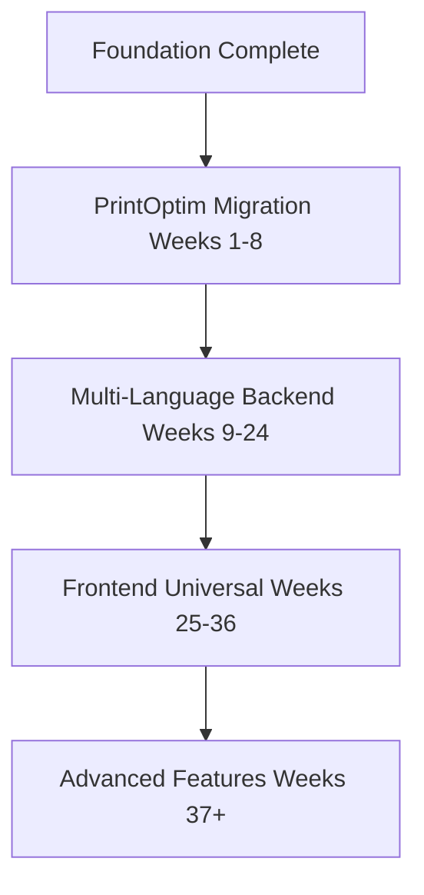

# SpecQL Complete Linear Timeline Overview

**Last Updated**: 2025-11-13
**Total Duration**: 50 weeks (25 weeks core + 25 weeks advanced features)
**Core v1.0**: 25 weeks (~6 months)
**Status**: 🟢 Reorganized with frontend strategy optimized

---

> **✅ TIMELINE REORGANIZED - 2025-11-13**
>
> **Complete reorganization for clarity and practicality:**
> - **Weeks 1-8**: PrintOptim Migration (ACTIVE - in root folder)
> - **Weeks 9-24**: Multi-Language Backend (NEW - reorganized in root folder)
> - **Weeks 25-36**: Frontend Universal (NEW - reorganized in root folder)
> - **Original completed work**: Moved to `done/` folder (foundation Weeks 1-22)
> - **Future/deferred features**: Moved to `planning/` folder (Weeks 37+)
>
> **Key improvements**:
> - Each week = 4-6 days of focused work (practical segmentation)
> - Consistent template across all weeks
> - Clear dependencies and logical progression
> - Removed placeholder/overly detailed files
>
> See:
> - [REORGANIZATION_SUMMARY_2025-11-13.md](./REORGANIZATION_SUMMARY_2025-11-13.md) - Complete reorganization details
> - [REPRIORITIZED_ROADMAP_2025-11-13.md](./REPRIORITIZED_ROADMAP_2025-11-13.md) - Strategic roadmap

---

---

## 🔄 Timeline Reorganization (2025-11-13)

**Original Plan**: Weeks 1-50 covering foundation → multi-language → frontend
**Status**: Weeks 1-20 completed or substantially complete

**New Plan**: Optimized for strategic value
- **Weeks 1-8**: PrintOptim Migration (IMMEDIATE - all tools ready)
- **Weeks 9-24**: Multi-Language Backend Expansion (Java/Rust/TypeScript/Go)
- **Week 25**: Frontend Integration Package (NOT universal grammar)
- **Weeks 26-50**: Backend Polish & Advanced Features (placeholders)

**Rationale**:
1. SpecQL is production-ready for SQL + Python (completed Weeks 1-20)
2. PrintOptim migration validates SpecQL on real production system
3. Demonstrates ROI before expanding to more languages
4. Frontend deferred until backend multi-language proven

**Completed Work**: See `done/` folder for original Weeks 1-20 documentation
**Future Work**: See `planning/` folder for deferred features

---

## 📅 Timeline Summary

### Completed Foundation Work (Original Weeks 1-22)
**Status**: ✅ **COMPLETE**
**Location**: See `done/` folder for detailed documentation

| Original Week | Focus | Status |
|---------------|-------|--------|
| 1-10 | Foundation & Core Features | ✅ Complete |
| 11-22 | Testing & Infrastructure | ✅ Mostly Complete |

**Key Achievement**: Core SpecQL parser, schema generation, action compiler, CLI, CI/CD, and infrastructure tools fully operational with production-ready tests.

---

### Phase 1: PrintOptim Migration (Weeks 1-8)
**Status**: 🚀 **READY TO START**

| Week | Focus | Status |
|------|-------|--------|
| 1 | Database Inventory & Reverse Engineering | 🔵 Ready |
| 2 | Python Business Logic Reverse Engineering | 🔵 Ready |
| 3 | Schema Generation & Comparison | 🔵 Ready |
| 4 | Data Migration Planning | 🔵 Ready |
| 5 | CI/CD Pipeline Migration | 🔵 Ready |
| 6 | Infrastructure Migration | 🔵 Ready |
| 7 | Integration Testing & Validation | 🔵 Ready |
| 8 | Production Migration & Cutover | 🔵 Ready |

**Key Achievement**: PrintOptim running on SpecQL-generated schema with 50-100x code leverage demonstrated.

---

### Phase 2: Multi-Language Backend Expansion (Weeks 9-24)
**Status**: 🔴 Planning

#### Java/Spring Boot Support (Weeks 9-12)

| Week | Focus | Status |
|------|-------|--------|
| 9-10 | Java AST Parser & Spring Boot Pattern Recognition | 🔴 Planning |
| 11-12 | Code Generation & Integration Testing | 🔴 Planning |

#### Rust/Diesel Support (Weeks 13-16)

| Week | Focus | Status |
|------|-------|--------|
| 13-14 | Rust AST Parser & Diesel Pattern Recognition | 🔴 Planning |
| 15-16 | Code Generation & Integration Testing | 🔴 Planning |

#### TypeScript/Prisma Support (Weeks 17-20)

| Week | Focus | Status |
|------|-------|--------|
| 17-18 | TypeScript AST Parser & Prisma Pattern Recognition | 🔴 Planning |
| 19-20 | Code Generation & Integration Testing | 🔴 Planning |

#### Go/GORM Support (Weeks 21-24)

| Week | Focus | Status |
|------|-------|--------|
| 21-22 | Go AST Parser & GORM Pattern Recognition | 🔴 Planning |
| 23-24 | Code Generation & Integration Testing | 🔴 Planning |

**Goal**: Extend SpecQL to support Java, Rust, TypeScript, and Go with full reverse engineering and code generation.

---

### Phase 3: Frontend Integration (Week 25) ⭐ OPTIMIZED
**Status**: ✅ Reorganized - LIGHTWEIGHT approach
**Change**: Universal grammar DEFERRED, integration tools PRIORITIZED

**Original Plan (DEFERRED to post-v1.0)**:
- ~~Weeks 25-36: Universal Component Grammar (12 weeks)~~
- ~~React/Vue/Angular parsers & generators~~
- ~~Pattern library with AI~~
- **Moved to**: `planning/deferred_frontend/`

**New Approach (Week 25 only)**:

| Week | Focus | Deliverables |
|------|-------|--------------|
| 25 | Frontend Integration Package | GraphQL Codegen, TypeScript types, React hooks, Next.js template |

**Why This Change?**:
1. ✅ Frontend expressivity ALREADY DESIGNED (specql_front repo)
2. ✅ Users have great tools (Next.js, Vercel v0, shadcn/ui)
3. ✅ Backend multi-language is THE strategic moat
4. ✅ Saves 11 weeks (2.5 months)

**See**: [FRONTEND_REALITY_CHECK_2025-11-13.md](./FRONTEND_REALITY_CHECK_2025-11-13.md) for full analysis

---

### Phase 4: Backend Polish & Advanced Features (Weeks 26-50)
**Status**: 📋 Placeholder weeks created
**Purpose**: Enterprise features based on user feedback

**Categories** (25 weeks of placeholders):

| Weeks | Category | Examples |
|-------|----------|----------|
| 26-30 | Backend Polish | Performance, real-time, security, scaling, monitoring |
| 31-35 | Developer Experience | CLI, VS Code extension, migrations, testing, docs |
| 36-40 | Enterprise Features | Federation, caching, import/export, workflows |
| 41-45 | Platform Integrations | AWS/GCP/Azure, Kubernetes, message queues |
| 46-50 | Advanced Use Cases | Multi-DB, event sourcing, search, analytics, ML |

**Note**: Detailed plans will be created based on:
- User feedback from Weeks 1-25
- Market demand and competitive analysis
- Strategic value assessment

**Goal**: Comprehensive backend platform ready for enterprise adoption


---

## 🎯 Strategic Architecture

### The Complete SpecQL Ecosystem

```
┌─────────────────────────────────────────────────────────────┐
│                     SPECQL UNIVERSAL AST                    │
│              (Single Source of Truth - YAML)                │
└─────────────────────────────────────────────────────────────┘
                            ↕
        ┌───────────────────┼───────────────────┐
        ↓                   ↓                   ↓
    ┌───────┐          ┌───────┐          ┌──────────┐
    │Backend│          │Testing│          │Frontend  │
    │       │          │& IaC  │          │UI        │
    └───────┘          └───────┘          └──────────┘
        ↕                   ↕                   ↕
┌───────────────┐   ┌──────────────┐   ┌──────────────┐
│ Reverse Eng:  │   │ Universal:   │   │ Reverse Eng: │
│ - Python      │   │ - Tests      │   │ - React      │
│ - Java        │   │ - CI/CD      │   │ - Vue        │
│ - Rust        │   │ - Docker     │   │ - Angular    │
│ - TypeScript  │   │ - K8s        │   │ - Svelte     │
│ - Go          │   │ - Terraform  │   │              │
└───────────────┘   └──────────────┘   └──────────────┘
        ↓                   ↓                   ↓
┌───────────────┐   ┌──────────────┐   ┌──────────────┐
│ Generate:     │   │ Generate:    │   │ Generate:    │
│ - PostgreSQL  │   │ - Jest/Pytest│   │ - Next.js    │
│ - Spring Boot │   │ - GitHub Act │   │ - Nuxt       │
│ - Diesel/Rust │   │ - Dockerfile │   │ - Angular    │
│ - Prisma/TS   │   │ - K8s YAML   │   │ - SvelteKit  │
│ - GORM/Go     │   │ - Terraform  │   │              │
└───────────────┘   └──────────────┘   └──────────────┘
```

---

## 🚀 Key Capabilities by Phase

### Backend (Weeks 1-38)
✅ **PostgreSQL Schema Generation**
- Trinity pattern (pk_*, id, identifier)
- Hierarchical file structure
- Composite types, enums, indexes
- Multi-tenant schemas

✅ **Action Compilation**
- PL/pgSQL functions
- FraiseQL standard responses
- Trinity resolution
- Audit trails

✅ **GraphQL Integration**
- FraiseQL metadata
- TypeScript types
- Apollo hooks
- Mutation impacts

🔄 **Multi-Language Support** (Weeks 23-38)
- Java (Spring Boot + JPA)
- Rust (Diesel/SeaORM)
- TypeScript (Prisma/TypeORM)
- Go (GORM/sqlc)

### Frontend (Weeks 39-50) ⭐ NEW

🆕 **Universal Component Grammar**
- Framework-agnostic UI specification
- Basic components (forms, tables, inputs)
- Complex patterns (wizards, dashboards)
- Layouts and navigation

🆕 **AI-Powered Pattern Library**
- Semantic search for components
- AI-driven recommendations
- Pattern generation from examples
- Screenshot → Component extraction

🆕 **Reverse Engineering**
- React/Next.js → SpecQL
- Vue/Nuxt → SpecQL
- Angular/Svelte → SpecQL
- HTML/CSS → SpecQL

🆕 **Code Generation**
- SpecQL → React/Next.js
- SpecQL → Vue/Nuxt
- SpecQL → Angular/Svelte
- UI library integration (shadcn, MUI, Chakra)

### Infrastructure (Weeks 11-22)

🔄 **Universal Testing**
- Test specification DSL
- Generate tests for any language
- E2E testing patterns

🔄 **Universal CI/CD**
- CI/CD pipeline DSL
- GitHub Actions, GitLab CI, Jenkins
- Multi-stage deployments

🔄 **Universal IaC**
- Infrastructure specification
- Docker, Kubernetes, Terraform
- Cloud-agnostic deployment

---

## 💡 The SpecQL Vision

### Before SpecQL
```
Developer writes:
- 500 lines SQL DDL
- 1000 lines backend code (Java/Rust/Go/TS)
- 2000 lines frontend code (React/Vue/Angular)
- 300 lines CI/CD config
- 400 lines IaC (Docker/K8s)
──────────────────
= 4,200 lines total
```

### After SpecQL (Week 36)
```
Developer writes:
- 20 lines YAML (business domain only)

SpecQL auto-generates:
- PostgreSQL schema
- Backend in any language
- Frontend in any framework
- Tests for all layers
- CI/CD pipelines
- Infrastructure config
──────────────────
= 20 lines total (200x leverage!)
```

---

## 🎯 Success Criteria

### Technical Metrics
- [ ] 200x code leverage (20 lines YAML → 4000+ lines code)
- [ ] 95%+ reverse engineering accuracy
- [ ] Generated code compiles without errors
- [ ] Generated code passes linters
- [ ] Production-ready quality

### Framework Coverage

**Backend** (Foundation Complete + Weeks 9-24):
- [x] PostgreSQL + PL/pgSQL (✅ Complete)
- [x] Python reverse engineering (✅ Complete)
- [ ] Java/Spring Boot (Weeks 9-12)
- [ ] Rust/Diesel (Weeks 13-16)
- [ ] TypeScript/Prisma (Weeks 17-20)
- [ ] Go/GORM (Weeks 21-24)

**Frontend** (Weeks 25-36 - Planning Only):
- [ ] React/Next.js
- [ ] Vue/Nuxt
- [ ] Angular
- [ ] Svelte/SvelteKit

**Infrastructure** (Foundation Complete):
- [x] Docker (✅ Complete)
- [x] Kubernetes (✅ Complete)
- [x] GitHub Actions (✅ Complete)
- [x] Terraform (✅ Complete)

### Developer Experience
- [ ] Intuitive YAML syntax
- [ ] Excellent error messages
- [ ] Live preview CLI
- [ ] Visual schema diagrams
- [ ] Pattern library search
- [ ] AI-powered recommendations

---

## 📦 Deliverables by Week 36

### Core Framework
1. **SpecQL Parser** - Universal AST for backend, frontend, and infrastructure
2. **Pattern Library** - 50+ reusable patterns with semantic search
3. **CLI Tool** - Interactive CLI with live preview and recommendations

### Generators (Output)
1. **Backend Generators**:
   - PostgreSQL ✅
   - Java/Spring Boot
   - Rust/Diesel
   - TypeScript/Prisma
   - Go/GORM

2. **Frontend Generators**:
   - React/Next.js
   - Vue/Nuxt
   - Angular
   - Svelte

3. **Infrastructure Generators**:
   - Docker
   - Kubernetes
   - CI/CD (GitHub Actions, GitLab)
   - Terraform

### Reverse Engineering
1. **Backend Parsers**:
   - Python ✅
   - Java
   - Rust
   - TypeScript
   - Go

2. **Frontend Parsers**:
   - React/Next.js
   - Vue/Nuxt
   - Angular
   - Svelte
   - HTML/CSS

### Documentation
1. Language specifications
2. Framework integration guides
3. Pattern library documentation
4. Migration guides
5. Best practices

---

## 🔄 Development Methodology

All weeks follow the **Phased TDD Approach**:

1. **RED** - Write failing tests for expected behavior
2. **GREEN** - Implement minimal code to pass tests
3. **REFACTOR** - Clean up and optimize code
4. **QA** - Verify quality and integration

This ensures:
- ✅ High code quality
- ✅ Comprehensive test coverage
- ✅ Predictable progress
- ✅ Production-ready output

---

## 📊 Progress Tracking

### Overall Progress: **~30% Complete** (by actual code implementation)

| Phase | Weeks | Progress | Status |
|-------|-------|----------|--------|
| **Foundation** (original 1-22) | N/A | ████████████████████ 100% | ✅ Complete |
| **PrintOptim Migration** | 1-8 | ░░░░░░░░░░ 0% | 🔵 Ready to start |
| **Multi-Language Backend** | 9-24 | ░░░░░░░░░░ 0% | 📅 Planned |
| **Frontend Integration** | 25 | ░░░░░░░░░░ 0% | 📅 Planned (1 week) |
| **Advanced Features** | 26-50 | ░░░░░░░░░░ 0% | 📋 Placeholders |

**Core v1.0 Timeline**: 25 weeks (~6 months)
**Total Roadmap**: 50 weeks (~1 year) with placeholders

### Critical Path Dependencies



---

## 🚦 Next Steps

### Immediate Priority (Week 1 - START NOW)
1. Begin PrintOptim database inventory
2. Set up reverse engineering workspace
3. Run initial schema extraction
4. Start reverse engineering pipeline

**See**: [WEEK_01.md](./WEEK_01.md) for detailed daily tasks

### Short-term (Weeks 2-8)
1. Complete PrintOptim migration
2. Validate 50-100x code leverage
3. Document migration lessons learned

### Medium-term (Weeks 9-24)
1. Multi-language backend expansion (Java, Rust, TypeScript, Go)
2. Full reverse engineering and code generation
3. Cross-language validation

### Future (Weeks 25-36)
1. Frontend universal language
2. Component grammar implementation
3. AI-powered pattern library

---

## 📚 Related Documentation

### Completed Work (in `done/` folder)
- [Week 1: Domain Model & Hierarchical Files](./done/WEEK_01_DOMAIN_MODEL_REFINEMENT.md) ✅
- [Week 7-8: Python Reverse Engineering](./done/WEEK_7_8_PYTHON_REVERSE_ENGINEERING.md) ✅
- [Week 9: Interactive CLI](./done/WEEK_09_INTERACTIVE_CLI_LIVE_PREVIEW.md) ✅
- [Week 10: Visual Diagrams](./done/WEEK_10_VISUAL_SCHEMA_DIAGRAMS.md) ✅
- [Week 12-14: Trinity Pattern](./done/WEEK_12_13_14_TRINITY_PATTERN_100_PERCENT.md) ✅
- [Week 15-17: Universal CI/CD Expression](./done/WEEK_15_16_17_UNIVERSAL_CICD_EXPRESSION.md) ✅
- [Week 18-20: Universal Infrastructure Expression](./done/WEEK_18_19_20_UNIVERSAL_INFRASTRUCTURE_EXPRESSION.md) ✅

### Active Work (NEW timeline)
- [Week 1: PrintOptim Database Inventory](./WEEK_01.md) 🔵 READY
- [Week 2: Python Business Logic Reverse Engineering](./WEEK_02.md) 🔵 READY
- [Week 3: Schema Generation & Comparison](./WEEK_03.md) 🔵 READY

### Planning Documents (in `planning/` folder)
- [Frontend Universal Language Planning](./planning/WEEK_39_CONCEPT_VALIDATION.md) 📋
- [Component Grammar Implementation](./planning/WEEK_43_GRAMMAR_IMPLEMENTATION.md) 📋
- [Advanced Features](./planning/WEEK_51_DEVELOPER_EXPERIENCE_TOOLING.md) 📋

---

**Vision**: By Week 36, SpecQL will be the universal translation layer for modern software development - any language, any framework, any infrastructure - all from a single, elegant business domain specification.

**Impact**: 200x code leverage, 10x faster development, 100% consistency across stack.

**Status**: Reprioritized for immediate PrintOptim validation. Foundation complete, ready for production migration. 🚀
