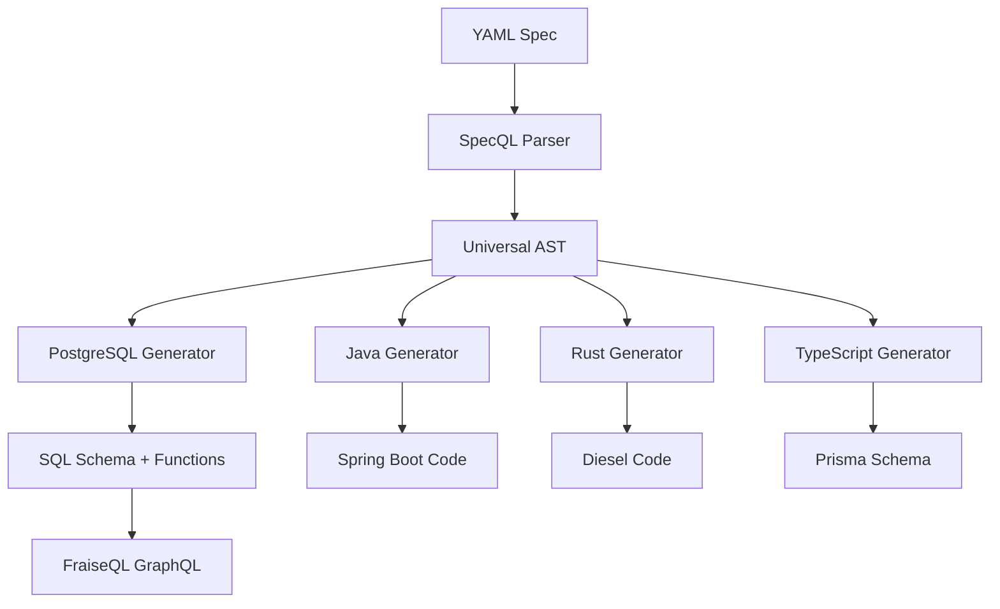
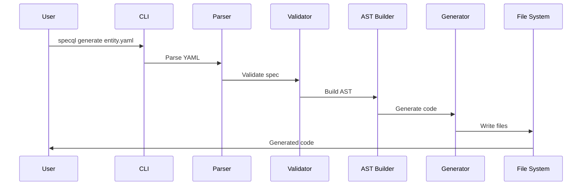

# Week 1: Documentation Polish & Accuracy Audit

**Goal**: Ensure all documentation accurately reflects v0.4.0-alpha capabilities and is easy for new users to understand.

**Estimated Time**: 35-40 hours (1 week full-time)

**Prerequisites**:
- SpecQL repository cloned and working
- Ability to run `uv run pytest` successfully
- Markdown editing skills
- Basic understanding of SpecQL features

---

## Overview

This week focuses on making SpecQL's documentation accurate, complete, and beginner-friendly. By the end of this week, a new user should be able to:
1. Understand what SpecQL does in 60 seconds
2. Install SpecQL in 5 minutes
3. Generate their first schema in 10 minutes
4. Find answers to common questions easily

---

## Day 1: README.md Audit & Update (8 hours)

### Morning: Audit Current State (4 hours)

**Objective**: Identify all inaccuracies in README.md

#### Task 1.1: Verify Feature Claims (90 min)

**Steps**:
1. Open `README.md` in your editor
2. Read through the "Features" section line by line
3. For each claimed feature, verify it actually works:

```bash
# Example verification process

# Claim: "PostgreSQL code generation"
uv run specql generate entities/examples/crm/contact.yaml
# ✅ If it generates SQL → Feature works
# ❌ If it errors → Document the issue

# Claim: "Java/Spring Boot generation"
uv run specql generate entities/examples/crm/contact.yaml --target java
# Verify output exists and looks correct

# Claim: "Rust/Diesel generation"
uv run specql generate entities/examples/crm/contact.yaml --target rust
# Verify output exists and looks correct

# Claim: "TypeScript/Prisma generation"
uv run specql generate entities/examples/crm/contact.yaml --target typescript
# Verify output exists and looks correct

# Claim: "Python reverse engineering"
uv run specql reverse python examples/sample_python_model.py
# If example doesn't exist, note that we need to create it

# Claim: "PostgreSQL reverse engineering"
uv run specql reverse sql examples/sample_schema.sql
# Verify this works
```

**Create a checklist**:
```markdown
# README.md Feature Verification Checklist

## Code Generation
- [ ] PostgreSQL generation works: YES/NO/PARTIAL
  - Notes: _____
- [ ] Java/Spring Boot generation works: YES/NO/PARTIAL
  - Notes: _____
- [ ] Rust/Diesel generation works: YES/NO/PARTIAL
  - Notes: _____
- [ ] TypeScript/Prisma generation works: YES/NO/PARTIAL
  - Notes: _____

## Reverse Engineering
- [ ] PostgreSQL → SpecQL works: YES/NO/PARTIAL
  - Notes: _____
- [ ] Python → SpecQL works: YES/NO/PARTIAL
  - Notes: _____
- [ ] Java → SpecQL works: YES/NO/PARTIAL
  - Notes: _____
- [ ] Rust → SpecQL works: YES/NO/PARTIAL
  - Notes: _____
- [ ] TypeScript → SpecQL works: YES/NO/PARTIAL
  - Notes: _____

## Additional Features
- [ ] FraiseQL integration works: YES/NO/PARTIAL
  - Notes: _____
- [ ] CI/CD generation works: YES/NO/PARTIAL
  - Notes: _____
- [ ] Infrastructure as Code generation works: YES/NO/PARTIAL
  - Notes: _____
- [ ] Test generation works: YES/NO/PARTIAL
  - Notes: _____
- [ ] Pattern Library works: YES/NO/PARTIAL
  - Notes: _____
- [ ] Visual Schema Diagrams work: YES/NO/PARTIAL
  - Notes: _____
```

Save this as `docs/implementation_plans/v0.5.0_beta/WEEK_01_VERIFICATION_CHECKLIST.md`

#### Task 1.2: Count Tests & Update Stats (60 min)

**Steps**:
```bash
# Count total tests
uv run pytest --collect-only | grep "test session starts" -A 5

# Or more precisely
uv run pytest --collect-only 2>&1 | grep -E "^<Module|^<Function" | wc -l

# Run tests to get pass/fail stats
uv run pytest --tb=short -q

# Get coverage report
uv run pytest --cov=src --cov-report=term

# Record the numbers:
# - Total tests: ____
# - Passing tests: ____
# - Coverage %: ____
```

**Update README.md** with accurate numbers:
- Find line mentioning test count
- Replace with actual count
- Find line mentioning coverage
- Replace with actual percentage

#### Task 1.3: Verify Installation Instructions (90 min)

**Test installation as a new user would**:

```bash
# Create a temporary directory
cd /tmp
mkdir test-specql-install
cd test-specql-install

# Test "From Source" installation
git clone https://github.com/fraiseql/specql.git
cd specql
uv sync
uv pip install -e .

# Verify CLI works
specql --version
# Expected output: 0.4.0-alpha

# Try generating something
specql generate entities/examples/**/*.yaml

# If this works, installation instructions are good
# If this fails, document exactly what went wrong
```

**Common issues to check**:
- Missing dependencies (Python version, uv, etc.)
- Unclear commands
- Incorrect paths
- Missing examples directory

**Document findings** in your verification checklist.

### Afternoon: Update README.md (4 hours)

#### Task 1.4: Rewrite Top Section (90 min)

The top of README.md needs to:
1. Explain what SpecQL is in one sentence
2. Show the value proposition (100x code leverage)
3. Have a compelling example

**Current structure**:
```markdown
# SpecQL - Multi-Language Backend Code Generator

> 🚧 ALPHA RELEASE...

20 lines YAML → 2000+ lines production code...
```

**Improved structure** (write this):
```markdown
# SpecQL - Multi-Language Backend Code Generator

> **🚧 v0.4.0-alpha**: Production-ready for backend generation. APIs stable. [Report issues](https://github.com/fraiseql/specql/issues).

**One YAML spec → PostgreSQL + Java + Rust + TypeScript** (100x code leverage)

SpecQL generates production-ready backends from business-domain YAML. Write your data model once, deploy across 4 languages.

## Quick Example

15 lines of YAML:
```yaml
entity: Contact
schema: crm

fields:
  email: text
  first_name: text
  last_name: text
  company: ref(Company)
  status: enum(lead, qualified, customer)

actions:
  - name: qualify_lead
    requires: caller.can_edit_contact
    steps:
      - validate: status = 'lead'
      - update: Contact SET status = 'qualified'
      - notify: owner
```

Auto-generates 2000+ lines across 4 languages:
- ✅ **PostgreSQL**: Tables, indexes, constraints, PL/pgSQL functions
- ✅ **Java/Spring Boot**: JPA entities, repositories, services, controllers
- ✅ **Rust/Diesel**: Models, schemas, queries, Actix-web handlers
- ✅ **TypeScript/Prisma**: Schema, interfaces, type-safe client

Plus: FraiseQL GraphQL metadata, tests, CI/CD workflows.

**[Try it now](#installation)** | **[Read the guide](docs/00_getting_started/README.md)**
```

#### Task 1.5: Update Installation Section (60 min)

**Current state**: Only shows source installation

**Improved version** (write this):
```markdown
## Installation

### From Source (Required for v0.4.0-alpha)

```bash
# Prerequisites: Python 3.11+, uv
# Install uv: curl -LsSf https://astral.sh/uv/install.sh | sh

git clone https://github.com/fraiseql/specql.git
cd specql
uv sync
uv pip install -e .
```

### Verify Installation

```bash
specql --version  # Should show: 0.4.0-alpha

# Generate example
specql generate entities/examples/crm/contact.yaml

# You should see generated SQL in output/
```

**Coming soon**: PyPI package (`pip install specql-generator`) in v0.5.0-beta

### Prerequisites

- **Python**: 3.11 or higher
- **uv**: [Installation guide](https://github.com/astral-sh/uv)
- **PostgreSQL** (optional): For testing generated schemas
- **Java JDK 11+** (optional): For Java reverse engineering

**Troubleshooting**: See [Installation Guide](docs/00_getting_started/INSTALLATION.md)
```

#### Task 1.6: Update Features Section (90 min)

Based on your verification checklist, update the Features section to be accurate.

**Template**:
```markdown
## Features

### Multi-Language Code Generation ✅

Generate production-ready code from single YAML specification:

#### PostgreSQL (100% Complete)
- Database schema with Trinity pattern (pk_*, id, identifier)
- Foreign keys, indexes, constraints, audit fields
- PL/pgSQL functions with business logic
- Test coverage: 96%+
- Example: [See PostgreSQL Generator](docs/03_reference/generators/POSTGRESQL.md)

#### Java/Spring Boot (100% Complete)
- JPA entities with Lombok annotations
- Repository interfaces (JpaRepository)
- Service classes with business logic
- REST controllers with validation
- Test coverage: 97%
- Performance: 1,461 entities/sec
- Example: [See Java Generator](docs/03_reference/generators/JAVA.md)

#### Rust/Diesel (100% Complete)
- Model structs with Diesel derives
- Schema definitions (schema.rs)
- Query builders and repositories
- Actix-web HTTP handlers
- Test pass rate: 100%
- Example: [See Rust Generator](docs/03_reference/generators/RUST.md)

#### TypeScript/Prisma (100% Complete)
- Prisma schema with relations
- TypeScript interfaces and types
- Type-safe client generation
- Test coverage: 96%
- Performance: 37,233 entities/sec
- Example: [See TypeScript Generator](docs/03_reference/generators/TYPESCRIPT.md)

### Reverse Engineering ✅

Transform existing code back to SpecQL:

- **PostgreSQL → SpecQL**: Extract schema and PL/pgSQL functions ([Guide](docs/02_guides/REVERSE_ENGINEERING_POSTGRESQL.md))
- **Python → SpecQL**: Parse dataclasses, Pydantic, Django, SQLAlchemy ([Guide](docs/02_guides/REVERSE_ENGINEERING_PYTHON.md))
- **Java → SpecQL**: Extract JPA entities and Spring Boot services ([Guide](docs/02_guides/REVERSE_ENGINEERING_JAVA.md))
- **Rust → SpecQL**: Parse Diesel models and impl blocks ([Guide](docs/02_guides/REVERSE_ENGINEERING_RUST.md))
- **TypeScript → SpecQL**: Extract Prisma schema and types ([Guide](docs/02_guides/REVERSE_ENGINEERING_TYPESCRIPT.md))

### Developer Tools ✅

- **Interactive CLI**: Live preview with Textual-based UI ([Demo](docs/06_examples/CLI_USAGE.md))
- **Pattern Library**: 100+ reusable patterns with semantic search ([Docs](docs/02_guides/PATTERN_LIBRARY.md))
- **Visual Diagrams**: Graphviz/Mermaid schema generation ([Guide](docs/02_guides/VISUAL_DIAGRAMS.md))
- **CI/CD Generation**: GitHub Actions, GitLab CI, CircleCI, Jenkins, Azure ([Guide](docs/02_guides/CICD_GENERATION.md))
- **Infrastructure as Code**: Terraform, Kubernetes, Docker Compose ([Guide](docs/02_guides/INFRASTRUCTURE_GENERATION.md))
- **Test Generation**: pgTAP SQL tests, pytest Python tests ([Guide](docs/02_guides/TEST_GENERATION.md))

### FraiseQL Integration ✅

- Automatic GraphQL metadata generation
- Vector search support via pgvector
- Auto-discovery for instant GraphQL APIs
- [FraiseQL Integration Guide](docs/02_guides/FRAISEQL_INTEGRATION.md)
```

**Important**: Only include features you verified as working. If something doesn't work, move it to a "Coming Soon" section.

---

## Day 2: Create Comprehensive Getting Started Guide (8 hours)

### Morning: Write Core Tutorial (4 hours)

**Objective**: Create `docs/00_getting_started/QUICKSTART.md` that gets a user from zero to working in 10 minutes.

#### Task 2.1: Create Tutorial Structure (30 min)

Create file: `docs/00_getting_started/QUICKSTART.md`

```markdown
# SpecQL Quickstart Guide

**Time**: 10 minutes
**Goal**: Generate your first multi-language backend from YAML

By the end of this guide, you'll have:
- ✅ Installed SpecQL
- ✅ Created a SpecQL entity definition
- ✅ Generated PostgreSQL schema
- ✅ Generated Java/Spring Boot code
- ✅ Tested the generated code

---

## Prerequisites

Before starting, ensure you have:
- [ ] Python 3.11 or higher installed
- [ ] `uv` package manager installed ([get it here](https://github.com/astral-sh/uv))
- [ ] Basic understanding of YAML
- [ ] (Optional) PostgreSQL for testing schemas

Check your Python version:
```bash
python --version  # Should show 3.11+
```

---

## Step 1: Install SpecQL (3 minutes)

[Continue with detailed steps...]
```

#### Task 2.2: Write Installation Steps (60 min)

**Write detailed, foolproof instructions**:

```markdown
## Step 1: Install SpecQL (3 minutes)

### 1.1 Install uv (if not already installed)

**macOS/Linux**:
```bash
curl -LsSf https://astral.sh/uv/install.sh | sh
```

**Windows** (PowerShell):
```powershell
irm https://astral.sh/uv/install.ps1 | iex
```

Verify installation:
```bash
uv --version  # Should show: uv 0.x.x
```

### 1.2 Clone SpecQL

```bash
# Choose a location for SpecQL
cd ~/code  # or wherever you keep projects

# Clone the repository
git clone https://github.com/fraiseql/specql.git
cd specql
```

### 1.3 Install Dependencies

```bash
# This installs all Python dependencies
uv sync

# Install SpecQL in editable mode
uv pip install -e .
```

### 1.4 Verify Installation

```bash
# Check SpecQL CLI is available
specql --version
# Expected output: 0.4.0-alpha

# Check help command works
specql --help
# Should show list of commands
```

**✅ Checkpoint**: If `specql --version` shows "0.4.0-alpha", you're ready to proceed!

**❌ Troubleshooting**:
- If `specql` command not found, make sure uv's bin directory is in your PATH
- On macOS/Linux: Add `export PATH="$HOME/.local/bin:$PATH"` to your `.bashrc` or `.zshrc`
- On Windows: Add `%USERPROFILE%\.local\bin` to your PATH environment variable
```

#### Task 2.3: Write First Example (90 min)

**Create a simple but realistic example**:

```markdown
## Step 2: Create Your First Entity (2 minutes)

Let's create a simple blog post entity.

### 2.1 Create Project Structure

```bash
# Create a new directory for your project
mkdir ~/my-specql-project
cd ~/my-specql-project

# Create entities directory
mkdir -p entities/blog
```

### 2.2 Create Entity YAML

Create file: `entities/blog/post.yaml`

```yaml
# entities/blog/post.yaml
entity: Post
schema: blog
description: A blog post with author and publication date

fields:
  # Basic fields
  title: text
  slug: text
  content: text
  excerpt: text

  # Metadata
  published_at: timestamp
  author_name: text
  view_count: integer

  # Status
  status: enum(draft, published, archived)

  # Auto-managed fields (created_at, updated_at added automatically)

indexes:
  - fields: [slug]
    unique: true
  - fields: [status, published_at]
  - fields: [author_name]

actions:
  - name: publish
    description: Publish a draft post
    requires: caller.can_publish
    steps:
      - validate: status = 'draft'
        error: "post_already_published"
      - update: Post SET status = 'published', published_at = NOW()
      - notify: subscribers

  - name: increment_views
    description: Increment view count
    steps:
      - update: Post SET view_count = view_count + 1
```

### 2.3 Understand the YAML

Let's break down what we just wrote:

- **entity**: The name of your entity (becomes table name `tb_post`)
- **schema**: PostgreSQL schema name (namespace)
- **fields**: Column definitions with types
  - `text`: String/varchar
  - `timestamp`: Date and time
  - `integer`: Whole number
  - `enum(...)`: Predefined choices
- **indexes**: Database indexes for performance
  - `unique: true`: Ensures no duplicates
- **actions**: Business logic functions
  - `validate`: Check conditions before proceeding
  - `update`: Modify data
  - `notify`: Trigger notifications

**✅ Checkpoint**: You now have a SpecQL entity definition!
```

#### Task 2.4: Write Generation Steps (60 min)

```markdown
## Step 3: Generate PostgreSQL Schema (2 minutes)

### 3.1 Generate SQL

```bash
# Generate PostgreSQL schema from your YAML
specql generate entities/blog/post.yaml --output output/postgresql

# You should see:
# ✓ Parsing entities/blog/post.yaml
# ✓ Generating PostgreSQL schema
# ✓ Writing output/postgresql/blog/01_tables.sql
# ✓ Writing output/postgresql/blog/02_functions.sql
# ✓ Generated 450 lines of SQL
```

### 3.2 Inspect Generated Files

```bash
# Look at the generated table
cat output/postgresql/blog/01_tables.sql

# You'll see:
# - CREATE SCHEMA blog;
# - CREATE TABLE blog.tb_post (
#     pk_post SERIAL PRIMARY KEY,
#     id UUID DEFAULT gen_random_uuid(),
#     identifier TEXT,  -- slug
#     title TEXT NOT NULL,
#     content TEXT,
#     ...
#   );
# - Indexes
# - Constraints
```

### 3.3 Test the Schema (Optional)

If you have PostgreSQL installed:

```bash
# Create a test database
createdb specql_test

# Apply the schema
psql specql_test < output/postgresql/blog/01_tables.sql
psql specql_test < output/postgresql/blog/02_functions.sql

# Test inserting data
psql specql_test -c "
INSERT INTO blog.tb_post (title, slug, content, status)
VALUES ('My First Post', 'first-post', 'Hello World!', 'draft');"

# Test calling the publish action
psql specql_test -c "
SELECT blog.fn_post_publish(1, 'user@example.com');"

# Query the data
psql specql_test -c "SELECT * FROM blog.tv_post;"
```

**✅ Checkpoint**: If you can query `blog.tv_post`, your schema works!

---

## Step 4: Generate Java/Spring Boot Code (2 minutes)

### 4.1 Generate Java

```bash
specql generate entities/blog/post.yaml --target java --output output/java

# You should see:
# ✓ Generating Java/Spring Boot code
# ✓ Writing output/java/com/example/blog/Post.java
# ✓ Writing output/java/com/example/blog/PostRepository.java
# ✓ Writing output/java/com/example/blog/PostService.java
# ✓ Writing output/java/com/example/blog/PostController.java
# ✓ Generated 380 lines of Java
```

### 4.2 Inspect Generated Java

```bash
# Look at the JPA entity
cat output/java/com/example/blog/Post.java
```

You'll see:
```java
package com.example.blog;

import lombok.Data;
import javax.persistence.*;
import java.time.Instant;
import java.util.UUID;

@Data
@Entity
@Table(name = "tb_post", schema = "blog")
public class Post {
    @Id
    @GeneratedValue(strategy = GenerationType.IDENTITY)
    @Column(name = "pk_post")
    private Long pkPost;

    @Column(name = "id", unique = true)
    private UUID id = UUID.randomUUID();

    @Column(name = "title", nullable = false)
    private String title;

    @Column(name = "slug", unique = true)
    private String slug;

    // ... more fields

    @Enumerated(EnumType.STRING)
    @Column(name = "status")
    private PostStatus status;

    // Timestamps
    @Column(name = "created_at")
    private Instant createdAt;

    @Column(name = "updated_at")
    private Instant updatedAt;
}
```

**✅ Checkpoint**: You now have production-ready Java code!

---

## Step 5: Generate Rust/Diesel Code (1 minute)

```bash
specql generate entities/blog/post.yaml --target rust --output output/rust

# You'll get:
# - Diesel schema definitions
# - Rust model structs
# - Query builders
# - Actix-web handlers
```

---

## Step 6: Generate TypeScript/Prisma (1 minute)

```bash
specql generate entities/blog/post.yaml --target typescript --output output/typescript

# You'll get:
# - Prisma schema
# - TypeScript interfaces
# - Type-safe client
```

---

## What You Just Did

In 10 minutes, you:
1. ✅ Installed SpecQL
2. ✅ Wrote 50 lines of YAML
3. ✅ Generated 2000+ lines of production code across 4 languages:
   - PostgreSQL schema with business logic
   - Java/Spring Boot application
   - Rust/Diesel backend
   - TypeScript/Prisma client

**Code leverage**: 40x (50 YAML → 2000+ code)

---

## Next Steps

### Learn More
- [Complete Tutorial](TUTORIAL.md) - Build a full CRM system
- [YAML Reference](../03_reference/yaml/complete_reference.md) - All field types and options
- [CLI Reference](../03_reference/cli/command_reference.md) - All command options

- [CRM Example](../06_examples/CRM_SYSTEM_COMPLETE.md) - Contact management system
- [E-commerce Example](../06_examples/ECOMMERCE_SYSTEM.md) - Product catalog
- [Blog Example](../06_examples/SIMPLE_BLOG.md) - Content management
- [User Authentication](../06_examples/USER_AUTHENTICATION.md) - Auth system
- [Multi-Tenant SaaS](../06_examples/MULTI_TENANT_SAAS.md) - Enterprise platform

- [Java Migration Guide](../../guides/JAVA_MIGRATION_GUIDE.md) - Migrate Java projects
- [Rust Migration Guide](../../guides/RUST_MIGRATION_GUIDE.md) - Migrate Rust projects
- [TypeScript Migration Guide](../../guides/TYPESCRIPT_MIGRATION_GUIDE.md) - Migrate TypeScript projects

---

**Congratulations!** You're now ready to use SpecQL in your projects. 🎉
```

### Afternoon: Create Real-World Examples (4 hours)

#### Task 2.5: Create CRM Example (2 hours)

Create file: `docs/06_examples/CRM_SYSTEM_COMPLETE.md`

This should be a complete, working CRM system example. Include:
1. Full YAML for Contact, Company, Deal, Activity entities
2. Complete generation commands
3. Sample SQL queries
4. How to integrate with FraiseQL
5. Common patterns (audit logging, soft deletes, etc.)

**Start with** this structure:
```markdown
# Complete CRM System Example

**What You'll Build**: A production-ready CRM with contacts, companies, deals, and activities.

**Time**: 30 minutes
**Complexity**: Intermediate

## System Overview

Our CRM will have:
- **Companies**: Organizations we do business with
- **Contacts**: People at those companies
- **Deals**: Sales opportunities
- **Activities**: Calls, emails, meetings

## Architecture

```
Company (1) ──< (N) Contact
   │                  │
   │                  │
   └──< (N) Deal <────┘
          │
          └──< (N) Activity
```

## Step 1: Create Company Entity

Create `entities/crm/company.yaml`:

```yaml
entity: Company
schema: crm
description: An organization we do business with

fields:
  # Identity
  name: text  # This becomes 'identifier' (Trinity pattern)
  legal_name: text
  website: url

  # Contact info
  phone: text
  email: email

  # Address
  address_line1: text
  address_line2: text
  city: text
  state: text
  postal_code: text
  country: text

  # Business info
  industry: text
  employee_count: integer
  annual_revenue: decimal

  # Status
  status: enum(prospect, customer, partner, inactive)

  # Metadata (created_at, updated_at auto-added)

indexes:
  - fields: [name]
    unique: true
  - fields: [status]
  - fields: [industry]

actions:
  - name: convert_to_customer
    description: Convert prospect to customer
    requires: caller.can_manage_companies
    steps:
      - validate: status = 'prospect'
        error: "already_customer"
      - update: Company SET status = 'customer'
      - notify: sales_team
      - log: "Company converted to customer"
```

[Continue with full example...]
```

#### Task 2.6: Create E-commerce Example (2 hours)

Create file: `docs/06_examples/ECOMMERCE_SYSTEM.md`

Similar structure, but for an e-commerce system with:
- Products
- Categories
- Orders
- OrderItems
- Customers
- Inventory

Include common e-commerce patterns:
- Stock management
- Order fulfillment workflow
- Price calculations
- Discount codes

---

## Day 3: Documentation Review & Consistency (8 hours)

### Morning: Audit All 157 Docs (4 hours)

#### Task 3.1: Create Documentation Inventory (60 min)

```bash
# Generate list of all docs
find docs -name "*.md" -type f | sort > /tmp/docs_inventory.txt

# Create a tracking spreadsheet
cat > docs/implementation_plans/v0.5.0_beta/DOCS_AUDIT_CHECKLIST.md << 'EOF'
# Documentation Audit Checklist

For each document, verify:
- [ ] Accurate for v0.4.0-alpha
- [ ] No broken links
- [ ] Code examples work
- [ ] Screenshots/diagrams current
- [ ] Grammar/spelling correct
- [ ] Formatting consistent

## Status Key
- ✅ Reviewed and accurate
- ⚠️ Needs minor updates
- ❌ Needs major revision
- 📝 Needs creation

---

## 00_getting_started/
- [ ] README.md - Status: ___
- [ ] INSTALLATION.md - Status: ___
- [ ] QUICKSTART.md - Status: ___ (created in Week 1)

## 01_tutorials/
- [ ] ... (list all files)

## 02_guides/
- [ ] ... (list all files)

[Continue for all directories...]
EOF
```

#### Task 3.2: Review Each Document (3 hours)

**For each document**:

1. **Open the file**
2. **Read it completely**
3. **Verify accuracy**:
   - Are the commands correct?
   - Do the examples work?
   - Are version numbers right?
   - Are file paths accurate?
4. **Check links**:
   ```bash
   # Extract all markdown links
   grep -o '\[.*\](.*\.md)' filename.md

   # Verify each file exists
   ls -la path/to/linked/file.md
   ```
5. **Test code examples**:
   - Copy-paste code snippets
   - Run them
   - Verify they work
6. **Mark status** in your checklist

**Priority order**:
1. Getting Started docs (highest priority)
2. Tutorials
3. Guides
4. Reference docs
5. Examples
6. Contributing/Troubleshooting

### Afternoon: Fix Critical Issues (4 hours)

#### Task 3.3: Fix High-Priority Docs (4 hours)

Based on your audit, fix the most critical issues:

**Priority 1: Getting Started** (90 min)
- Fix any broken installation instructions
- Update outdated commands
- Correct version numbers

**Priority 2: Top 5 Most Viewed Guides** (90 min)
- Update code examples
- Fix broken links
- Correct any errors

**Priority 3: Reference Docs** (60 min)
- Ensure YAML spec is accurate
- Update generator docs
- Fix API reference

**Create a summary**:
```markdown
# Documentation Audit Results

**Date**: YYYY-MM-DD
**Audited**: 157 docs
**Status**:
- ✅ Accurate: ___ docs
- ⚠️ Minor updates needed: ___ docs
- ❌ Major revision needed: ___ docs
- 📝 Missing: ___ docs

## Critical Issues Fixed
1. [Issue description] - Fixed in [file]
2. [Issue description] - Fixed in [file]

## Known Issues (To Fix Later)
1. [Issue description] - Affects [file]
2. [Issue description] - Affects [file]

## Recommendations for Week 2
- Focus on missing docs: [list]
- Consider consolidating: [redundant docs]
```

---

## Day 4: Create Missing Examples (8 hours)

### Task 4.1: Identify Missing Examples (60 min)

**Common user journeys that need examples**:

```markdown
# Missing Examples Analysis

## Beginner Examples (Need)
- [ ] Simple blog (CRUD)
- [ ] Todo list (basic actions)
- [ ] User authentication (security patterns)

## Intermediate Examples (Need)
- [ ] CRM system (relationships)
- [ ] E-commerce (transactions)
- [ ] Inventory management (stock tracking)

## Advanced Examples (Need)
- [ ] Multi-tenant SaaS (row-level security)
- [ ] Event sourcing (audit logs)
- [ ] API gateway (microservices)

## Integration Examples (Need)
- [ ] FraiseQL + SpecQL (full stack)
- [ ] SpecQL + Next.js frontend
- [ ] SpecQL + Spring Boot + React

## Reverse Engineering Examples (Need)
- [ ] Import Django models
- [ ] Import Spring Boot app
- [ ] Import Prisma schema
```

### Task 4.2: Create Simple Blog Example (3 hours)

Create: `docs/06_examples/SIMPLE_BLOG.md`

**Include**:
1. Full YAML for all entities
2. Step-by-step generation
3. How to test locally
4. Sample data inserts
5. Common queries
6. Integration with frontend

**Template**:
```markdown
# Simple Blog Platform

**Complexity**: Beginner
**Time**: 20 minutes
**What You'll Learn**: Basic CRUD, relationships, enums

## What We're Building

A simple blog with:
- Posts (with title, content, status)
- Authors (users who write posts)
- Comments (on posts)
- Tags (for categorization)

## Prerequisites

- SpecQL installed
- PostgreSQL running (optional, for testing)

## Step 1: Create Entities

### Author Entity

Create `entities/blog/author.yaml`:

```yaml
entity: Author
schema: blog

fields:
  username: text
  email: email
  full_name: text
  bio: text
  avatar_url: url
  status: enum(active, inactive)

indexes:
  - fields: [username]
    unique: true
  - fields: [email]
    unique: true
```

### Post Entity

Create `entities/blog/post.yaml`:

```yaml
entity: Post
schema: blog

fields:
  title: text
  slug: text
  content: text
  excerpt: text
  cover_image_url: url

  # Relationships
  author: ref(Author)

  # Metadata
  published_at: timestamp
  view_count: integer

  # Status
  status: enum(draft, published, archived)

indexes:
  - fields: [slug]
    unique: true
  - fields: [author_id, status]
  - fields: [published_at]

actions:
  - name: publish
    description: Publish a draft post
    steps:
      - validate: status = 'draft'
      - update: Post SET status = 'published', published_at = NOW()

  - name: archive
    description: Archive a published post
    steps:
      - validate: status = 'published'
      - update: Post SET status = 'archived'
```

[Continue with Comment, Tag entities...]

## Step 2: Generate Code

[Full generation steps...]

## Step 3: Test the Database

[Sample data, queries...]

## Step 4: Add to Frontend

[Integration example...]

## Full Source Code

All YAML files for this example:
- [View Source](../../examples/simple-blog/)
- [View on GitHub](https://github.com/fraiseql/specql/tree/main/examples/simple-blog)
```

### Task 4.3: Create Authentication Example (2 hours)

Create: `docs/06_examples/USER_AUTHENTICATION.md`

Show how to handle:
- User registration
- Password hashing
- Login/logout
- Session management
- Role-based access control
- Email verification

### Task 4.4: Create Multi-Tenant Example (2 hours)

Create: `docs/06_examples/MULTI_TENANT_SAAS.md`

Show:
- Tenant isolation
- Row-level security
- Shared vs tenant-specific data
- Tenant onboarding
- Cross-tenant queries (admin)

---

## Day 5: Video/GIF Demos & Visual Content (8 hours)

### Morning: Create Terminal Recordings (4 hours)

#### Task 5.1: Install Recording Tools (30 min)

```bash
# Install asciinema (terminal recorder)
# macOS
brew install asciinema

# Linux
sudo apt-get install asciinema
# or
sudo yum install asciinema

# Test it
asciinema rec test.cast
# Type some commands
# Ctrl+D to stop
# Play it back
asciinema play test.cast
```

#### Task 5.2: Record Installation Demo (60 min)

**Script to record**:
```bash
# Start recording
asciinema rec docs/demos/installation.cast

# Show the steps
echo "# Installing SpecQL"
sleep 2

echo "Step 1: Clone repository"
sleep 1
git clone https://github.com/fraiseql/specql.git
cd specql

echo "Step 2: Install dependencies"
sleep 1
uv sync

echo "Step 3: Install SpecQL"
sleep 1
uv pip install -e .

echo "Step 4: Verify installation"
sleep 1
specql --version

echo "Installation complete! ✓"

# Stop recording (Ctrl+D)
```

**Convert to GIF**:
```bash
# Install agg (asciinema to GIF converter)
cargo install agg

# Convert
agg docs/demos/installation.cast docs/demos/installation.gif

# Or use asciicast2gif
npm install -g asciicast2gif
asciicast2gif docs/demos/installation.cast docs/demos/installation.gif
```

#### Task 5.3: Record Quickstart Demo (90 min)

Record the full quickstart flow:
1. Creating YAML entity
2. Running generation
3. Viewing output
4. Testing schema

Save as: `docs/demos/quickstart.gif`

#### Task 5.4: Record Advanced Features (90 min)

Create demos for:
- Reverse engineering: `docs/demos/reverse-engineering.gif`
- Pattern library: `docs/demos/pattern-library.gif`
- Interactive CLI: `docs/demos/interactive-cli.gif`
- Multi-language generation: `docs/demos/multi-language.gif`

### Afternoon: Create Diagrams (4 hours)

#### Task 5.5: Architecture Diagram (90 min)

Create: `docs/04_architecture/architecture.png`

Use draw.io or similar to create:
- High-level SpecQL architecture
- Parser → AST → Generators flow
- How reverse engineering works
- Where FraiseQL fits

**Alternative**: Use Mermaid diagrams (renders in GitHub):

Create: `docs/04_architecture/ARCHITECTURE.md`

```markdown
# SpecQL Architecture

## High-Level Overview



## Code Generation Flow



[Add more diagrams...]
```

#### Task 5.6: Create Workflow Diagrams (90 min)

Create diagrams for:
1. **Reverse Engineering Flow**: Code → Parser → AST → YAML
2. **FraiseQL Integration**: SpecQL → PostgreSQL → FraiseQL → GraphQL
3. **Testing Strategy**: Unit → Integration → E2E
4. **CI/CD Pipeline**: Commit → Test → Build → Deploy

#### Task 5.7: Update README with Visuals (60 min)

Add the GIFs and diagrams to README.md:

```markdown
## See It In Action

### Installation (30 seconds)


### Generate Your First Backend (2 minutes)


### Reverse Engineering


## How It Works


[Explanation of the architecture...]
```

---

## Week 1 Deliverables Checklist

At the end of Week 1, you should have:

### Documentation
- [ ] README.md updated and accurate
- [ ] QUICKSTART.md created (10-minute tutorial)
- [ ] All 157 docs audited with status report
- [ ] Critical doc issues fixed
- [ ] Documentation audit report created

### Examples
- [ ] Simple blog example (complete)
- [ ] CRM system example (complete)
- [ ] E-commerce example (complete)
- [ ] Authentication example (complete)
- [ ] Multi-tenant example (complete)

### Visual Content
- [ ] Installation demo (GIF)
- [ ] Quickstart demo (GIF)
- [ ] Reverse engineering demo (GIF)
- [ ] Pattern library demo (GIF)
- [ ] Architecture diagram (PNG/SVG)
- [ ] Workflow diagrams (Mermaid)

### Quality Checks
- [ ] All code examples tested and work
- [ ] All links verified
- [ ] No broken references
- [ ] Consistent formatting
- [ ] Accurate version numbers

---

## Tips for Success

### For Documentation Writing
1. **Test everything**: Every command, every example
2. **Think like a beginner**: What would confuse you?
3. **Add checkpoints**: Let users verify they're on track
4. **Troubleshoot common issues**: Document what can go wrong
5. **Use consistent formatting**: Same style throughout

### For Examples
1. **Start simple**: Basic CRUD before complex relationships
2. **Build progressively**: Each example more complex than last
3. **Real-world patterns**: Show actual business logic
4. **Complete examples**: Don't leave steps out
5. **Provide downloads**: Make it easy to get full source

### For Testing
```bash
# Create a test script to verify all examples work
cat > test_week1_examples.sh << 'EOF'
#!/bin/bash
set -e

echo "Testing Week 1 Documentation Examples..."

# Test quickstart example
cd /tmp/test-quickstart
specql generate entities/blog/post.yaml
echo "✓ Quickstart example works"

# Test CRM example
cd /tmp/test-crm
specql generate entities/crm/**/*.yaml
echo "✓ CRM example works"

# Test E-commerce example
cd /tmp/test-ecommerce
specql generate entities/shop/**/*.yaml
echo "✓ E-commerce example works"

echo "All examples working! ✓"
EOF

chmod +x test_week1_examples.sh
```

### Common Pitfalls
1. ❌ **Don't assume prior knowledge**: Explain everything
2. ❌ **Don't skip error cases**: Show what failure looks like
3. ❌ **Don't use placeholder code**: All examples must work
4. ❌ **Don't forget prerequisites**: List what's needed
5. ❌ **Don't leave broken links**: Check every single one

---

## Questions? Issues?

If you get stuck:
1. Check existing docs for similar patterns
2. Look at completed examples in `docs/06_examples/`
3. Run `specql --help` for command reference
4. Open an issue on GitHub
5. Ask in project chat/discord

---

**Next Week**: [Week 2 - PyPI Publication Prep](WEEK_02_PYPI_PUBLICATION_PREP.md)
