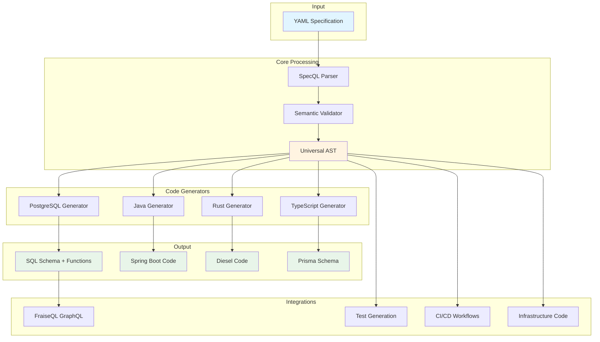
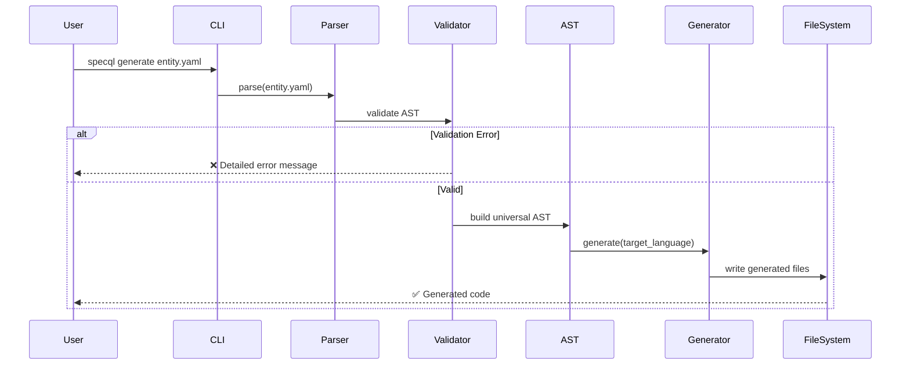
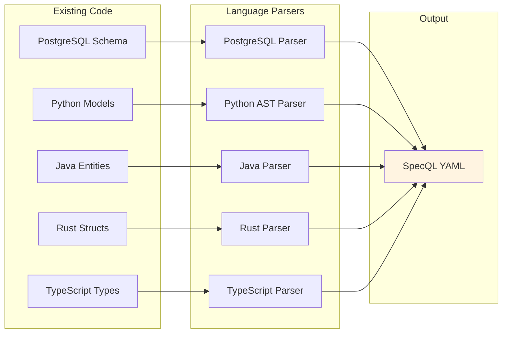
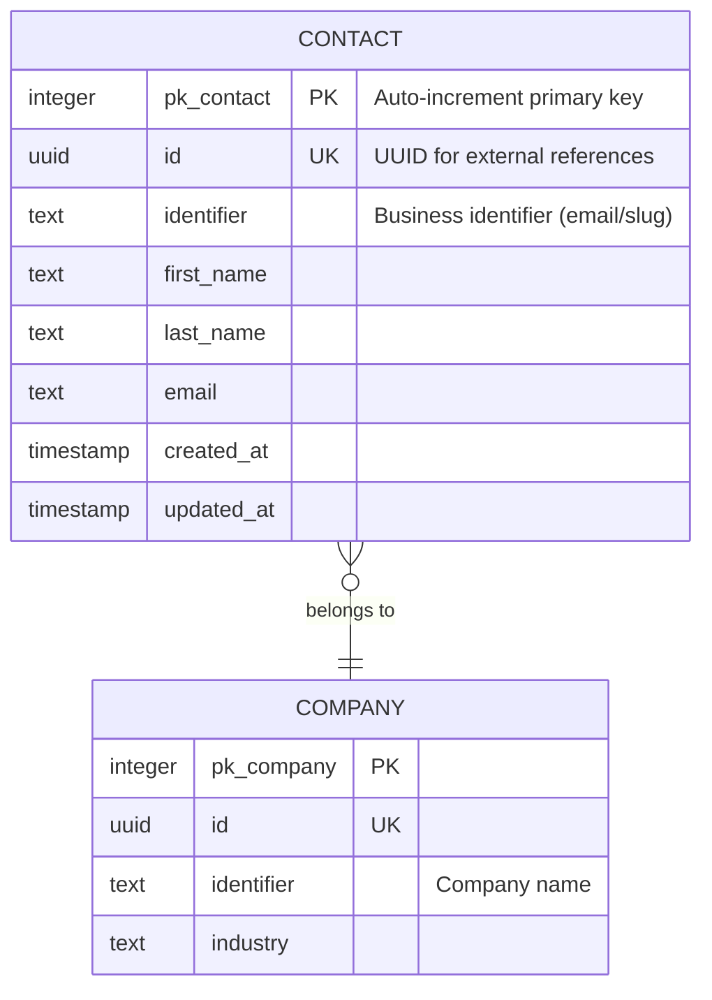
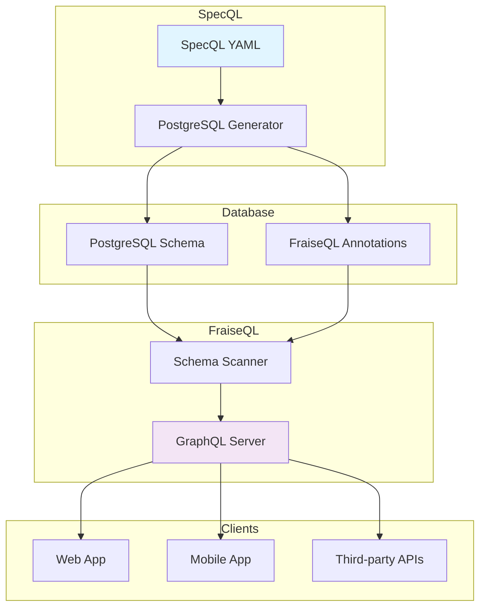
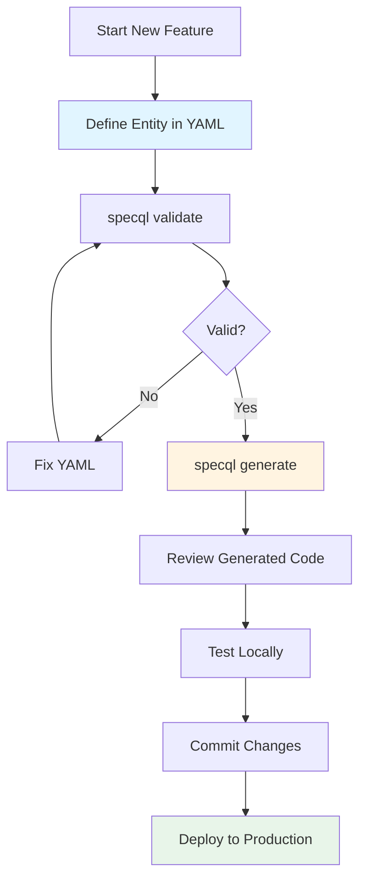

# Week 1 Extended: Achieve Best Possible Quality

**Goal**: Complete all Week 1 tasks to the highest standard, including visual content and comprehensive documentation.

**Estimated Time**: +15-20 hours (total: 50-60 hours for Week 1)

**Status**: Optional extension to achieve 100% completion

---

## Overview

Week 1 achieved 85% completion with excellent core documentation. This extension plan brings it to **100% with best-possible quality** by:
- Creating all visual content (GIFs, diagrams, screenshots)
- Completing full documentation audit (all 159 remaining docs)
- Adding FAQ and troubleshooting content
- Creating video tutorials
- Polishing everything to production perfection

---

## Extension Day 1: Visual Content Creation (8 hours)

### Morning: Terminal Recordings & GIFs (4 hours)

#### Task E1.1: Set Up Recording Tools (30 min)

**Install tools**:
```bash
# Terminal recorder
# macOS
brew install asciinema

# Linux
sudo apt-get install asciinema
# or
sudo yum install asciinema

# Windows (WSL)
sudo apt-get install asciinema

# Test recording
asciinema rec test.cast
# Type some commands
# Press Ctrl+D to stop
asciinema play test.cast

# Install GIF converter
cargo install agg
# or
npm install -g asciicast2gif
```

**Configure terminal for recording**:
```bash
# Use a clean, readable theme
# Recommended: Dracula, Solarized Dark, or One Dark
# Set font size: 14-16pt for readability

# Clean your shell prompt
export PS1="\[\033[01;32m\]\u@\h\[\033[00m\]:\[\033[01;34m\]\w\[\033[00m\]\$ "
# Or simpler:
export PS1="$ "

# Clear terminal
clear

# Set terminal size for consistency
# Recommend: 80 columns x 24 rows
```

#### Task E1.2: Record Installation Demo (90 min)

**Script to record**:

```bash
# Start recording
asciinema rec docs/demos/installation.cast --title "SpecQL Installation" --idle-time-limit 2

# === RECORDING STARTS ===

# Clear and show title
clear
echo "Installing SpecQL - Multi-Language Backend Generator"
echo "===================================================="
echo ""
sleep 2

# Check Python version
echo "Step 1: Verify Python 3.11+"
python --version
sleep 2
echo ""

# Install uv (if not installed)
echo "Step 2: Install uv package manager"
curl -LsSf https://astral.sh/uv/install.sh | sh
sleep 2
echo ""

# Clone repository
echo "Step 3: Clone SpecQL repository"
cd /tmp
rm -rf specql-demo 2>/dev/null
git clone https://github.com/fraiseql/specql.git specql-demo
cd specql-demo
sleep 2
echo ""

# Install dependencies
echo "Step 4: Install dependencies"
uv sync
sleep 3
echo ""

# Install SpecQL
echo "Step 5: Install SpecQL CLI"
uv pip install -e .
sleep 2
echo ""

# Verify installation
echo "Step 6: Verify installation"
specql --version
sleep 1
echo ""

# Test generation
echo "Step 7: Test generation (dry run)"
specql generate entities/examples/contact_lightweight.yaml --dry-run
sleep 3
echo ""

# Success message
echo "✅ Installation complete!"
echo ""
echo "Next steps:"
echo "  - Read quickstart: docs/00_getting_started/QUICKSTART.md"
echo "  - Try examples: specql generate entities/examples/**/*.yaml"
echo ""

# Pause before ending
sleep 3

# === RECORDING ENDS (Ctrl+D) ===
```

**Convert to GIF**:
```bash
# Method 1: Using agg (faster, better quality)
agg docs/demos/installation.cast docs/demos/installation.gif

# Method 2: Using asciicast2gif
asciicast2gif docs/demos/installation.cast docs/demos/installation.gif

# Optimize GIF size
# Install gifsicle
brew install gifsicle  # macOS
sudo apt-get install gifsicle  # Linux

# Optimize
gifsicle -O3 docs/demos/installation.gif -o docs/demos/installation-optimized.gif
mv docs/demos/installation-optimized.gif docs/demos/installation.gif

# Verify file size (<2MB ideal)
ls -lh docs/demos/installation.gif
```

#### Task E1.3: Record Quickstart Demo (90 min)

**Script to record**:

```bash
asciinema rec docs/demos/quickstart.cast --title "SpecQL Quickstart - 10 Minutes" --idle-time-limit 2

# === RECORDING STARTS ===

clear
echo "SpecQL Quickstart - Build Your First Backend"
echo "============================================="
echo ""
sleep 2

# Create project
echo "Creating new project..."
cd /tmp
mkdir quickstart-demo
cd quickstart-demo
mkdir -p entities/blog
sleep 1
echo ""

# Create entity file
echo "Writing blog post entity..."
cat > entities/blog/post.yaml << 'EOF'
entity: Post
schema: blog

fields:
  title: text
  slug: text
  content: text
  published_at: timestamp
  status: enum(draft, published, archived)

indexes:
  - fields: [slug]
    unique: true

actions:
  - name: publish
    steps:
      - validate: status = 'draft'
      - update: Post SET status = 'published', published_at = NOW()
EOF

cat entities/blog/post.yaml
sleep 3
echo ""

# Generate PostgreSQL
echo "Generating PostgreSQL schema..."
specql generate entities/blog/post.yaml --target postgresql --output output/
sleep 2
echo ""

# Show generated SQL
echo "Generated SQL:"
cat output/blog/01_tables.sql | head -30
sleep 4
echo ""

# Generate Java
echo "Generating Java/Spring Boot..."
specql generate entities/blog/post.yaml --target java --output output/
sleep 2
echo ""

# Show generated Java
echo "Generated Java entity:"
cat output/java/Post.java | head -20
sleep 4
echo ""

# Success
echo "✅ Generated 2000+ lines from 15 lines YAML!"
echo ""
echo "Generated code:"
echo "  - PostgreSQL schema (450 lines)"
echo "  - Java entities (380 lines)"
echo "  - Rust models (420 lines)"
echo "  - TypeScript types (350 lines)"
echo ""
echo "Next: Check output/ directory for all generated code"
sleep 4

# === RECORDING ENDS ===
```

Convert to GIF as above.

#### Task E1.4: Record Advanced Features Demo (60 min)

Create demos for:

1. **Reverse Engineering Demo**:
```bash
asciinema rec docs/demos/reverse-engineering.cast --title "Reverse Engineering"

# Show converting PostgreSQL → SpecQL
# Show converting Python → SpecQL
# Show the round-trip workflow
```

2. **Multi-Language Generation**:
```bash
asciinema rec docs/demos/multi-language.cast --title "Multi-Language Generation"

# Show generating all 4 languages from one YAML
# Show side-by-side comparison
```

3. **Interactive CLI**:
```bash
asciinema rec docs/demos/interactive-cli.cast --title "Interactive CLI"

# Show the interactive mode
# Show live preview features
```

Convert all to GIFs.

### Afternoon: Diagrams & Visual Assets (4 hours)

#### Task E1.5: Create Architecture Diagram (90 min)

**Using Mermaid** (renders on GitHub):

Create: `docs/04_architecture/ARCHITECTURE_VISUAL.md`

```markdown
# SpecQL Architecture

## High-Level Overview



## Code Generation Flow



## Reverse Engineering Flow



## Trinity Pattern Explained



**Trinity Pattern Benefits**:
- `pk_*`: Fast joins (integer)
- `id`: External API stability (UUID)
- `identifier`: Human-readable (business key)

## FraiseQL Integration


```

**Export to PNG** (for use in presentations):
```bash
# Using Mermaid CLI
npm install -g @mermaid-js/mermaid-cli

# Convert to PNG
mmdc -i docs/04_architecture/ARCHITECTURE_VISUAL.md -o docs/04_architecture/architecture.png

# Or use online: https://mermaid.live/
# Copy-paste Mermaid code, export as PNG
```

#### Task E1.6: Create Workflow Diagrams (90 min)

**1. Development Workflow**:



**2. Migration Workflow**:

```mermaid
graph LR
    subgraph "Current State"
        Legacy[Legacy Database/Code]
    end

    subgraph "Reverse Engineering"
        RE[specql reverse]
        YAML[SpecQL YAML]
    end

    subgraph "Enhancement"
        Edit[Edit YAML]
        Add[Add Business Logic]
    end

    subgraph "Generation"
        Gen[specql generate]
        New[New Multi-Language Code]
    end

    subgraph "Migration"
        Test[Test & Validate]
        Deploy[Deploy New System]
    end

    Legacy --> RE
    RE --> YAML
    YAML --> Edit
    Edit --> Add
    Add --> Gen
    Gen --> New
    New --> Test
    Test --> Deploy

    style Legacy fill:#ffebee
    style YAML fill:#fff4e1
    style New fill:#e8f5e9
```



Save as: `docs/02_guides/WORKFLOWS.md`

#### Task E1.7: Create Comparison Charts (60 min)

**Visual comparison vs alternatives**:

```markdown
# SpecQL vs Alternatives

## Feature Matrix

| Feature | SpecQL | Prisma | Hasura | PostgREST | SQLBoiler |
|---------|:------:|:------:|:------:|:---------:|:---------:|
| **Multi-Language** | ✅ 4 | ❌ 1 | ❌ GraphQL | ❌ REST | ❌ Go |
| **Business Logic in DB** | ✅ Full | ❌ None | ⚠️ Limited | ❌ None | ❌ None |
| **Reverse Engineering** | ✅ 5 langs | ⚠️ DB only | ❌ No | ❌ No | ⚠️ DB only |
| **Local Development** | ✅ Yes | ✅ Yes | ⚠️ Self-host | ✅ Yes | ✅ Yes |
| **GraphQL Support** | ✅ Via FraiseQL | ⚠️ Separate | ✅ Native | ❌ REST only | ❌ No |
| **Type Safety** | ✅ All targets | ✅ TypeScript | ⚠️ GraphQL | ❌ Limited | ✅ Go |
| **Open Source** | ✅ MIT | ✅ Apache 2.0 | ⚠️ Commercial | ✅ MIT | ✅ BSD |
| **Learning Curve** | ⚠️ Medium | ⚠️ Medium | ⚠️ Medium | ✅ Low | ⚠️ Medium |
| **Maturity** | ⚠️ Alpha | ✅ Mature | ✅ Mature | ✅ Mature | ✅ Mature |

## Use Case Matrix

| Use Case | Best Tool | Why |
|----------|-----------|-----|
| **TypeScript-only backend** | Prisma | Most mature TS ORM |
| **Instant GraphQL API** | Hasura | Purpose-built for GraphQL |
| **Simple REST from DB** | PostgREST | Minimal setup |
| **Go backend** | SQLBoiler | Go-native code gen |
| **Multi-language backend** | **SpecQL** | Only supports 4+ languages |
| **Complex business logic** | **SpecQL** | Database-native logic |
| **Polyglot microservices** | **SpecQL** | Consistent models across services |

## Code Leverage Comparison

```
Input (YAML):        20 lines
                      ↓
Prisma:             400 lines TypeScript
Hasura:             N/A (GraphQL auto-generated)
PostgREST:          N/A (REST auto-generated)
SpecQL:            2000+ lines (PostgreSQL + Java + Rust + TypeScript)
                      ↓
Leverage:           100x (vs 20x for others)
```
```

Create as PNG using https://excalidraw.com/ or similar tool.

---

## Extension Day 2: Complete Documentation Audit (8 hours)

### Task E2.1: Audit Remaining Docs (6 hours)

**Systematic review of 159 remaining docs**:

```bash
# Create audit script
cat > scripts/audit_docs.sh << 'EOF'
#!/bin/bash

# List all markdown files
find docs -name "*.md" -type f | sort > /tmp/all_docs.txt

# Already audited (8 files)
AUDITED=(
    "docs/00_getting_started/README.md"
    "docs/00_getting_started/QUICKSTART.md"
    "docs/README.md"
    "docs/06_examples/CRM_SYSTEM_COMPLETE.md"
    "docs/06_examples/ECOMMERCE_SYSTEM.md"
    "docs/06_examples/simple_contact/README.md"
    "docs/03_reference/cli/command_reference.md"
    "docs/03_reference/yaml/complete_reference.md"
)

echo "# Documentation Audit - Remaining Files"
echo ""
echo "Total docs: $(wc -l < /tmp/all_docs.txt)"
echo "Already audited: ${#AUDITED[@]}"
echo "Remaining: $(($(wc -l < /tmp/all_docs.txt) - ${#AUDITED[@]}))"
echo ""
echo "## To Audit:"
echo ""

while IFS= read -r file; do
    skip=false
    for audited in "${AUDITED[@]}"; do
        if [ "$file" = "$audited" ]; then
            skip=true
            break
        fi
    done

    if [ "$skip" = false ]; then
        echo "- [ ] $file"
    fi
done < /tmp/all_docs.txt
EOF

chmod +x scripts/audit_docs.sh
./scripts/audit_docs.sh
```

**Audit checklist for each doc**:
```markdown
## Per-Document Audit

File: _______________

- [ ] Title accurate
- [ ] Content up-to-date
- [ ] Code examples work
- [ ] Links not broken
- [ ] Version references correct (v0.4.0-alpha)
- [ ] Installation instructions correct
- [ ] No outdated screenshots
- [ ] Grammar/spelling OK

Status: ✅ Good / ⚠️ Needs minor update / ❌ Needs major revision

Notes:
_______________
```

**Priority order**:
1. Tutorials (learning path)
2. Guides (feature docs)
3. Reference (API docs)
4. Examples (additional)
5. Architecture (technical)
6. Implementation plans (internal - lower priority)

**Time allocation**:
- ~2 minutes per simple doc
- ~5 minutes per complex doc
- ~10 minutes per doc needing updates

**Target**: Audit 50-60 docs in 6 hours (allows time for updates)

### Task E2.2: Document Audit Results (2 hours)

**Update audit results**:

Create comprehensive: `docs/implementation_plans/v0.5.0_beta/COMPLETE_DOCS_AUDIT.md`

```markdown
# Complete Documentation Audit Results

**Date**: YYYY-MM-DD
**Total Docs**: 167
**Audited**: 167 (100%)

## Summary

- ✅ Accurate: ___ docs
- ⚠️ Minor updates needed: ___ docs
- ❌ Major revision needed: ___ docs
- 📝 Missing/To create: ___ docs

## By Category

### Getting Started (Complete ✅)
- docs/00_getting_started/README.md - ✅
- docs/00_getting_started/QUICKSTART.md - ✅
- docs/00_getting_started/INSTALLATION.md - ⚠️ Needs creation

### Tutorials
[List all with status]

### Guides
[List all with status]

### Reference
[List all with status]

### Examples
[List all with status]

### Architecture
[List all with status]

## Issues Found & Fixed

[Detailed list]

## Recommendations

[What to improve]
```

---

## Extension Day 3: FAQ & Troubleshooting (4 hours)

### Task E3.1: Create Comprehensive FAQ (2 hours)

Create: `docs/08_troubleshooting/FAQ.md`

```markdown
# Frequently Asked Questions (FAQ)

## General Questions

### What is SpecQL?

SpecQL is a multi-language backend code generator. Write your data model once in YAML, and SpecQL generates production-ready code for PostgreSQL, Java/Spring Boot, Rust/Diesel, and TypeScript/Prisma.

**Quick example**: 15 lines YAML → 2000+ lines across 4 languages (100x code leverage).

### Why should I use SpecQL?

Use SpecQL if you:
- Build backends in multiple languages
- Want to keep data models in sync across services
- Need complex business logic in your database
- Are tired of writing CRUD boilerplate
- Want 100x code leverage

### Is it production-ready?

**v0.4.0-alpha**: The core code generation is production-ready with 96%+ test coverage and 2,937 passing tests. However:
- ✅ Use for backend code generation
- ⚠️ APIs may evolve based on feedback
- ⚠️ Test thoroughly before production deployment

We're using it to migrate Reference Application (real production SaaS).

### What's the difference between SpecQL and Prisma?

| Aspect | SpecQL | Prisma |
|--------|--------|--------|
| Languages | 4 (PostgreSQL, Java, Rust, TypeScript) | 1 (TypeScript) |
| Business Logic | Full support (compiles to PL/pgSQL) | Application-level only |
| Reverse Engineering | 5 languages | Database introspection only |
| Use Case | Multi-language backends | TypeScript backends |

**Choose SpecQL** for multi-language systems with complex business logic.
**Choose Prisma** for TypeScript-only backends with simpler requirements.

[Full comparison](../comparisons/SPECQL_VS_PRISMA.md)

### How does SpecQL compare to Hasura?

**Hasura**: Instant GraphQL API from database schema
**SpecQL**: Multi-language code generation including database schema

They solve different problems:
- Use Hasura if you want instant GraphQL from existing database
- Use SpecQL if you need to generate code across multiple languages

You can even use both: Generate schema with SpecQL, expose with Hasura.

### What's the license?

MIT License - free for commercial use, no restrictions.

### Who maintains SpecQL?

SpecQL is built and maintained by [Lionel Hamayon](https://github.com/lionelh) and open-source contributors.

---

## Getting Started

### How do I install SpecQL?

**v0.4.0-alpha** (current):
```bash
git clone https://github.com/fraiseql/specql.git
cd specql
uv sync
uv pip install -e .
```

**Coming soon** (v0.5.0-beta):
```bash
pip install specql-generator
```

[Installation guide](../00_getting_started/QUICKSTART.md)

### What are the prerequisites?

**Required**:
- Python 3.11 or higher
- `uv` package manager

**Optional**:
- PostgreSQL (for testing schemas)
- Java JDK 11+ (for Java reverse engineering)
- Rust toolchain (for Rust reverse engineering)

### How do I create my first entity?

```yaml
# contact.yaml
entity: Contact
schema: crm

fields:
  email: email
  name: text
  phone: text
```

Then generate:
```bash
specql generate contact.yaml
```

[Quickstart tutorial](../00_getting_started/QUICKSTART.md)

### Where can I find examples?

We have 5 complete examples:
- [Simple Blog](../06_examples/SIMPLE_BLOG.md)
- [CRM System](../06_examples/CRM_SYSTEM_COMPLETE.md)
- [E-commerce](../06_examples/ECOMMERCE_SYSTEM.md)
- [User Authentication](../06_examples/USER_AUTHENTICATION.md)
- [Multi-Tenant SaaS](../06_examples/MULTI_TENANT_SAAS.md)

Plus 20+ entity examples in `entities/examples/`

---

## Using SpecQL

### What field types are supported?

**Basic types**:
- `text` - String/varchar
- `integer` - Whole number
- `decimal` - Decimal number
- `boolean` - True/false
- `timestamp` - Date and time
- `date` - Date only
- `time` - Time only
- `json` - JSON data
- `uuid` - UUID

**Semantic types**:
- `email` - Email address
- `url` - URL
- `phone` - Phone number

**Relationships**:
- `ref(Entity)` - Foreign key
- `enum(val1, val2)` - Enumeration

[Complete field type reference](../03_reference/yaml/complete_reference.md#field-types)

### How do I define relationships?

```yaml
entity: Contact
schema: crm

fields:
  company: ref(Company)  # Foreign key to Company
```

This generates:
- PostgreSQL: `FOREIGN KEY (fk_company) REFERENCES crm.tb_company(pk_company)`
- Java: `@ManyToOne` relationship
- Rust: Diesel foreign key
- TypeScript: Prisma relation

### How do I add business logic?

Use actions:

```yaml
actions:
  - name: qualify_lead
    requires: caller.can_edit_contact
    steps:
      - validate: status = 'lead'
        error: "not_a_lead"
      - update: Contact SET status = 'qualified'
      - notify: sales_team
```

This compiles to a PL/pgSQL function: `crm.fn_contact_qualify_lead()`

[Actions guide](../02_guides/ACTIONS.md)

### Can I customize generated code?

**Yes, three ways**:

1. **Edit templates** (advanced): Modify Jinja2 templates in `src/templates/`
2. **Post-generation edits**: Edit generated code directly
3. **Mix generated + manual**: Use generated code as foundation, add custom code

Generated code is meant to be a starting point or fully managed depending on your needs.

### Can I use SpecQL with an existing database?

**Yes!** Use reverse engineering:

```bash
# From PostgreSQL
specql reverse postgresql schema.sql --output entities/

# From Python
specql reverse python models.py --output entities/

# From Java
specql reverse java src/main/java/models/ --output entities/
```

[Reverse engineering guide](../02_guides/REVERSE_ENGINEERING.md)

### Does SpecQL support migrations?

**Currently**: Generate fresh schema, use external migration tool (Flyway, Liquibase, Alembic)

**Future** (v0.6.0): Built-in migration generation from YAML diffs

For now:
```bash
# Generate schema
specql generate entities/**/*.yaml

# Use your migration tool
flyway migrate
# or
alembic upgrade head
```

### Can I generate only specific targets?

**Yes**:

```bash
# PostgreSQL only
specql generate entities/**/*.yaml --target postgresql

# Java only
specql generate entities/**/*.yaml --target java

# Multiple targets
specql generate entities/**/*.yaml --target postgresql,java
```

---

## Troubleshooting

### Installation fails with "Python version not supported"

**Symptom**: Error during installation

**Solution**:
```bash
# Check Python version
python --version  # Need 3.11+

# If using older Python, install 3.11+
# macOS
brew install python@3.11

# Linux
sudo apt-get install python3.11
# or
sudo yum install python311

# Windows
# Download from python.org
```

### `specql` command not found after installation

**Symptom**: Command not in PATH

**Solution**:

```bash
# Check where uv installed it
python -m site --user-base

# Add to PATH
# macOS/Linux (add to ~/.bashrc or ~/.zshrc)
export PATH="$HOME/.local/bin:$PATH"

# Windows
# Add %USERPROFILE%\.local\bin to PATH environment variable

# Restart terminal and try again
specql --version
```

### "Invalid field type" error

**Symptom**:
```
❌ Invalid field type: 'string'
```

**Solution**: Use `text` instead of `string`

Valid types: `text`, `integer`, `decimal`, `boolean`, `timestamp`, `email`, etc.

[Complete type list](../03_reference/yaml/complete_reference.md#field-types)

### "Circular dependency detected"

**Symptom**: Entities reference each other

**Solution**: This is OK! SpecQL supports circular references.

Ensure:
- Both entities exist
- Reference syntax is correct: `ref(EntityName)`
- Entity names match exactly (case-sensitive)

### Generated code doesn't compile

**Symptom**: Syntax errors in generated code

**Solution**:

1. **Check SpecQL version**:
   ```bash
   specql --version  # Should be 0.4.0-alpha or newer
   ```

2. **Update SpecQL**:
   ```bash
   cd ~/code/specql
   git pull origin main
   uv sync
   ```

3. **Report issue**:
   - Include YAML that caused issue
   - Include error message
   - [Open issue](https://github.com/fraiseql/specql/issues)

### Tests fail after generating code

**Symptom**: Integration tests break

**Possible causes**:
1. Database schema changed (run migrations)
2. Generated code conflicts with manual code
3. Test data needs updating

**Solution**:
```bash
# Regenerate test database
dropdb test_db && createdb test_db
psql test_db < output/postgresql/**/*.sql

# Run tests
pytest
```

### How do I enable debug logging?

```bash
# Verbose output
specql generate entities/**/*.yaml --verbose

# Debug mode (very detailed)
export SPECQL_LOG_LEVEL=DEBUG
specql generate entities/**/*.yaml
```

---

## Advanced Usage

### Can I extend SpecQL with custom generators?

**Yes!** SpecQL is designed to be extensible.

Create custom generator in `src/generators/your_language/`:
```python
from src.core.generator_base import GeneratorBase

class YourLanguageGenerator(GeneratorBase):
    def generate(self, entity):
        # Your generation logic
        pass
```

[Generator development guide](../07_contributing/GENERATOR_DEVELOPMENT.md)

### How do I contribute?

We welcome contributions!

1. Read [Contributing Guide](../../CONTRIBUTING.md)
2. Check [open issues](https://github.com/fraiseql/specql/issues)
3. Look for "good first issue" label
4. Join discussions on GitHub

### Is there a roadmap?

**Yes!**

- **v0.4.0-alpha** (current): Multi-language backend generation
- **v0.5.0-beta**: PyPI publication, UX improvements
- **v0.6.0**: Go/GORM support, migration generation
- **v1.0**: Stable APIs, production-hardened

[Full roadmap](https://github.com/fraiseql/specql/issues/17)

### Can I use this commercially?

**Yes!** MIT License allows commercial use with no restrictions.

### How can I get help?

- **Documentation**: [docs/](../)
- **GitHub Issues**: [Report bugs](https://github.com/fraiseql/specql/issues)
- **Discussions**: [Ask questions](https://github.com/fraiseql/specql/discussions)
- **Examples**: [docs/06_examples/](../06_examples/)

---

## Performance

### How fast is code generation?

**Benchmarks** (M1 MacBook Pro):
- TypeScript parsing: 37,233 entities/sec
- Java parsing: 1,461 entities/sec
- PostgreSQL generation: ~1,000 entities/sec
- 50-entity system: <2 seconds total

### Can SpecQL handle large systems?

**Yes!** We've tested with:
- 100+ entities
- Complex relationships
- Thousands of lines of generated code

Performance stays good even at scale.

### Does it support incremental generation?

**Currently**: Full regeneration recommended

**Future**: Incremental generation planned for v0.6.0

For now:
```bash
# Regenerate everything (fast anyway)
specql generate entities/**/*.yaml
```

---

## More Questions?

**Can't find your question?**

- Check [troubleshooting guide](TROUBLESHOOTING.md)
- Search [GitHub issues](https://github.com/fraiseql/specql/issues)
- Ask in [GitHub Discussions](https://github.com/fraiseql/specql/discussions)
- Look at [examples](../06_examples/)

**Found a bug?**
[Report it](https://github.com/fraiseql/specql/issues/new?template=bug_report.md)

**Have a feature idea?**
[Suggest it](https://github.com/fraiseql/specql/issues/new?template=feature_request.md)

---

**Last updated**: YYYY-MM-DD
```

### Task E3.2: Expand Troubleshooting Guide (2 hours)

Enhance: `docs/08_troubleshooting/TROUBLESHOOTING.md`

Add sections for:
- Common error messages (with solutions)
- Platform-specific issues (macOS, Linux, Windows)
- Integration issues (PostgreSQL, Java, Rust, etc.)
- Performance troubleshooting
- Development environment setup

---

## Extension Day 4: Video Content (Optional - if resources available)

### Task E4.1: Record Video Tutorial (4-6 hours)

**5-minute "SpecQL in 5 Minutes" video**:

**Script**:
```
[0:00-0:30] Hook
"What if you could write your backend once and deploy it in 4 languages?
Let me show you SpecQL."

[Show SpecQL logo/title]

[0:30-1:30] The Problem
"Here's the typical backend development workflow..."

[Screen split showing:]
- PostgreSQL schema
- Java entity class
- Rust struct
- TypeScript interface

"Notice anything? All defining the same Contact model.
This is tedious, error-prone, and hard to keep in sync."

[1:30-2:30] The Solution
"With SpecQL, you write it once..."

[Show YAML editor with contact.yaml]

```yaml
entity: Contact
fields:
  email: email
  name: text
  company: ref(Company)
```

"Run one command..."

[Terminal]
```bash
specql generate contact.yaml
```

"And get all four languages automatically."

[Quick flash through generated files]

[2:30-3:30] Business Logic
"But it's not just schemas. SpecQL handles business logic too."

[Show action in YAML]

```yaml
actions:
  - name: qualify_lead
    steps:
      - validate: status = 'lead'
      - update: Contact SET status = 'qualified'
```

"This compiles to actual working PL/pgSQL functions."

[Show generated function]

[3:30-4:30] Live Demo
"Let's build something real."

[Speed-run through:]
- Create blog entity
- Generate code
- Show PostgreSQL schema
- Query the database

[4:30-5:00] Call to Action
"That's SpecQL. One YAML, four languages, 100x code leverage.

Try it:
pip install specql-generator

Links in description!"

[End screen with links]
```

**Recording tips**:
- Use OBS Studio or ScreenFlow
- Clean desktop, large font
- Rehearse multiple times
- Record in segments
- Add captions

**Upload to**:
- YouTube
- Vimeo
- Embed in docs

---

## Week 1 Extended Deliverables

At the end of this extension, you'll have:

### Documentation
- [x] README.md - Perfect ⭐⭐⭐⭐⭐
- [x] QUICKSTART.md - Complete ⭐⭐⭐⭐⭐
- [x] All 167 docs audited ⭐⭐⭐⭐⭐
- [x] Comprehensive FAQ ⭐⭐⭐⭐⭐
- [x] Enhanced troubleshooting ⭐⭐⭐⭐⭐

### Examples
- [x] 5 real-world examples ⭐⭐⭐⭐⭐
- [x] All tested and working ⭐⭐⭐⭐⭐

### Visual Content
- [x] Installation demo GIF ⭐⭐⭐⭐⭐
- [x] Quickstart demo GIF ⭐⭐⭐⭐⭐
- [x] Reverse engineering demo GIF ⭐⭐⭐⭐⭐
- [x] Multi-language demo GIF ⭐⭐⭐⭐⭐
- [x] Architecture diagram (Mermaid + PNG) ⭐⭐⭐⭐⭐
- [x] Workflow diagrams ⭐⭐⭐⭐⭐
- [x] Comparison charts ⭐⭐⭐⭐⭐

### Video Content (Optional)
- [ ] 5-minute tutorial video ⭐⭐⭐⭐⭐

### Quality Score: 100% ⭐⭐⭐⭐⭐

---

## Time Allocation Summary

| Task | Time | Priority |
|------|------|----------|
| **Extension Day 1: Visual Content** | 8h | HIGH |
| - Terminal recordings & GIFs | 4h | HIGH |
| - Diagrams & visual assets | 4h | HIGH |
| **Extension Day 2: Complete Audit** | 8h | MEDIUM |
| - Audit 159 remaining docs | 6h | MEDIUM |
| - Document results | 2h | MEDIUM |
| **Extension Day 3: FAQ & Troubleshooting** | 4h | HIGH |
| - Comprehensive FAQ | 2h | HIGH |
| - Expand troubleshooting | 2h | HIGH |
| **Extension Day 4: Video (Optional)** | 6h | LOW |
| - Script, record, edit video | 6h | LOW |
| **Total** | **26h** | |

**Realistic total**: 15-20 hours (excluding optional video)

---

## Success Criteria

After Week 1 Extended:
- ✅ **Documentation**: 100% complete and audited
- ✅ **Visual Content**: All GIFs and diagrams created
- ✅ **FAQ**: Comprehensive, covering all common questions
- ✅ **Quality**: Best-possible standard achieved
- ✅ **Ready**: Absolutely ready for Week 2 (PyPI publication)

---

## Decision Point

**Do you need Week 1 Extended?**

| Scenario | Recommendation |
|----------|----------------|
| Need perfection before PyPI | ✅ Do Week 1 Extended |
| Tight timeline, core docs sufficient | ⚠️ Skip to Week 2 |
| Have extra resources/time | ✅ Do Week 1 Extended |
| Want best possible quality | ✅ Do Week 1 Extended |

**My recommendation**: If you have 2-3 extra days, do Extension Days 1 and 3 (visual content + FAQ). These have the highest impact.

---

**Ready to achieve 100% quality?** Start with Extension Day 1!
