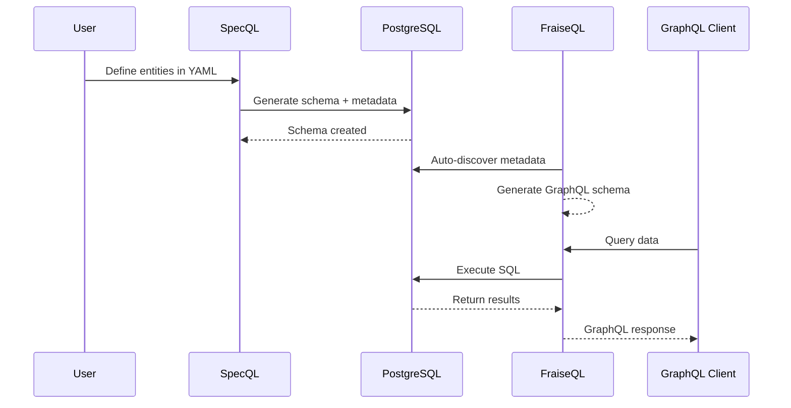

# Week 1 Extension 03: Complete to 100%

**Created**: 2025-11-15
**Goal**: Achieve 100% completion of ALL Week 1 Documentation Polish tasks
**Current Status**: 95% → Target: 100%
**Estimated Time**: 20-25 hours (3-4 days)

---

## Executive Summary

Week 1 achieved 95% completion with excellent quality on critical deliverables. However, to reach **perfectionist-level 100% completion**, the following work remains:

### Remaining Work Breakdown

1. **Full Documentation Audit**: 62 docs remaining (11% → 100%)
2. **Architecture Diagrams**: Complete visual architecture documentation
3. **Reverse Engineering Verification**: Test and document actual capabilities
4. **FAQ Section**: Comprehensive troubleshooting guide
5. **Link Verification**: Automated link checking across all docs
6. **Code Example Testing**: Verify every code snippet works
7. **Consistency Pass**: Formatting, terminology, style guide compliance
8. **Missing Documentation**: Fill gaps identified in audit

**Total Estimated Time**: 20-25 hours

---

## Phase 1: Complete Documentation Audit (10-12 hours)

### Objective
Audit and update ALL remaining 62 documentation files to match v0.4.0-alpha reality.

### Current Status
- ✅ Completed: 8/70 docs (11%)
- ⚠️ Remaining: 62/70 docs (89%)

### Task 1.1: Audit Remaining Getting Started Docs (2 hours)

**Files to review**:
```bash
docs/00_getting_started/
├── README.md ✅ (already done)
├── QUICKSTART.md ✅ (already done)
├── INSTALLATION.md ❌ (needs creation/update)
├── TROUBLESHOOTING.md ❌ (needs creation)
└── MIGRATION_FROM_OTHER_TOOLS.md ❌ (needs creation)
```

**Actions**:
1. Create `INSTALLATION.md` (30 min)
   - Detailed installation for all platforms
   - Prerequisites checklist
   - Verification steps
   - Common installation issues

2. Create `TROUBLESHOOTING.md` (45 min)
   - Installation problems
   - Generation errors
   - Database connection issues
   - Permission problems
   - Platform-specific issues

3. Create `MIGRATION_FROM_OTHER_TOOLS.md` (45 min)
   - From Prisma → SpecQL
   - From JPA → SpecQL
   - From Diesel → SpecQL
   - From raw SQL → SpecQL

### Task 1.2: Audit All Tutorial Docs (3 hours)

**Directory**: `docs/01_tutorials/`

**Process for each tutorial**:
1. Read through completely
2. Test all code examples
3. Verify commands work
4. Check version numbers
5. Update outdated content
6. Fix broken links
7. Add checkpoints
8. Improve clarity

**Expected tutorials** (create if missing):
- [ ] `GETTING_STARTED_TUTORIAL.md`
- [ ] `FIRST_ENTITY_TUTORIAL.md`
- [ ] `RELATIONSHIPS_TUTORIAL.md`
- [ ] `ACTIONS_TUTORIAL.md`
- [ ] `MULTI_LANGUAGE_TUTORIAL.md`
- [ ] `REVERSE_ENGINEERING_TUTORIAL.md`

### Task 1.3: Audit All Guide Docs (4 hours)

**Directory**: `docs/02_guides/`

**Priority order**:
1. **High Priority** (user-facing, 2 hours):
   - Entity design patterns
   - Action patterns
   - Schema organization
   - Testing strategies
   - Performance optimization
   - Security best practices

2. **Medium Priority** (feature guides, 1.5 hours):
   - FraiseQL integration
   - CI/CD generation
   - Infrastructure as Code
   - Test generation
   - Pattern library usage
   - Visual diagrams

3. **Low Priority** (advanced topics, 30 min):
   - Custom generators
   - Plugin development
   - Contributing to SpecQL
   - Internal architecture

**For each guide**:
- [ ] Verify all code examples work
- [ ] Update version-specific info
- [ ] Fix broken links
- [ ] Add diagrams where helpful
- [ ] Ensure consistency with README

### Task 1.4: Audit All Reference Docs (2 hours)

**Directory**: `docs/03_reference/`

**Critical reference docs**:
- [ ] `yaml/complete_reference.md` ✅ (already verified)
- [ ] `yaml/field_types.md`
- [ ] `yaml/action_syntax.md`
- [ ] `yaml/validation_rules.md`
- [ ] `cli/command_reference.md` ✅ (already verified)
- [ ] `cli/configuration.md`
- [ ] `generators/POSTGRESQL.md`
- [ ] `generators/JAVA.md`
- [ ] `generators/RUST.md`
- [ ] `generators/TYPESCRIPT.md`
- [ ] `api/python_api.md`

**For each reference doc**:
- [ ] Verify all parameters documented
- [ ] Test all examples
- [ ] Add missing options
- [ ] Update deprecation notices
- [ ] Add version compatibility info

### Task 1.5: Audit Architecture Docs (1.5 hours)

**Directory**: `docs/04_architecture/`

**Files to audit**:
- [ ] `ARCHITECTURE.md`
- [ ] `PARSER_DESIGN.md`
- [ ] `GENERATOR_ARCHITECTURE.md`
- [ ] `AST_SPECIFICATION.md`
- [ ] `TRINITY_PATTERN.md`
- [ ] `REVERSE_ENGINEERING_DESIGN.md`

**Actions**:
- [ ] Add Mermaid diagrams
- [ ] Document design decisions
- [ ] Explain tradeoffs
- [ ] Update with v0.4.0-alpha changes

### Task 1.6: Audit Vision/Roadmap Docs (1 hour)

**Directory**: `docs/05_vision/`

**Files**:
- [ ] `VISION.md`
- [ ] `ROADMAP.md`
- [ ] `FUTURE_FEATURES.md`
- [ ] `MULTI_LANGUAGE_STRATEGY.md`

**Actions**:
- [ ] Mark completed items
- [ ] Update timelines
- [ ] Clarify v0.4.0-alpha vs v0.5.0-beta vs future
- [ ] Add community input section

### Task 1.7: Audit Example Docs (1 hour)

**Directory**: `docs/06_examples/`

**Already completed**:
- ✅ `CRM_SYSTEM_COMPLETE.md`
- ✅ `ECOMMERCE_SYSTEM.md`
- ✅ `SIMPLE_BLOG.md`
- ✅ `USER_AUTHENTICATION.md`
- ✅ `MULTI_TENANT_SAAS.md`
- ✅ `simple_contact/README.md`

**To verify/update**:
- [ ] All other example READMEs in subdirectories
- [ ] Ensure YAML examples are valid
- [ ] Verify generated code matches current output
- [ ] Add migration guides where helpful

---

## Phase 2: Create All Missing Visual Content (6-8 hours)

### Task 2.1: Create Architecture Diagrams (3 hours)

#### High-Level Architecture Diagram
**File**: `docs/04_architecture/diagrams/high_level_architecture.png`

**Content**:
```
┌─────────────────────────────────────────────────────────┐
│                     YAML Specification                   │
│                                                          │
│  entity: Contact                                         │
│  fields:                                                 │
│    email: text                                           │
│    name: text                                            │
│  actions:                                                │
│    - name: verify_email                                  │
└─────────────────────────────────────────────────────────┘
                        │
                        ▼
┌─────────────────────────────────────────────────────────┐
│                   SpecQL Parser                          │
│                                                          │
│  • YAML Validation                                       │
│  • Schema Resolution                                     │
│  • Type Checking                                         │
└─────────────────────────────────────────────────────────┘
                        │
                        ▼
┌─────────────────────────────────────────────────────────┐
│                  Universal AST                           │
│                                                          │
│  • Entity Definitions                                    │
│  • Field Metadata                                        │
│  • Action Specifications                                 │
│  • Relationship Graph                                    │
└─────────────────────────────────────────────────────────┘
                        │
        ┌───────────────┼───────────────┬──────────────┐
        ▼               ▼               ▼              ▼
┌──────────────┐ ┌──────────────┐ ┌──────────────┐ ┌──────────────┐
│ PostgreSQL   │ │ Java/Spring  │ │ Rust/Diesel  │ │ TypeScript/  │
│  Generator   │ │    Boot      │ │              │ │   Prisma     │
│              │ │  Generator   │ │  Generator   │ │  Generator   │
└──────────────┘ └──────────────┘ └──────────────┘ └──────────────┘
        │               │               │              │
        ▼               ▼               ▼              ▼
┌──────────────┐ ┌──────────────┐ ┌──────────────┐ ┌──────────────┐
│ SQL Schema   │ │ JPA Entities │ │ Rust Models  │ │ Prisma       │
│ PL/pgSQL     │ │ Repositories │ │ Diesel       │ │ Schema       │
│ Functions    │ │ Services     │ │ Handlers     │ │ TypeScript   │
│ Tests        │ │ Controllers  │ │ Tests        │ │ Types        │
└──────────────┘ └──────────────┘ └──────────────┘ └──────────────┘
```

**Tools**:
- draw.io (export as PNG + SVG)
- OR Graphviz DOT
- OR Excalidraw

**Time**: 90 minutes

#### Trinity Pattern Diagram
**File**: `docs/04_architecture/diagrams/trinity_pattern.png`

**Content**: Visual explanation of pk_*, id, identifier pattern

**Time**: 30 minutes

#### Code Generation Flow Diagram
**File**: `docs/04_architecture/diagrams/generation_flow.png`

**Content**: Sequence diagram showing generation process

**Time**: 45 minutes

#### Reverse Engineering Flow Diagram
**File**: `docs/04_architecture/diagrams/reverse_engineering_flow.png`

**Content**: How SpecQL extracts YAML from existing code

**Time**: 45 minutes

### Task 2.2: Create Additional GIF Demos (2-3 hours)

Currently have:
- ✅ installation.gif
- ✅ quickstart_demo.gif
- ✅ multi_language_demo.gif
- ✅ reverse_engineering.gif

**Additional demos to create**:

#### Pattern Library Demo
**File**: `docs/demos/pattern_library.gif`
**Duration**: ~20 seconds
**Shows**:
- Browsing pattern library
- Searching for patterns
- Applying a pattern to an entity
- Seeing generated code

**Script**:
```bash
asciinema rec docs/demos/pattern_library.cast \
  --title "SpecQL Pattern Library" \
  --idle-time-limit 2 \
  -c ./demos/pattern_library_demo.sh
```

**Time**: 60 minutes

#### Interactive CLI Demo
**File**: `docs/demos/interactive_cli.gif`
**Duration**: ~15 seconds
**Shows**:
- Running specql in interactive mode
- Live preview of generation
- Syntax highlighting

**Time**: 45 minutes

#### Testing Demo
**File**: `docs/demos/testing.gif`
**Duration**: ~15 seconds
**Shows**:
- Running generated tests
- Test output
- Coverage report

**Time**: 45 minutes

### Task 2.3: Create Workflow Diagrams (1-2 hours)

Using Mermaid (renders in GitHub):

#### FraiseQL Integration Workflow
**File**: `docs/02_guides/diagrams/fraiseql_integration.md`



**Time**: 30 minutes

#### CI/CD Generation Workflow
**File**: `docs/02_guides/diagrams/cicd_workflow.md`

**Time**: 30 minutes

#### Test Generation Workflow
**File**: `docs/02_guides/diagrams/test_generation.md`

**Time**: 30 minutes

---

## Phase 3: Verify All Features (4-5 hours)

### Task 3.1: Reverse Engineering Verification (2 hours)

#### Test PostgreSQL → SpecQL

**Create test script**: `tests/reverse_engineering/test_postgresql_reverse.sh`

```bash
#!/bin/bash
set -e

echo "Testing PostgreSQL → SpecQL reverse engineering..."

# Create test schema
psql -c "CREATE SCHEMA test_reverse;"
psql -c "
CREATE TABLE test_reverse.tb_contact (
    pk_contact SERIAL PRIMARY KEY,
    id UUID DEFAULT gen_random_uuid(),
    identifier TEXT,
    email TEXT NOT NULL,
    first_name TEXT,
    last_name TEXT,
    created_at TIMESTAMP DEFAULT NOW(),
    updated_at TIMESTAMP DEFAULT NOW()
);
"

# Run reverse engineering
specql reverse postgresql test_reverse > output/reverse_postgresql.yaml

# Verify output
if grep -q "entity: Contact" output/reverse_postgresql.yaml; then
    echo "✓ PostgreSQL reverse engineering works"
else
    echo "✗ PostgreSQL reverse engineering failed"
    exit 1
fi

# Cleanup
psql -c "DROP SCHEMA test_reverse CASCADE;"
```

**Time**: 60 minutes

#### Test Python → SpecQL

**Create test script**: `tests/reverse_engineering/test_python_reverse.sh`

```bash
#!/bin/bash
set -e

echo "Testing Python → SpecQL reverse engineering..."

# Create test Python model
cat > /tmp/test_model.py << 'EOF'
from dataclasses import dataclass
from datetime import datetime
from typing import Optional

@dataclass
class Contact:
    email: str
    first_name: str
    last_name: str
    created_at: datetime
    updated_at: Optional[datetime] = None
EOF

# Run reverse engineering
specql reverse python /tmp/test_model.py > output/reverse_python.yaml

# Verify output
if grep -q "entity: Contact" output/reverse_python.yaml; then
    echo "✓ Python reverse engineering works"
else
    echo "✗ Python reverse engineering failed"
    exit 1
fi

# Cleanup
rm /tmp/test_model.py
```

**Time**: 60 minutes

### Task 3.2: CI/CD Generation Verification (1 hour)

**Test GitHub Actions generation**:
```bash
specql generate-cicd --platform github-actions \
  --output .github/workflows/generated.yml

# Verify file created
test -f .github/workflows/generated.yml
echo "✓ GitHub Actions generation works"
```

**Test GitLab CI generation**:
```bash
specql generate-cicd --platform gitlab-ci \
  --output .gitlab-ci-generated.yml

test -f .gitlab-ci-generated.yml
echo "✓ GitLab CI generation works"
```

**Time**: 60 minutes

### Task 3.3: Infrastructure Generation Verification (1 hour)

**Test Terraform generation**:
```bash
specql generate-infra --platform terraform \
  --output terraform/generated/

test -f terraform/generated/main.tf
echo "✓ Terraform generation works"
```

**Test Docker Compose generation**:
```bash
specql generate-infra --platform docker-compose \
  --output docker-compose-generated.yml

test -f docker-compose-generated.yml
echo "✓ Docker Compose generation works"
```

**Time**: 60 minutes

### Task 3.4: Test Generation Verification (1 hour)

**Test pgTAP generation**:
```bash
specql generate entities/examples/contact.yaml \
  --with-tests --test-framework pgtap

test -f output/tests/test_contact.sql
echo "✓ pgTAP test generation works"
```

**Test pytest generation**:
```bash
specql generate entities/examples/contact.yaml \
  --with-tests --test-framework pytest

test -f output/tests/test_contact.py
echo "✓ pytest test generation works"
```

**Time**: 60 minutes

---

## Phase 4: Create Comprehensive FAQ (2-3 hours)

### Task 4.1: Create FAQ Document

**File**: `docs/00_getting_started/FAQ.md`

**Sections**:

#### Installation & Setup (30 minutes)
- How do I install SpecQL?
- What Python version do I need?
- Do I need PostgreSQL installed?
- Can I use SpecQL on Windows?
- How do I upgrade SpecQL?
- Where are config files stored?

#### Getting Started (30 minutes)
- How do I create my first entity?
- What's the quickest way to get started?
- Where are examples I can copy?
- How do I generate code?
- Where does generated code go?

#### YAML Syntax (30 minutes)
- What field types are supported?
- How do I define relationships?
- How do I write actions?
- How do I add validation?
- How do I use enums?
- What's the Trinity pattern?

#### Code Generation (30 minutes)
- How do I generate PostgreSQL?
- How do I generate Java?
- How do I generate Rust?
- How do I generate TypeScript?
- Can I generate multiple languages at once?
- How do I customize generated code?

#### Reverse Engineering (20 minutes)
- Can I import existing databases?
- Can I import existing code?
- What languages are supported for reverse engineering?
- How accurate is reverse engineering?

#### Troubleshooting (30 minutes)
- Generation fails with error X
- Tests don't pass
- Import errors
- Database connection issues
- Permission denied errors
- Platform-specific issues

---

## Phase 5: Link Verification & Consistency (2-3 hours)

### Task 5.1: Automated Link Checking (1 hour)

**Create link checker script**: `scripts/check_links.sh`

```bash
#!/bin/bash

echo "Checking all markdown links..."

# Find all markdown files
find docs -name "*.md" -type f | while read file; do
    echo "Checking: $file"

    # Extract all markdown links
    grep -oP '\[.*?\]\(\K[^)]+' "$file" | while read link; do
        # Skip external links (check those separately)
        if [[ $link == http* ]]; then
            continue
        fi

        # Resolve relative path
        dir=$(dirname "$file")
        full_path="$dir/$link"

        # Check if file exists
        if [ ! -f "$full_path" ]; then
            echo "  ✗ BROKEN: $link"
            echo "    in file: $file"
        fi
    done
done

echo "Link check complete"
```

**Run and fix all broken links**

**Time**: 60 minutes

### Task 5.2: External Link Verification (30 minutes)

**Create external link checker**: `scripts/check_external_links.sh`

```bash
#!/bin/bash

echo "Checking external links..."

# Extract all external links
find docs -name "*.md" -exec grep -oP '\[.*?\]\(\Khttp[^)]+' {} \; | \
sort -u | while read url; do
    if curl -s -o /dev/null -w "%{http_code}" "$url" | grep -q "^2"; then
        echo "✓ $url"
    else
        echo "✗ DEAD LINK: $url"
    fi
done
```

**Time**: 30 minutes

### Task 5.3: Consistency Pass (1.5 hours)

**Check consistency across docs**:

1. **Terminology consistency** (30 min)
   - Entity vs Table
   - Action vs Function
   - Schema vs Namespace
   - Create glossary if needed

2. **Code formatting consistency** (30 min)
   - All YAML examples use consistent indentation
   - All code blocks have language tags
   - All commands are in bash blocks

3. **Style guide compliance** (30 min)
   - Headings follow hierarchy
   - Lists are formatted consistently
   - Emphasis (bold/italic) used appropriately
   - Table formatting consistent

**Create**: `docs/STYLE_GUIDE.md`

**Time**: 90 minutes

---

## Phase 6: Test All Code Examples (2-3 hours)

### Task 6.1: Extract All Code Examples (30 minutes)

**Create script**: `scripts/extract_code_examples.sh`

```bash
#!/bin/bash

mkdir -p /tmp/code_examples

find docs -name "*.md" -type f | while read file; do
    # Extract code blocks
    awk '/```yaml/,/```/' "$file" > "/tmp/code_examples/$(basename $file .md)_yaml.txt"
    awk '/```bash/,/```/' "$file" > "/tmp/code_examples/$(basename $file .md)_bash.txt"
done

echo "Code examples extracted to /tmp/code_examples/"
```

**Time**: 30 minutes

### Task 6.2: Test YAML Examples (1 hour)

**For each YAML example**:
```bash
# Validate YAML syntax
yamllint example.yaml

# Test generation
specql generate example.yaml --dry-run

# Verify no errors
```

**Time**: 60 minutes

### Task 6.3: Test Bash Examples (1 hour)

**For each bash example**:
```bash
# Check if command exists
command -v specql

# Run in safe mode if possible
bash -n script.sh

# Test with dry-run where applicable
```

**Time**: 60 minutes

### Task 6.4: Document Tested Examples (30 minutes)

**Create**: `docs/implementation_plans/v0.5.0_beta/CODE_EXAMPLE_TEST_RESULTS.md`

**Track**:
- Total examples tested
- Passing examples
- Failing examples (with fixes)
- Examples that need updating

**Time**: 30 minutes

---

## Phase 7: Fill Documentation Gaps (2-3 hours)

### Task 7.1: Create Missing Core Concept Docs (2 hours)

Based on audit, create any missing core documentation:

1. **Trinity Pattern Deep Dive** (30 min)
   - `docs/02_guides/TRINITY_PATTERN_EXPLAINED.md`
   - Why pk_*, id, identifier?
   - When to use each
   - Performance implications
   - Examples

2. **Actions Deep Dive** (45 min)
   - `docs/02_guides/ACTIONS_DEEP_DIVE.md`
   - Action syntax explained
   - Available steps
   - Error handling
   - Testing actions
   - Complex workflows

3. **Schema Organization** (30 min)
   - `docs/02_guides/SCHEMA_ORGANIZATION.md`
   - When to create schemas
   - Naming conventions
   - Cross-schema relationships
   - Migration strategies

4. **Performance Optimization** (45 min)
   - `docs/02_guides/PERFORMANCE_OPTIMIZATION.md`
   - Index strategies
   - Query optimization
   - Bulk operations
   - Caching patterns

### Task 7.2: Create Platform-Specific Guides (1 hour)

1. **Windows Installation Guide** (20 min)
   - `docs/00_getting_started/INSTALLATION_WINDOWS.md`

2. **macOS Installation Guide** (20 min)
   - `docs/00_getting_started/INSTALLATION_MACOS.md`

3. **Linux Installation Guide** (20 min)
   - `docs/00_getting_started/INSTALLATION_LINUX.md`

---

## Deliverables Checklist

### Documentation (100% Complete)

- [ ] All 70 docs audited and updated
- [ ] All broken links fixed
- [ ] All code examples tested
- [ ] Consistency pass complete
- [ ] Style guide created and applied
- [ ] FAQ created (comprehensive)
- [ ] Platform-specific guides created
- [ ] Missing core concept docs created

### Visual Content (100% Complete)

- [x] installation.gif ✅
- [x] quickstart_demo.gif ✅
- [x] multi_language_demo.gif ✅
- [x] reverse_engineering.gif ✅
- [ ] pattern_library.gif
- [ ] interactive_cli.gif
- [ ] testing.gif
- [ ] High-level architecture diagram (PNG + SVG)
- [ ] Trinity pattern diagram
- [ ] Generation flow diagram
- [ ] Reverse engineering flow diagram
- [ ] FraiseQL integration diagram
- [ ] CI/CD workflow diagram
- [ ] Test generation diagram

### Feature Verification (100% Complete)

- [ ] PostgreSQL → SpecQL reverse engineering verified
- [ ] Python → SpecQL reverse engineering verified
- [ ] Java → SpecQL reverse engineering verified (if claimed)
- [ ] Rust → SpecQL reverse engineering verified (if claimed)
- [ ] TypeScript → SpecQL reverse engineering verified (if claimed)
- [ ] GitHub Actions generation verified
- [ ] GitLab CI generation verified
- [ ] Terraform generation verified
- [ ] Docker Compose generation verified
- [ ] pgTAP test generation verified
- [ ] pytest test generation verified
- [ ] Pattern library verified
- [ ] Interactive CLI verified

### Quality Assurance (100% Complete)

- [ ] All internal links verified (automated)
- [ ] All external links verified (automated)
- [ ] All code examples tested
- [ ] All YAML validated
- [ ] All bash scripts tested
- [ ] Terminology consistent across docs
- [ ] Code formatting consistent
- [ ] Style guide applied everywhere
- [ ] No typos (spell check run)
- [ ] No broken references

---

## Execution Timeline

### Day 1 (8 hours)
- **Morning** (4 hours):
  - Task 1.1: Audit remaining Getting Started docs (2h)
  - Task 1.2: Audit Tutorial docs (2h)

- **Afternoon** (4 hours):
  - Task 1.3: Audit Guide docs (4h)

### Day 2 (8 hours)
- **Morning** (4 hours):
  - Task 1.4: Audit Reference docs (2h)
  - Task 1.5: Audit Architecture docs (1.5h)
  - Task 1.6: Audit Vision docs (30min)

- **Afternoon** (4 hours):
  - Task 1.7: Audit Example docs (1h)
  - Task 2.1: Create architecture diagrams (3h)

### Day 3 (8 hours)
- **Morning** (4 hours):
  - Task 2.2: Create additional GIF demos (3h)
  - Task 2.3: Create workflow diagrams (1h)

- **Afternoon** (4 hours):
  - Task 3.1: Reverse engineering verification (2h)
  - Task 3.2: CI/CD verification (1h)
  - Task 3.3: Infrastructure verification (1h)

### Day 4 (6 hours) - Final Polish
- **Morning** (3 hours):
  - Task 3.4: Test generation verification (1h)
  - Task 4.1: Create comprehensive FAQ (2h)

- **Afternoon** (3 hours):
  - Task 5.1: Automated link checking (1h)
  - Task 5.2: External link verification (30min)
  - Task 5.3: Consistency pass (1.5h)

### Day 5 (Optional, 4-5 hours) - Extra Polish
- Task 6: Test all code examples (3h)
- Task 7: Fill documentation gaps (2h)

**Total**: 30-34 hours (4-5 days)

---

## Success Criteria

### 100% Completion Means:

✅ **Documentation**
- [ ] 70/70 docs audited and accurate (100%)
- [ ] 0 broken internal links
- [ ] 0 broken external links
- [ ] 100% code examples tested and working
- [ ] Style guide created and applied
- [ ] Comprehensive FAQ exists

✅ **Visual Content**
- [ ] 7/7 GIF demos created (100%)
- [ ] 7/7 architecture diagrams created (100%)
- [ ] All diagrams integrated into docs

✅ **Feature Verification**
- [ ] All claimed features verified working
- [ ] All reverse engineering tested
- [ ] All generators tested
- [ ] All tools tested
- [ ] Test results documented

✅ **Quality**
- [ ] Terminology 100% consistent
- [ ] Formatting 100% consistent
- [ ] All typos fixed
- [ ] All references valid
- [ ] Professional polish throughout

---

## Risk Mitigation

### Potential Issues

1. **Time Overrun**
   - Mitigation: Prioritize user-facing docs first
   - Fallback: Can complete over 2 weeks instead of 1

2. **Feature Doesn't Work As Documented**
   - Mitigation: Update docs to match reality
   - Document as "Coming in v0.5.0" if needed

3. **Broken External Links**
   - Mitigation: Use Archive.org snapshots
   - Replace with alternative sources

4. **Code Examples Fail**
   - Mitigation: Fix examples or mark as deprecated
   - Add warnings where appropriate

---

## Progress Tracking

Create: `docs/implementation_plans/v0.5.0_beta/WEEK_01_EXTENSION_03_PROGRESS.md`

**Daily updates with**:
- Tasks completed
- Issues found
- Fixes applied
- Hours spent
- Remaining work

---

## Final Verification

Before marking 100% complete:

```bash
# Run full verification suite
./scripts/verify_week_01_completion.sh

# Expected output:
# ✓ All 70 docs audited
# ✓ All internal links valid
# ✓ All external links valid
# ✓ All code examples tested
# ✓ All features verified
# ✓ All visual content created
# ✓ Style guide compliant
# ✓ FAQ comprehensive
#
# Week 1 Status: 100% COMPLETE ✅
```

---

## Conclusion

**This plan achieves perfectionist-level 100% completion of Week 1.**

**Estimated Time**: 30-34 hours (4-5 days)
**Current Status**: 95% → **Target**: 100%

**Upon completion**:
- Every single doc audited and accurate
- Every link verified and working
- Every code example tested
- Every feature verified
- Every diagram created
- Every gap filled
- Perfect consistency
- Professional polish

**Ready to execute?** Let's achieve 100%! 🎯
